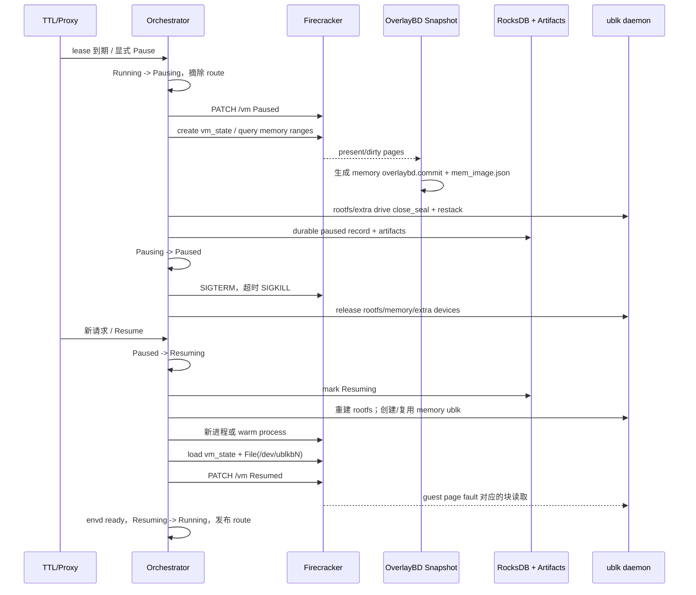

# AgentENV 基于 Firecracker 的 Idle microVM CPU/内存释放与恢复机制源码分析

> 调研时间：2026-07-28 15:35:10（UTC+8）  
> AgentENV 源码版本：`6296bc4be7ad79eb3a278eb5264ef011c341adf5`  
> 源码目录：`/mnt/u/hukeyang/AKernel/kvcache-ai/AgentENV`  
> 分析目标：解释 AgentENV 如何实现 “Idle environments can quickly release CPU and memory, then return when new work arrives”，重点分析 CPU/vCPU、guest memory、内存快照、OverlayBD、ublk、资源计量和恢复路径。

## 1. 结论摘要

AgentENV 不是把 Firecracker microVM 永久停在 `Paused` 状态，也不是仅依靠 balloon 从一个仍存活的 VMM 进程里回收部分内存。它的完整 idle 生命周期是：

1. 用 TTL/lease 到期判断 sandbox 应被回收；这里的 “idle” 不是基于 CPU utilization 的空闲检测。
2. 将编排状态从 `Running` 原子切到 `Pausing`，摘除代理路由，阻止新请求进入。
3. 调 Firecracker `PATCH /vm` 暂停 vCPU，以得到一致的 CPU、设备和内存状态。
4. 保存 `vm_state.bin`，把当前有效内存页直接或经稀疏 `mem.bin` 封装成增量 OverlayBD layer，同时把 rootfs/额外盘的 writable upper 封层。
5. 先将 paused metadata 和快照 artifact 持久化，再终止原 Firecracker 进程。
6. Firecracker 进程退出后，其 vCPU 线程、KVM VM 和私有 RSS 被宿主机回收；rootfs、内存及额外盘 ublk handle 被释放，网络 slot 被归还。
7. 新工作到达时，新建一个 Firecracker 进程（或取得一个尚未配置 microVM 的预热进程），重建 rootfs/额外盘/内存 ublk，以 `BackendType::File` 加载 `vm_state.bin` 和只读分层内存镜像，然后恢复 vCPU。
8. 恢复不是全量预读 guest RAM。Firecracker 将 memory ublk 当作 file-backed memory，未访问页按需 fault；写入页转为该 VM 私有的匿名 COW 页。同一快照启动的多个 VM 还能共享一个只读 ublk 和宿主 page cache。

最核心的实现可以概括为：

```text
CPU 回收：冻结 vCPU -> 保存 vCPU/设备状态 -> 杀掉旧 Firecracker 进程
内存回收：保存有效页的增量层 -> 杀掉旧进程释放 RSS -> 恢复时按页读取+COW
```

所以这里有三个必须区分的概念：

- Firecracker `Paused`：vCPU 暂停执行，但 VMM 进程和 guest memory 仍在，尚未完成资源释放。
- AgentENV `Paused`：快照已持久化，旧 Firecracker runtime 已被 stop，microVM 的专属 CPU/RAM 应已释放。
- `pausedAllocatedCPU/Memory`：为未来恢复保留的逻辑规格/承诺，不是 paused microVM 当前仍驻留的物理 CPU 或 RAM。

## 2. “Idle” 的真实语义：TTL/lease，而不是 CPU 空闲检测

AgentENV 的 `SandboxMetadata` 保存 `timeout` 和 `expires_at`，更新 timeout 时从当前时间重新计算过期点；它没有按某个 VM 的 CPU 使用率来判定 idle（[metadata.rs](/mnt/u/hukeyang/AKernel/kvcache-ai/AgentENV/src/orchestrator/store/metadata.rs:89)）。

默认配置是：

| 配置 | 默认值 | 含义 |
|---|---:|---|
| `auto_evict_interval_ms` | 1000 ms | 每秒扫描一次到期 sandbox |
| `default_sandbox_timeout_secs` | 15 s | 默认 lease/TTL |
| `auto_resume_min_sandbox_timeout_secs` | 300 s | 自动恢复后至少续租 300 秒 |
| proxy auto-resume wait | 60 s | 数据面等待自动恢复的上限 |

前三项来自 [default.toml](/mnt/u/hukeyang/AKernel/kvcache-ai/AgentENV/config/default.toml:118)，proxy 的 60 秒上限来自 [proxy.rs](/mnt/u/hukeyang/AKernel/kvcache-ai/AgentENV/src/api/proxy.rs:102)。

后台 auto-evict task 只扫描已经到期且仍是 `Running` 的 sandbox，然后按 `timeout_action` 执行 Pause 或 Delete（[service.rs](/mnt/u/hukeyang/AKernel/kvcache-ai/AgentENV/src/orchestrator/service.rs:1720)）。创建 cold sandbox 时，`autoPause` 缺省或为 true 会选择 Pause，显式 false 才选择 Delete；`autoResume.enabled` 是另一个独立开关（[sandbox.rs](/mnt/u/hukeyang/AKernel/kvcache-ai/AgentENV/src/api/impls/sandbox.rs:484)）。

因此，对宣传语更精确的改写应是：

> 当 sandbox 的 lease 到期时，AgentENV 能把 microVM 转成可恢复快照并释放 VM 侧 CPU/RAM；启用 auto-resume 后，新代理请求会触发恢复。

## 3. 总体架构和生命周期

### 3.1 组件分工

| 层次 | 组件 | 与 CPU/内存相关的职责 |
|---|---|---|
| API/Proxy | `src/api/` | 创建资源规格、显式 pause/resume、发现 Paused 后触发 auto-resume |
| Orchestrator | `src/orchestrator/` | TTL、状态机、并发串行化、持久化顺序、逻辑资源计量 |
| Firecracker backend | `src/sandbox/firecracker/` | 创建 VMM、配置 vCPU/RAM、暂停、快照、加载快照、终止进程 |
| Memory image | `storage/overlaybd/` | 把有效内存页保存为带索引的增量只读层，分层解析和远端读取 |
| Block frontend | `storage/ublk/` | 将 OverlayBD memory image 暴露成 `/dev/ublkbN` |
| Device daemon | `storage/ublk-daemon/` | 统一管理 ublk 生命周期、共享设备、引用计数和 warm pool |
| Persistence | `src/orchestrator/persistence/` | 用 RocksDB 保存 paused record，并保存快照 artifact 路径 |

### 3.2 完整时序



编排器的 public pause 明确描述为 “taking a snapshot and stopping its VM”（[service.rs](/mnt/u/hukeyang/AKernel/kvcache-ai/AgentENV/src/orchestrator/service.rs:973)）。backend trait 也规定 `pause()` 只产生可恢复状态，调用者随后必须 `stop()` 释放系统资源（[backend.rs](/mnt/u/hukeyang/AKernel/kvcache-ai/AgentENV/src/sandbox/backend.rs:185)）。这说明 “snapshot + stop” 是设计契约，不是偶然实现细节。

## 4. CPU/vCPU 资源实现

### 4.1 CPU 数量如何进入 microVM

默认配置是 2 vCPU、1024 MiB RAM（[default.toml](/mnt/u/hukeyang/AKernel/kvcache-ai/AgentENV/config/default.toml:109)）。cold create API 可覆盖 `cpuCount` 和 `memoryMB`；CPU 只要求大于 0，内存至少 128 MiB（[sandbox.rs](/mnt/u/hukeyang/AKernel/kvcache-ai/AgentENV/src/api/impls/sandbox.rs:252)）。资源被保存为：

```rust
SandboxResources {
    cpu_count: u32,
    memory_mib: u32,
    disk_size_mib: u32,
}
```

定义见 [resources.rs](/mnt/u/hukeyang/AKernel/kvcache-ai/AgentENV/src/types/resources.rs:7)。factory 把请求值写入 `FirecrackerSandboxConfig.vcpu_count` 和 `mem_size_mib`（[factory.rs](/mnt/u/hukeyang/AKernel/kvcache-ai/AgentENV/src/sandbox/firecracker/factory.rs:100)）。fresh boot 在 VM 启动前调用：

```rust
set_machine_config(mem_size_mib, vcpu_count, false, false)
```

即 `smt=false`、`track_dirty_pages=false`（[sandbox.rs](/mnt/u/hukeyang/AKernel/kvcache-ai/AgentENV/src/sandbox/firecracker/sandbox.rs:1543)）。底层构造 Firecracker `MachineConfiguration` 并 `PUT /machine-config`（[instance.rs](/mnt/u/hukeyang/AKernel/kvcache-ai/AgentENV/src/sandbox/firecracker/instance.rs:275)）。

### 4.2 这不是物理核独占或 CPU quota

`cpu_count` 的实际意义是 VM 向 Firecracker 声明的 vCPU 数。Firecracker/KVM 为 vCPU 提供执行线程，由宿主 Linux scheduler 调度。当前 sandbox 创建路径只负责启动 Firecracker、进入 netns、配置 capabilities 和 API socket；源码中没有为每个 sandbox 写 `cpu.max`、cpuset、CPU affinity 或独立 cgroup。

因此：

- `2 vCPU` 不等于独占两个物理核。
- 多个 microVM 可以 overcommit 宿主 CPU。
- AgentENV 的 `allocated_cpu` 是逻辑 vCPU reservation 总和，不是 CPU 使用率，也不是硬隔离保证。
- CPU feature template/cluster CPU intersection 用来保证迁移/快照兼容性，不是 CPU 配额；fresh VM 通过 `PUT /cpu-config` 设置（[instance.rs](/mnt/u/hukeyang/AKernel/kvcache-ai/AgentENV/src/sandbox/firecracker/instance.rs:245)）。

控制平面配置甚至明确允许 allocated CPU percent 超过 100%，因为 reservation 可以 overcommit（[config.go](/mnt/u/hukeyang/AKernel/kvcache-ai/AgentENV/services/shared/config/config.go:35)）。

### 4.3 Pause 时 CPU 如何真正释放

这分成两步：

1. **冻结 vCPU。** `pause_to_dir()` 先调用 Firecracker `PATCH /vm { state: Paused }`（[sandbox.rs](/mnt/u/hukeyang/AKernel/kvcache-ai/AgentENV/src/sandbox/firecracker/sandbox.rs:538)，[instance.rs](/mnt/u/hukeyang/AKernel/kvcache-ai/AgentENV/src/sandbox/firecracker/instance.rs:416)）。此时 vCPU 不再运行，但 vCPU 线程、KVM fd、VMM 地址空间仍存在。
2. **终止 VMM。** 快照和 durable record 成功后，orchestrator 调 `sandbox.stop()`（[service.rs](/mnt/u/hukeyang/AKernel/kvcache-ai/AgentENV/src/orchestrator/service.rs:1162)）。`FirecrackerInstance::stop()` 先发 SIGTERM，超时则 SIGKILL，并 wait 子进程退出（[instance.rs](/mnt/u/hukeyang/AKernel/kvcache-ai/AgentENV/src/sandbox/firecracker/instance.rs:211)）。只有这一步完成后，vCPU threads/KVM VM 才真正从宿主调度系统消失。

所以 CPU 快速回收的根本机制不是 balloon，也不是把 vCPU thread 永久睡眠，而是：

```text
freeze -> serialize CPU/device state -> terminate old VMM
```

### 4.4 Resume 时 CPU 如何回来

恢复不是对旧 PID 发 resume。Orchestrator 从 `PausedSandboxState` 构造新的 `FirecrackerSandbox`（[factory.rs](/mnt/u/hukeyang/AKernel/kvcache-ai/AgentENV/src/sandbox/firecracker/factory.rs:164)），然后启动新的 Firecracker 进程；也可能从 Firecracker warm pool 取得一个仅启动了 API socket、尚未配置 microVM 的进程（[sandbox.rs](/mnt/u/hukeyang/AKernel/kvcache-ai/AgentENV/src/sandbox/firecracker/sandbox.rs:1294)）。

resume 路径不再次 `PUT /machine-config`。它加载 `vm_state.bin`，其中已有 vCPU 数、寄存器、设备状态和 machine configuration；随后显式 `PATCH /vm Resumed`（[sandbox.rs](/mnt/u/hukeyang/AKernel/kvcache-ai/AgentENV/src/sandbox/firecracker/sandbox.rs:1463)）。原 metadata 中的 `SandboxResources` 仍被传进 resume launch plan，用于逻辑容量计量（[service.rs](/mnt/u/hukeyang/AKernel/kvcache-ai/AgentENV/src/orchestrator/service.rs:1283)）。

### 4.5 Firecracker warm pool 的边界

默认 pool low watermark 为 2，并开启 Firecracker startup prewarm（[default.toml](/mnt/u/hukeyang/AKernel/kvcache-ai/AgentENV/config/default.toml:169)）。warm entry 包含 Firecracker 进程、network slot 和工作目录，用来跳过恢复关键路径上的 process spawn/API socket wait（[pool.rs](/mnt/u/hukeyang/AKernel/kvcache-ai/AgentENV/src/sandbox/firecracker/pool.rs:1)）。创建 warm entry 时只 spawn 进程并等待 socket，没有配置 machine/vCPU/RAM（[pool.rs](/mnt/u/hukeyang/AKernel/kvcache-ai/AgentENV/src/sandbox/firecracker/pool.rs:287)）。

因此，准确表述是：暂停的那个 microVM 的 vCPU 和 guest RAM 已释放，但节点可能继续保留少量共享的、未配置 VM 的 Firecracker 进程和预热 network slot。平台 baseline 不一定降到零。

## 5. 运行态内存：逻辑容量、实际 RSS 与 balloon

### 5.1 `mem_size_mib` 是 guest physical address space 规格

`mem_size_mib` 通过 `/machine-config` 进入 Firecracker。它表示 guest 可见的物理内存容量，不等于 Firecracker 进程在任意时刻都占用同等大小的 host RSS，更不等于 AgentENV 为该进程设置了 `memory.max`。

当前 per-sandbox 路径没有创建独立 memory cgroup。因此 microVM 内存隔离的主要边界是 Firecracker/KVM 配置的 guest memory 大小；宿主总体 OOM 仍依赖节点容量规划和上层调度。Firecracker 子进程的 `oom_score_adj` 被设为 1000，使其在宿主 OOM 时优先于 AgentENV server 被杀（创建进程逻辑位于 [instance.rs](/mnt/u/hukeyang/AKernel/kvcache-ai/AgentENV/src/sandbox/firecracker/instance.rs:65)）。

### 5.2 运行中先做温和回收

fresh microVM 配置 virtio-balloon：

```rust
amount_mib = 0
deflate_on_oom = true
free_page_reporting = true
```

源码说明 free page reporting 让 guest 把空闲页返回给 VMM，Firecracker 可通过 `MADV_DONTNEED` 降低 host memory pressure（[instance.rs](/mnt/u/hukeyang/AKernel/kvcache-ai/AgentENV/src/sandbox/firecracker/instance.rs:387)）。

guest kernel boot args 同时启用 DAMON reclaim，`min_age=60s`，单个 quota interval 最多回收 1 GiB，且 `skip_anon=Y`，主要针对 file-backed/page-cache 冷页，不主动激进回收 agent 进程的匿名 heap（[config.rs](/mnt/u/hukeyang/AKernel/kvcache-ai/AgentENV/src/sandbox/firecracker/config.rs:27)，[default.toml](/mnt/u/hukeyang/AKernel/kvcache-ai/AgentENV/config/default.toml:15)）。

这层机制的定位是**运行态密度优化**。完整 idle 内存回收仍依赖快照后杀掉 Firecracker 进程。

## 6. 内存快照：从 guest pages 到增量 OverlayBD layer

### 6.1 快照入口和 artifact

`pause_to_dir()` 先冻结 VM，再进入 `snapshot_to_dir()`。一次 paused snapshot 至少形成：

```text
<artifact_root>/
├── vm_state.bin                 # vCPU、设备、machine state
├── mem_image.json               # memory OverlayBD lowers 配置
├── mem_overlaybd/
│   └── overlaybd.commit         # 本轮有效内存页
├── rootfs/
│   ├── image.json
│   └── snapshot.commit          # 本轮 rootfs writable upper
└── drives/<drive-id>/...        # attached drive snapshot
```

代码先生成 `vm_state.bin` 和 memory layer，再继承父 memory config 并写 `mem_image.json`，该 config 被标为只读（[sandbox.rs](/mnt/u/hukeyang/AKernel/kvcache-ai/AgentENV/src/sandbox/firecracker/sandbox.rs:561)）。随后 rootfs 走 restack，额外盘也逐盘 snapshot。

### 6.2 当前默认路径：直接从 Firecracker HVA 生成 OverlayBD

默认 `memory_snapshot.direct_overlaybd=true`（[default.toml](/mnt/u/hukeyang/AKernel/kvcache-ai/AgentENV/config/default.toml:185)）。所以默认不会长期、甚至不会中间落地 `mem.bin`。流程是：

1. 调 Firecracker 创建只含 VM state 的 Diff snapshot。
2. 读取 `/vm/dirty-memory-ranges`。
3. 获取每段 `base_host_virt_addr`、`image_offset` 和 `length`。
4. 校验 Firecracker page size 为 4096 字节、地址/长度 4 KiB 对齐，转成 OverlayBD 512 字节 sector mapping。
5. `ProcessVmReader` 用 `process_vm_readv` 从 Firecracker PID 的 HVA 读取页。
6. `compact_to` 直接生成临时 commit，成功后原子 rename 为 `overlaybd.commit`。

入口见 [sandbox.rs](/mnt/u/hukeyang/AKernel/kvcache-ai/AgentENV/src/sandbox/firecracker/sandbox.rs:702)，range 转换和 direct compaction 见 [overlaybd_snapshot.rs](/mnt/u/hukeyang/AKernel/kvcache-ai/AgentENV/src/sandbox/firecracker/overlaybd_snapshot.rs:656)，远程进程内存 reader 见 [process_vm_reader.rs](/mnt/u/hukeyang/AKernel/kvcache-ai/AgentENV/src/sandbox/firecracker/process_vm_reader.rs:10)。

该路径的优势是少一次“大逻辑地址空间稀疏文件”的落盘和再扫描。它只保存 Firecracker 返回的有效 range，并发 compaction 常量为 32，page size 为 4 KiB，OverlayBD 对齐为 512 字节（[overlaybd_snapshot.rs](/mnt/u/hukeyang/AKernel/kvcache-ai/AgentENV/src/sandbox/firecracker/overlaybd_snapshot.rs:33)）。

### 6.3 回退路径：Diff snapshot + 稀疏 `mem.bin`

若关闭 direct mode，AgentENV 请求 Firecracker：

```text
snapshot_type = Diff
snapshot_path = vm_state.bin
mem_file_path = mem.bin
```

fresh VM 明确设置 `track_dirty_pages=false`。Firecracker wrapper 的注释说明，这种情况下 Diff snapshot 内部用 `mincore` 找 present pages，将 `mem.bin` 写成稀疏文件（[instance.rs](/mnt/u/hukeyang/AKernel/kvcache-ai/AgentENV/src/sandbox/firecracker/instance.rs:434)）。因此这里的 “Diff” 更接近 present working set，而不是持续 KVM dirty bitmap 的传统增量语义。

`mem.bin` 的 `metadata.len()` 仍是完整 guest memory image 的逻辑长度；未驻留区域是 hole。`convert_sparse_mem_to_overlaybd()` 调 `package_raw_as_overlaybd()`，成功后删除中间 `mem.bin`（[overlaybd_snapshot.rs](/mnt/u/hukeyang/AKernel/kvcache-ai/AgentENV/src/sandbox/firecracker/overlaybd_snapshot.rs:619)）。具体打包逻辑：

- 用 source 文件逻辑长度作为 OverlayBD virtual size。
- 通过 `SEEK_DATA`/`SEEK_HOLE` 扫描实际 data extents。
- hole 不生成 `SegmentMapping`。
- 对有效 extents 做 32 并发 compact，写临时 commit 后原子 rename。

入口见 [packaging.rs](/mnt/u/hukeyang/AKernel/kvcache-ai/AgentENV/storage/overlaybd/src/tools/packaging.rs:111)，稀疏 extent 扫描见 [helper.rs](/mnt/u/hukeyang/AKernel/kvcache-ai/AgentENV/storage/overlaybd/src/lsmt/file/helper.rs:714)。

两条创建路径的差别只在于“内存页如何进入本轮 commit”；后续父层继承、ublk 暴露和 Firecracker restore 完全一致。

### 6.4 内存的增量分层

如果 sandbox 本身由旧 snapshot 恢复而来，新的 `mem_image.json` 会继承旧 config 的 `lowers`，再把本轮 `overlaybd.commit` 追加为最新层（[overlaybd_snapshot.rs](/mnt/u/hukeyang/AKernel/kvcache-ai/AgentENV/src/sandbox/firecracker/overlaybd_snapshot.rs:548)）。读取某个 guest physical offset 时，OverlayBD 先查最新层；没有 mapping 时向父层回退；所有层都没有则是 zero/hole。

这使存储量接近每轮 present/changed working set，而不是每轮完整 `mem_size_mib`。但 pause/resume 很多次会增加层数和查找成本，所以当可合并的 runtime suffix 使总层数超过 32 时会触发 compaction（[overlaybd_snapshot.rs](/mnt/u/hukeyang/AKernel/kvcache-ai/AgentENV/src/sandbox/firecracker/overlaybd_snapshot.rs:405)）。

### 6.5 rootfs/attached drives 与内存是两条独立数据路径

内存页形成 memory OverlayBD lowers；用户 rootfs 和 attached drives 则在暂停时对 live writable upper 做 `close_seal + restack`。旧 upper 被封成最新 lower，runtime 可重新打开一个新 writable upper（[overlaybd_snapshot.rs](/mnt/u/hukeyang/AKernel/kvcache-ai/AgentENV/src/sandbox/firecracker/overlaybd_snapshot.rs:457)）。

这一步会改变 live runtime 的 layer 结构，所以某些 restack 后失败被标为 Terminal：调用者不能再把原 runtime 当成安全的 Running VM。它解释了为什么 paused state 必须同时保存 CPU state、memory image、rootfs 和每个 attached drive 的状态。

## 7. Pause 后内存如何释放

paused artifact 写入后，orchestrator 先持久化 record，再把 metadata 设成 `Paused`，最后调用 backend stop（[service.rs](/mnt/u/hukeyang/AKernel/kvcache-ai/AgentENV/src/orchestrator/service.rs:1107)）。Firecracker backend 的 stop 顺序是（[sandbox.rs](/mnt/u/hukeyang/AKernel/kvcache-ai/AgentENV/src/sandbox/firecracker/sandbox.rs:760)）：

1. 终止 Firecracker 进程；KVM VM 和 Firecracker 私有 guest memory mapping 随进程退出。
2. 清空 envd handle。
3. 释放 rootfs ublk runtime。
4. 显式释放 shared memory ublk handle。
5. 释放所有 attached-drive ublk runtime。
6. 执行 extension stop hook。
7. 归还 network slot。

停止后的数据去向如下：

| 资源 | Paused 后状态 |
|---|---|
| vCPU threads/KVM VM | 随 Firecracker 进程退出而销毁 |
| guest anonymous RSS | 随 Firecracker 地址空间退出而释放 |
| CPU/设备状态 | 保存在 `vm_state.bin` |
| guest memory 内容 | 保存在一组只读 memory OverlayBD commits |
| rootfs/extra-drive 写入 | 封成 OverlayBD lower commits |
| paused metadata | RocksDB record + artifact root 路径 |
| memory ublk/page cache | 无其他引用时 release；仍有其他 VM 使用时继续共享 |
| warm ublk/network/FC 对象 | 可能被平台池保留，但不再绑定该 sandbox 的业务状态 |

### 7.1 共享 memory ublk 的引用计数

`UblkDeviceManager` 以 canonicalized `mem_image.json` 路径为 key，保存 `Weak<SharedMemDeviceInner>`。同一 snapshot 的多个 sandbox 会复用同一个只读 ublk 和 Linux page cache；只有最后一个强引用释放后才真正 release/delete 设备（[device.rs](/mnt/u/hukeyang/AKernel/kvcache-ai/AgentENV/src/sandbox/ublk/device.rs:449)）。daemon 内部还有一层 `(image_config, global_config)` -> device/refcount 的共享表（[server.rs](/mnt/u/hukeyang/AKernel/kvcache-ai/AgentENV/storage/ublk-daemon/src/server.rs:1268)）。

因此，暂停一个 VM 时不能保证对应 snapshot 的 page cache 全部消失：如果它仍服务其他 VM，保留是正确行为；被释放的是该 VM 私有的 anonymous/COW 页和 Firecracker RSS。

### 7.2 block warm pool 不会继续 pin 业务 image

block pool 开启时，release 的 ublk kernel device 可能进入 warm pool而不是删除。但 daemon 会先对 block device 做 best-effort `BLKFLSBUF`，再把 target 换成同 virtual size 的 daemon-owned sparse placeholder，并 drop 原 business image（[server.rs](/mnt/u/hukeyang/AKernel/kvcache-ai/AgentENV/storage/ublk-daemon/src/server.rs:1334)）。page cache flush 实现见 [server.rs](/mnt/u/hukeyang/AKernel/kvcache-ai/AgentENV/storage/ublk-daemon/src/server.rs:1630)。

所以 “设备对象仍在池中” 不等于 “暂停 sandbox 的内存镜像仍被该设备强引用”。

## 8. Resume：file-backed memory、按需 fault 与 COW

### 8.1 重建 runtime

`Paused -> Resuming` 后，factory 从持久化的 `FirecrackerPausedState` 构造新 backend。恢复路径依次：

1. 重建 writable rootfs OverlayBD ublk。
2. 重建 attached-drive ublk。
3. 分配或复用 network slot，spawn 或取得 warm Firecracker process。
4. `get_or_create_shared_mem()` 创建/复用只读 memory ublk，得到 `/dev/ublkbN`（[sandbox.rs](/mnt/u/hukeyang/AKernel/kvcache-ai/AgentENV/src/sandbox/firecracker/sandbox.rs:1435)）。
5. 调 Firecracker snapshot load，memory backend 设为 `BackendType::File`，path 为 `/dev/ublkbN`（[instance.rs](/mnt/u/hukeyang/AKernel/kvcache-ai/AgentENV/src/sandbox/firecracker/instance.rs:505)）。
6. `resume_vm=false` 先保持暂停，覆盖新 runtime 的 `eth0 -> tap0`、更新 MMDS，然后显式 resume。
7. envd ready 后才将 metadata 改为 `Running` 并发布代理路由。

### 8.2 为什么恢复不需要先读完整 RAM

AgentENV 架构说明明确指出：Firecracker mmap 这个 file-backed block device，首次写时把页 COW 到匿名内存，因此底层只读 snapshot 不会被改写（[architecture.md](/mnt/u/hukeyang/AKernel/kvcache-ai/AgentENV/docs/src/internals/architecture.md:126)）。

```mermaid
flowchart LR
    A[guest 访问 GPA 页] --> B{页是否已驻留}
    B -- 否 --> C[Firecracker file-backed mmap fault]
    C --> D[/dev/ublkbN block read]
    D --> E[OverlayBD 查最新 memory layer]
    E -->|未命中| F[向父 layer 回退]
    E -->|命中| G[进入 host page cache]
    F --> G
    B -- 是 --> H[直接访问]
    G --> I{guest 是否写入}
    I -- 否 --> J[共享只读 snapshot page]
    I -- 是 --> K[该 VM 私有 anonymous COW page]
```

这带来四个结果：

- 恢复延迟由启动所需 working set 主导，不要求顺序加载完整 `mem_size_mib`。
- 恢复后 host RSS 更接近实际热 working set，而不是 guest 逻辑容量。
- 同模板 VM 的只读 snapshot pages 可共享 page cache。
- 每个 VM 的写入仍隔离在各自匿名 COW page 中。

默认还启用 memory layer background download：16 MiB block、单 layer 4 并发、进程级最多 16 个 in-flight blocks；下载等待 envd ready 后启动，信号丢失有 fallback（[default.toml](/mnt/u/hukeyang/AKernel/kvcache-ai/AgentENV/config/default.toml:190)）。foreground fault 仍可先服务，因此后台补全不阻止初始恢复。

## 9. 持久化和崩溃恢复

paused record 包含 `version`、`Paused/Resuming` lifecycle、完整 metadata、artifact root 和 backend opaque JSON state（[file_backed.rs](/mnt/u/hukeyang/AKernel/kvcache-ai/AgentENV/src/orchestrator/persistence/file_backed.rs:20)）。生产 persister 使用 `LocalKvStore`/RocksDB，artifact 目录形如：

```text
$AENV_HOME/persisted-sandboxes/
├── records.db/
└── artifacts/<sandbox-id>/<uuid>/...
```

pause 的安全顺序是：

```text
完成 snapshot artifacts
  -> 写 durable Paused record
  -> 内存 metadata 改 Paused
  -> stop runtime
```

若 record 持久化失败，主流程会尝试在旧 Firecracker 进程上 in-place resume，成功则恢复 handle、route 和 `Running`；失败则 stop 并删除 metadata。持久化入口及失败时清理本轮 artifact root 见 [file_backed.rs](/mnt/u/hukeyang/AKernel/kvcache-ai/AgentENV/src/orchestrator/persistence/file_backed.rs:292)。

AgentENV server 重启时，orchestrator 会加载 persisted Paused records，重建 `PausedSandboxState` 并重新保护所依赖 image artifacts（[service.rs](/mnt/u/hukeyang/AKernel/kvcache-ai/AgentENV/src/orchestrator/service.rs:158)）。若记录停在 `Resuming`，当前实现将其视为恢复中崩溃后的不安全状态并清理，而不是盲目重放（[file_backed.rs](/mnt/u/hukeyang/AKernel/kvcache-ai/AgentENV/src/orchestrator/persistence/file_backed.rs:236)）。

## 10. 资源计量：逻辑 allocation 与物理 usage 必须分开

### 10.1 状态到计量的映射

Orchestrator 每次扫描 metadata store 重新聚合资源：

| 状态 | `running_count` | `starting_count` | active allocated CPU/RAM | paused reservation |
|---|---:|---:|---:|---:|
| Creating | 0 | 1 | 计入 | 0 |
| Resuming | 0 | 1 | 计入 | 0 |
| Running | 1 | 0 | 计入 | 0 |
| Pausing/Snapshotting/Forking/Killing | 1 | 0 | 计入 | 0 |
| Paused | 0 | 0 | 0 | 记录原 CPU/RAM 规格 |

实现见 [metrics.rs](/mnt/u/hukeyang/AKernel/kvcache-ai/AgentENV/src/orchestrator/metrics.rs:56)。`allocated_memory_bytes` 只是 `resources.memory_mib * 1024 * 1024`，并没有读取 Firecracker RSS；`allocated_cpu` 也只是 vCPU count 求和。

Node snapshot 另外采集 `/proc/stat` CPU percent、`/proc/meminfo`/cgroup host memory usage，并与 allocated 字段并列输出（[service.rs](/mnt/u/hukeyang/AKernel/kvcache-ai/AgentENV/src/observability/service.rs:69)）。因此：

- `allocated_*`：声明/容量规划维度。
- `cpu_percent`、`memory_used_bytes`：节点实际 usage 维度。
- `paused_allocated_*`：恢复承诺或“包括 paused 的总规格”维度。

### 10.2 Scheduler 只是阈值过滤，不是硬资源隔离

prototype scheduler 可按 active allocated percent、actual used percent，以及 active+paused 总规格过滤节点（[filter.go](/mnt/u/hukeyang/AKernel/kvcache-ai/AgentENV/services/scheduler/internal/filter.go:28)）。但该机制不在 VM 进程层建立 cgroup quota，也不能替代严格的 request-aware admission control。

这意味着：

- CPU 可 overcommit。
- memory allocation 也是逻辑规格，必须由运维阈值和节点容量共同约束。
- paused reservation 有助于防止节点积累过多“未来可能同时恢复”的 VM，但并不代表这些内存当前驻留。

## 11. 各阶段资源状态对照

| 阶段 | Firecracker PID | vCPU | 私有 guest RSS | memory snapshot ublk | 持久化快照 | 可服务请求 |
|---|---|---|---|---|---|---|
| Running | 有 | 运行 | 按 working set 驻留 | fresh 时无；restore 后有 | 可能有父 snapshot | 是 |
| Firecracker Paused/快照中 | 有 | 冻结 | 仍在 | 若 restore 来源则仍持有 | 正在生成新层 | 否，route 已摘除 |
| AgentENV Paused | 无（正常路径） | 无 | 无专属 RSS | 最后引用时释放；也可能被其他 VM 共享 | 有 | 否；可 auto-resume |
| Resuming | 新 PID/预热 PID | 正在恢复 | 按页增长 | 创建或共享 | 仍保留 | envd ready 前否 |
| Running after resume | 有 | 运行 | 热页 + 私有 COW 页 | 持有 shared read-only ublk | 仍作为父层依赖 | 是 |

## 12. 失败语义与源码审计发现

### 12.1 已有的安全设计

snapshot capture error 分为 `Recoverable` 和 `Terminal`。Terminal 表示 live runtime 已被不可逆地修改，调用者不能把它恢复成可服务的 Running（[backend.rs](/mnt/u/hukeyang/AKernel/kvcache-ai/AgentENV/src/sandbox/backend.rs:49)）。例如 rootfs restack 已 seal 旧 upper、reopen 新 upper 后，跨文件系统复制或 runtime config rewrite 失败会被提升为 Terminal（[overlaybd_snapshot.rs](/mnt/u/hukeyang/AKernel/kvcache-ai/AgentENV/src/sandbox/firecracker/overlaybd_snapshot.rs:495)）。Orchestrator 对 Terminal pause failure 会 stop runtime 并删除 metadata，而不是恢复 route。

resume 任一阶段失败时，会 stop 新 runtime，将内存 metadata 从 `Resuming` 回滚到 `Paused`，并把 durable lifecycle 回滚，以便用户重试。

### 12.2 当前值得修复的边界

以下是基于当前 commit 的源码审计结论，不影响主流程原理，但会影响“资源一定已释放/状态一定一致”的绝对表述。

1. **artifact root 分配失败的回滚缺口。** pause 已 detach handle/route 后，`allocate_artifact_root(...).await?` 直接返回；这条路径没有显式恢复 handle、route 和 `Pausing -> Running`（[service.rs](/mnt/u/hukeyang/AKernel/kvcache-ai/AgentENV/src/orchestrator/service.rs:1048)）。异常 Drop 会杀 Firecracker/释放网络，但 daemon-mode ublk 异常 Drop 不会立即显式 release，而是留给 daemon shutdown（[sandbox.rs](/mnt/u/hukeyang/AKernel/kvcache-ai/AgentENV/src/sandbox/firecracker/sandbox.rs:1025)）。
2. **recoverable backend pause failure 可能留下“metadata Running、VM 实际 Paused”。** `pause_to_dir()` 在 snapshot 前已 `PATCH /vm Paused`，snapshot error 只清理目录；backend `pause()` 将普通 anyhow error 默认映射为 Recoverable。Orchestrator 的 recoverable 分支恢复 handle/route/metadata，却没有调用 backend `resume()`（[service.rs](/mnt/u/hukeyang/AKernel/kvcache-ai/AgentENV/src/orchestrator/service.rs:1066)）。相比之下，用户 snapshot API 的 recoverable error 分支明确调用了 resume（[sandbox.rs](/mnt/u/hukeyang/AKernel/kvcache-ai/AgentENV/src/sandbox/firecracker/sandbox.rs:200)）。
3. **logical Paused 早于 stop 完成。** durable record 成功后先更新 store 为 Paused，再 stop；stop error 只记录 warn，pause 仍返回成功（[service.rs](/mnt/u/hukeyang/AKernel/kvcache-ai/AgentENV/src/orchestrator/service.rs:1162)）。`FirecrackerInstance::stop()` 自带 SIGKILL 兜底，主进程通常能退出；但若后续 ublk/network release 失败，metrics 已经按 Paused 记 active CPU/RAM 为 0，物理清理可能依赖 Drop/daemon 兜底。
4. **运行态 anonymous memory 不由 DAMON 主动回收。** 默认 `skip_anon=Y`；因此一个仍 Running 但应用匿名 heap 很大的 agent，不会仅因 CPU 低而被 DAMON 大幅回收。要完整释放，仍必须让 lease 到期并走 snapshot+stop。
5. **direct snapshot 中 `process_vm_readv` 是同步调用。** reader 源码带有 TODO：当前同步 read 运行在 Tokio worker polling 路径，尚未无额外 copy 地迁移到专用 blocking worker（[process_vm_reader.rs](/mnt/u/hukeyang/AKernel/kvcache-ai/AgentENV/src/sandbox/firecracker/process_vm_reader.rs:19)）。大 working set 的 pause latency 需要实测。
6. **`storage/uffd-core` 不是当前生产恢复路径。** 它保留作参考且不在 workspace build；实际路径是 OverlayBD + ublk + Firecracker File backend（[architecture.md](/mnt/u/hukeyang/AKernel/kvcache-ai/AgentENV/docs/src/internals/architecture.md:126)）。

## 13. 对这句架构能力描述的最终解释

“Idle environments can quickly release CPU and memory, then return when new work arrives” 在 AgentENV 当前源码中的逐词含义是：

- **Idle environments**：lease/TTL 到期、且 timeout action 为 Pause 的 Running sandbox。
- **quickly release CPU**：先冻结并保存 vCPU state，再终止 Firecracker 进程；不是把物理核永久预留给 paused VM。
- **release memory**：将 present/dirty working set 保存为增量 OverlayBD layers，然后靠 Firecracker 进程退出释放私有 RSS；不是只靠 balloon。
- **then return**：从 durable paused state 新建 runtime，用 file-backed memory ublk 加载 snapshot，按需 fault、写时 COW。
- **when new work arrives**：显式 resume/connect，或 proxy 发现 `Paused + auto_resume=true` 后触发 resume；proxy auto-resume 逻辑见 [proxy.rs](/mnt/u/hukeyang/AKernel/kvcache-ai/AgentENV/src/api/proxy.rs:649)。

从系统设计角度，AgentENV 把 paused microVM 从“正在占用 vCPU/RAM 的进程”转换成“磁盘/对象存储中的可恢复状态 + 一份逻辑恢复承诺”。它用增量快照降低 pause 的写入量，用 file-backed demand paging 降低 resume 的首包前读入量，用 shared ublk/page cache 降低同模板多实例的内存和 I/O 放大。这三者共同支撑了 microVM 级 scale-to-zero 与快速 scale-from-zero。

## 14. 关键源码索引

| 主题 | 主要源码 |
|---|---|
| API resource / auto pause | [src/api/impls/sandbox.rs](/mnt/u/hukeyang/AKernel/kvcache-ai/AgentENV/src/api/impls/sandbox.rs:252) |
| Proxy auto resume | [src/api/proxy.rs](/mnt/u/hukeyang/AKernel/kvcache-ai/AgentENV/src/api/proxy.rs:649) |
| Pause/resume state machine | [src/orchestrator/service.rs](/mnt/u/hukeyang/AKernel/kvcache-ai/AgentENV/src/orchestrator/service.rs:973) |
| Logical resource metrics | [src/orchestrator/metrics.rs](/mnt/u/hukeyang/AKernel/kvcache-ai/AgentENV/src/orchestrator/metrics.rs:56) |
| Paused RocksDB persistence | [src/orchestrator/persistence/file_backed.rs](/mnt/u/hukeyang/AKernel/kvcache-ai/AgentENV/src/orchestrator/persistence/file_backed.rs:234) |
| Firecracker process/API | [src/sandbox/firecracker/instance.rs](/mnt/u/hukeyang/AKernel/kvcache-ai/AgentENV/src/sandbox/firecracker/instance.rs:211) |
| Sandbox pause/stop/resume | [src/sandbox/firecracker/sandbox.rs](/mnt/u/hukeyang/AKernel/kvcache-ai/AgentENV/src/sandbox/firecracker/sandbox.rs:527) |
| Memory/rootfs snapshot | [src/sandbox/firecracker/overlaybd_snapshot.rs](/mnt/u/hukeyang/AKernel/kvcache-ai/AgentENV/src/sandbox/firecracker/overlaybd_snapshot.rs:457) |
| Direct HVA reader | [src/sandbox/firecracker/process_vm_reader.rs](/mnt/u/hukeyang/AKernel/kvcache-ai/AgentENV/src/sandbox/firecracker/process_vm_reader.rs:10) |
| Shared memory ublk | [src/sandbox/ublk/device.rs](/mnt/u/hukeyang/AKernel/kvcache-ai/AgentENV/src/sandbox/ublk/device.rs:449) |
| ublk daemon refcount/pool | [storage/ublk-daemon/src/server.rs](/mnt/u/hukeyang/AKernel/kvcache-ai/AgentENV/storage/ublk-daemon/src/server.rs:1268) |
| File-backed memory architecture | [docs/src/internals/architecture.md](/mnt/u/hukeyang/AKernel/kvcache-ai/AgentENV/docs/src/internals/architecture.md:126) |
