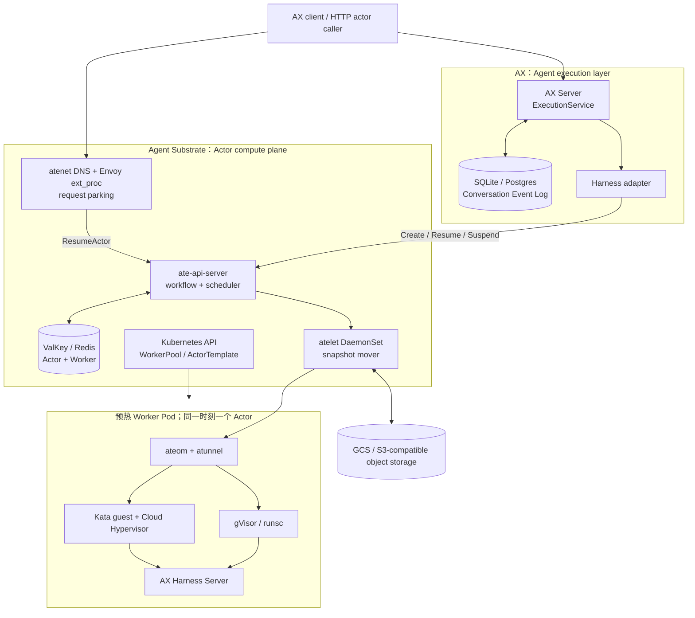
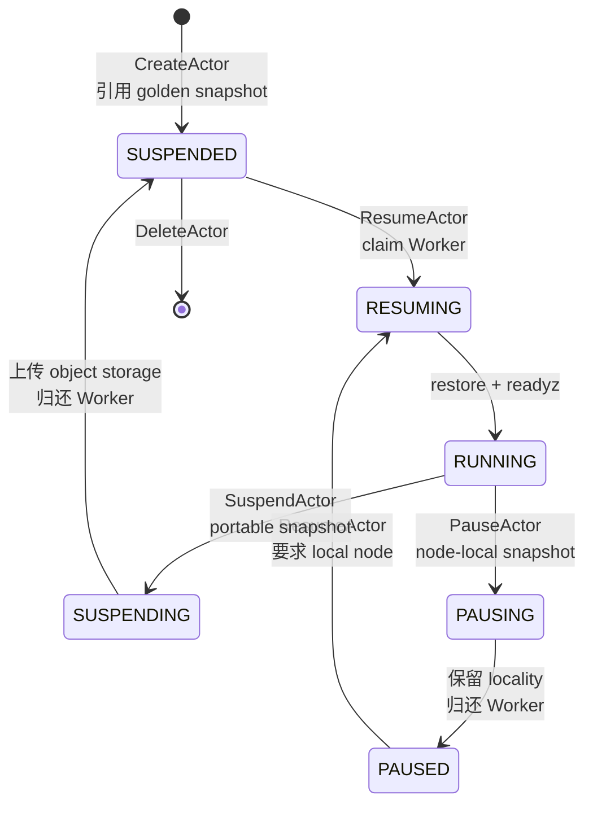
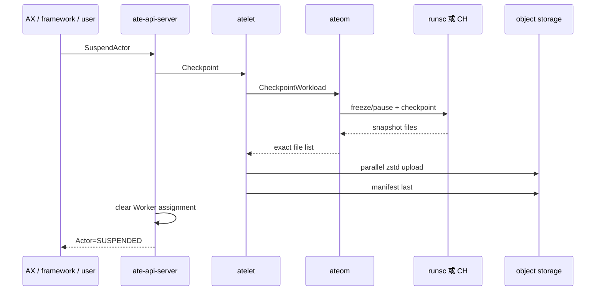
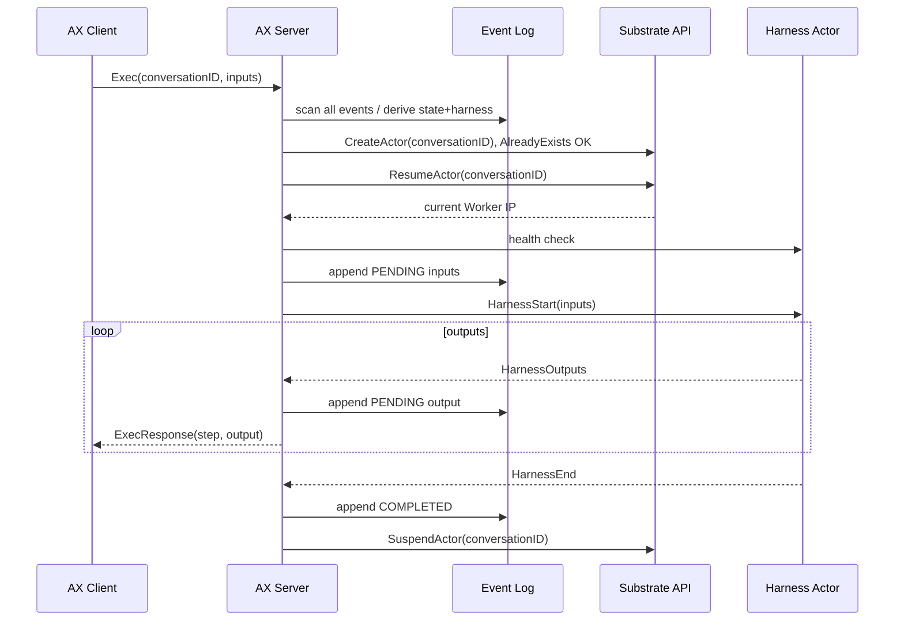

# Google AX / Agent Substrate 架构与 AgentENV 源码级对比调研

> 调研时间：2026-08-01 16:11:03（UTC+8）  
> 文档时间戳：`20260801T081103Z`  
> Substrate 源码：`cbdeb7dbe003a55a16960a301bc595d9aa38b1ad`（2026-07-31）  
> AX 源码：`f327e23b5b842e9b700675ded9a6cdb79c505856`（2026-07-28）  
> AgentENV 源码：`6296bc4be7ad79eb3a278eb5264ef011c341adf5`（2026-07-28）  
> 调研方法：README/架构文档用于确定设计意图，Go/Rust 源码与部署清单用于确认当前实现；没有在真实 GKE/KVM 集群中复跑 benchmark。  
> 术语约定：本文用 **Substrate** 指 Agent Substrate，用 **CH** 指 Cloud Hypervisor，用 **FC** 指 Firecracker。

## 1. 结论摘要

### 1.1 最重要的结论：AX、Substrate、AgentENV 不完全处于同一层

不能把 AX、Substrate 和 AgentENV 当成三个同构的 sandbox 产品：

```text
AX
  = conversation / execution turn / harness / event-log 层
  = 决定“Agent 一轮如何执行、事件如何记录、失败后如何续聊”

Substrate
  = Kubernetes 上的 Actor/Worker 复用、调度、唤醒、路由和快照控制面
  = 决定“一个有状态 Actor 在哪个预热 Worker 上运行，何时 suspend/resume”

gVisor 或 Kata + Cloud Hypervisor
  = Substrate 真正执行 checkpoint/restore 的隔离 runtime

AgentENV
  = E2B-compatible sandbox API + Firecracker microVM runtime
  + OverlayBD/ublk rootfs 与内存快照数据面
  + 节点内生命周期编排及原型化多节点控制面
```

因此：

- **AX 不是 AgentENV 的直接替代品。** AX 可以部署在 Substrate 之上，理论上也可以新增一个 AgentENV provider，把 AgentENV 当作 AX 的 compute backend。
- **Substrate 才是 AgentENV 的主要对照对象。** 二者都解决有状态 sandbox 的 create/pause/resume/snapshot 与请求到来时恢复，但系统边界、隔离 runtime、存储数据面和集群抽象不同。
- **AX + Substrate 的组合**覆盖了 Agent 执行协议层与 Kubernetes Actor compute 层；AgentENV 当前主要覆盖后者以及更深的 Firecracker/存储层，不提供 AX 的 conversation event log、harness 或工具副作用语义。

### 1.2 Substrate 的核心创新不是一种新 VMM，而是 Actor 与 Worker 解耦

Substrate 把大量逻辑 Actor 映射到少量已经启动的 Worker Pod：

- Actor 是可 suspend/resume、可跨 Worker 移动的逻辑有状态实例。
- Worker 是预热 Kubernetes Pod，当前同一时刻最多承载一个 Actor。
- Kubernetes 负责低频的节点、Deployment、Worker Pod 和资源配额；Substrate 自己的控制面负责高频 Actor 状态、Worker claim、快照恢复与路由，从而把 Kubernetes scheduler、Pod 创建和 image pull 尽量移出唤醒关键路径。
- Actor 动态状态存 ValKey/Redis；`WorkerPool`、`ActorTemplate`、`SandboxConfig` 等低频配置才进入 Kubernetes API。

这与 AgentENV 的“每个 Running sandbox 启动一个 Firecracker 进程，Paused 后终止该进程”不同。AgentENV 没有固定的 Actor→预热 Worker Pod slot 抽象；它通过 warm Firecracker process、network slot、ublk device pool 与 snapshot demand paging 优化启动。

### 1.3 Substrate 的 microVM 不是 Firecracker

Substrate 当前有两种 sandbox class：

| sandbox class | 运行时 | FULL snapshot 的核心内容 | 恢复方式 |
|---|---|---|---|
| `gvisor`（默认） | `runsc` | gVisor process tree + filesystem checkpoint images | `runsc restore` |
| `microvm` | Kata guest + Cloud Hypervisor | CH VM state + sparse `memory-ranges`；rootfs writable upper 位于 guest tmpfs，因此也随 RAM 保存 | CH `OnDemand` restore，基于 `userfaultfd` 按需取页 |

microVM 路径不是“用 CH 替换一下 FC”这么简单：它还依赖 Kata guest/agent、virtio-fs lower、guest tmpfs upper、可选 host-backed DurableDir share，以及 CH 的 REST snapshot/restore API。

### 1.4 Idle 资源释放的准确语义

Substrate 的设计目标是 idle Actor suspend 后释放 Worker，后续请求再 resume；但当前源码有一个重要边界：

- 通用 Substrate **尚未实现自动按空闲检测并 suspend**。request-parking demo 明确写着 `auto-suspend-on-idle isn't implemented yet`，目前由调用方显式 `SuspendActor`/`PauseActor`。
- AX 的 Substrate provider 在每一轮 execution 的 `Close` 中显式调用 `SuspendActor`，所以 AX+Substrate 组合能在“每轮结束”归还 Worker，但这不是 Substrate 内核自动观察 CPU/网络空闲得出的决定。
- 新 HTTP 请求到达 suspended Actor 时，`atenet-router` 调 `ResumeActor`；若 WorkerPool 暂时满，默认最多停泊 1024 个请求、每个 resume flight 最多等待 5 秒，而不是立刻返回 503。

资源释放是完整 hibernation：gVisor sandbox 被 checkpoint/delete，或 CH guest 被 pause/snapshot 后 VMM/virtiofsd 被 teardown；它不是运行中动态缩小一台 VM 的 CPU/RAM。

### 1.5 Substrate microVM 的内存快照与 AgentENV 有相似点，但持久化组织不同

相似点：

- 两者恢复都不要求首包前读入完整 RAM。
- Substrate CH 使用 `OnDemand`/`userfaultfd`；AgentENV FC 使用 file-backed mmap + ublk/OverlayBD。
- 两者都会利用稀疏内存文件，只处理实际存在/驻留的数据区，而不扫描或传输所有逻辑 RAM。
- 两者在恢复后写入页面时都形成运行实例私有状态，不直接修改只读基线。

关键差异：

- Substrate CH 从 OnDemand snapshot 再 checkpoint 时，CH 只产出 faulted pages delta；Substrate 会把 delta **合并回 restore source，重新构造一份 self-contained complete `memory-ranges`**，随后上传这份完整逻辑快照。它利用 sparse extent 避免空洞 I/O，但当前没有跨快照保留 parent-layer chain。
- AgentENV 使用 Firecracker native diff snapshot，将每一轮 present/dirty pages 转成新的 OverlayBD memory layer，并与父层 stack；因此持久化模型是真正的跨版本增量层链。多个 sandbox 还能共享同一个只读 memory ublk 与 host page cache。
- Substrate roadmap 仍把 gVisor incremental snapshots、存储分层、P2P 和数据本地性列为待办；AgentENV 已经有 OverlayBD incremental layering、POSIX/OSS snapshot repository 和可选 Iroh P2P artifact transport。

### 1.6 CPU/内存弹性：两个 microVM 方案都没有 vCPU hotplug 闭环

- Substrate microVM 的 guest 规格来自 Kata runtime config，未配置时回退到 1 vCPU、2048 MiB；创建 VM 时 `BootVcpus == MaxVcpus`，当前没有调用 CH CPU hotplug API，也没有 per-Actor CPU/memory patch API。
- AgentENV 的 per-sandbox vCPU 同样在 FC pre-boot 固定，不能把 1-vCPU snapshot 原地变成 4-vCPU。
- Substrate ActorTemplate 当前不包含 per-Actor CPU/memory；实际资源 shape 主要由 WorkerPool Pod 的 Kubernetes requests/limits 和 sandbox runtime config 决定。roadmap 只把 vertical worker autoscaling/IPPU 列为“additional idea”。
- AgentENV 至少提供 per-sandbox `cpuCount`/`memoryMB`，并启用了 FC virtio-balloon free-page reporting，可在 VM 运行时释放 guest 已空闲页的 host backing；Substrate CH 配置当前没有等价 balloon device/control-plane 集成。

### 1.7 AX 的 durable execution 目前是“骨架 + 部分实现”，不能解读为 exactly-once

AX 已经实现：

- SQLite/Postgres append-only conversation event log；
- 每个事件独立事务、按 `step` 排序；
- 单个 AX server 进程内，同一 conversation 只允许一个 in-flight Exec；
- 正常路径下 input 先写 PENDING，再运行 harness；output 通常先 append 再发给 client；
- 已完成 conversation 下一轮可以绑定同一 harness，并通过 Substrate 恢复同名 Actor。

但当前源码没有闭合：

- 部署清单启动 3 个 AX server replica，single-writer 锁却只在单进程内；没有 DB lease/fencing 或 conversation-affinity 的实现。
- `last_step` 只存在于 proto/CLI，Controller 不读取，EventLog 也没有 `EventsAfter(step)`；README 所述断线补流目前不可用。
- PENDING execution 的恢复路径 `Start` 后不 `Queue` 就直接 `Run`，但内置 harness 都拒绝空输入；源码仍留有“Resume an incomplete execution” TODO。
- event log、harness cursor/trajectory/workspace、Substrate snapshot 是三个独立持久化域，没有共同 commit barrier。
- snapshot suspend 失败只记日志并返回成功；output/completion append 失败也只 warn，不能保证 durable-before-delivery。
- 工具调用副作用没有幂等 ledger/outbox，因此当前不具备 exactly-once tool execution。

最准确的评价是：AX 已提供 **conversation continuation、事件前缀审计与 compute actor resumption 的架构骨架**，但 README 中的 resumable stream、分布式 single-writer 和自动 execution recovery 仍处于 active early development。

## 2. 调研范围与证据分级

### 2.1 源码版本

本报告固定到以下 commit，避免把后续变更反推到当前实现：

| 项目 | commit | 上游固定链接 |
|---|---|---|
| Agent Substrate | `cbdeb7dbe003a55a16960a301bc595d9aa38b1ad` | [agent-substrate/substrate@cbdeb7d](https://github.com/agent-substrate/substrate/tree/cbdeb7dbe003a55a16960a301bc595d9aa38b1ad) |
| AX | `f327e23b5b842e9b700675ded9a6cdb79c505856` | [google/ax@f327e23](https://github.com/google/ax/tree/f327e23b5b842e9b700675ded9a6cdb79c505856) |
| AgentENV | `6296bc4be7ad79eb3a278eb5264ef011c341adf5` | [kvcache-ai/AgentENV@6296bc4](https://github.com/kvcache-ai/AgentENV/tree/6296bc4be7ad79eb3a278eb5264ef011c341adf5) |

Substrate README 明确说它不是 Google 官方支持产品，也不在 Google OSS VRP 范围内；同时项目处于 early development、不适合生产且 API 几乎必然变化。AX README 同样把 core/resumption protocol 标记为 active early development。本文因此使用“Google 开源/Google 团队维护”，不把它描述成有生产 SLA 的正式 Google 产品。

### 2.2 证据强度

| 类别 | 本文如何使用 | 示例 |
|---|---|---|
| 当前源码路径 | 作为“已实现”证据 | CH `Pause→Snapshot→Merge→Shutdown`、AX `inFlight map` |
| 部署清单/默认值 | 作为当前配置事实 | AX 3 replicas、parking 5s/1024 |
| README demo 描述 | 只作为项目演示声明 | 约 250 Actor/8 Pod、30x+ oversubscription |
| 源码注释中的耗时 | 标成作者工程注释，不当作正式 benchmark | CH OnDemand `~75ms` vs eager `~1.8s` |
| Architecture/North Star | 只作为设计目标 | p95 100ms、10 亿 Actor、1000 wakeups/s |
| Roadmap | 明确标成未实现/计划 | incremental snapshot、P2P、vertical worker autoscaling |

Substrate 的 benchmarking README 自称 `nascent suite`，仓库没有一份可直接引用的、带环境和置信区间的稳定结果表。因此本文不把 north-star 指标或 README 视频演示写成可复现实测结论。

## 3. AX + Substrate 的整体架构

### 3.1 分层图



### 3.2 为什么把 Kubernetes 移出 Actor 唤醒关键路径

直接为每个 Agent 启动 Pod 会经过 API server、scheduler、kubelet、网络和 image pull。Substrate 的做法是先由 Kubernetes 维持一组 ready Worker Pod，然后把高频操作变成：

```text
查询 Actor
  -> claim 一个空闲 Worker record
  -> atelet 下载 snapshot / 准备 OCI bundle
  -> ateom restore sandbox
  -> 更新 Actor/Worker record
  -> router 建立到新 Worker 的 tunnel
```

因此 Kubernetes 仍然负责物理容量和 Pod resource isolation，但不参与每次 Actor wakeup。动态状态用 Redis 版本号、分布式锁和补偿 workflow 管理，而不是把百万级 Actor 全写成 CRD。

## 4. Substrate 详细源码分析

### 4.1 资源模型：配置面与高频状态面分离

Kubernetes CRD 配置面：

- `WorkerPool`：replica 数、ateom image、sandbox class、Pod placement 和 Pod resources。
- `ActorTemplate`：不可变的容器镜像、命令、环境、volume、snapshot policy、sandbox class 与 Worker selector。
- `SandboxConfig`：runsc/CH/Kata/kernel/image 等 runtime asset，snapshot manifest 会 pin 具体 asset，以保持跨升级恢复可重复。

Redis/ValKey 高频状态面：

- `Actor`：`RESUMING/RUNNING/SUSPENDING/SUSPENDED/PAUSING/PAUSED/CRASHED`、当前 Worker、latest snapshot、local snapshot locality、version。
- `Worker`：是否 active、是否已有 assignment、Pod IP/UID/node/labels/sandbox class。
- `ActorSnapshot`：不可变 snapshot metadata 和 content scope；物理存储位置不直接暴露给用户。

这种拆分是 Substrate 最值得借鉴的控制面设计之一：把治理性强、变化慢的环境定义留在 Kubernetes，把极高频的 Actor/Worker assignment 放进面向低延迟和原子更新的专用 store。

### 4.2 Worker 调度并不是通用资源装箱

当前 scheduler：

1. 列出 Worker；
2. 过滤已有 assignment 的 Worker；
3. 要求 `STATE_ACTIVE`；
4. 要求 sandbox class、template selector、actor selector、required node locality 均匹配；
5. 在候选中随机选一个；
6. 用 Worker/Actor versioned update claim，并靠 workflow 补偿冲突或半完成状态。

它没有计算 per-Actor CPU/memory request，也没有 bin packing、NUMA、GPU 拓扑或实时利用率评分。物理资源 shape 已经在 WorkerPool Pod 创建时决定；调度的本质是从匹配 pool 里拿一个空 slot。

这解释了 Substrate 的密度来源：不是在一个 Worker 内同时塞多个 Actor，而是让 **Actor 数远大于 Worker 数**，只有活跃 Actor 占 slot，idle Actor 变成 snapshot。

### 4.3 Actor 生命周期



创建 Actor 不会立刻启动 workload，而是生成一个 `SUSPENDED` record，首次 resume 使用 ActorTemplate 的 golden snapshot。Golden snapshot 由 controller 启动临时 golden actor，完成初始化后 checkpoint version 0。

`SuspendActor` 与 `PauseActor` 不完全相同：

- **Suspend** 把 snapshot 上传到 durable object storage，适合跨 Worker/跨节点恢复。
- **Pause** 保留 node-local snapshot 和 required-node locality，避免远端传输，但节点故障会影响可恢复性。

### 4.4 请求唤醒、location transparency 与 request parking

Actor DNS 形如：

```text
<actor-name>.<atespace>.actors.resources.substrate.ate.dev
```

请求先到 Envoy。`ext_proc` 从 Host 提取 Actor identity，调用 `ResumeActor`；控制面返回当前 Worker 后，router 通过 mTLS 连接 Worker Pod 443 上的 `atunnel`，由 `atunnel` 转发到 Actor 私有 veth。Worker Pod 的普通 port 80 不是 Actor 直达入口。

WorkerPool 短时饱和时，parking 的默认行为是：

| 参数 | 默认值 | 作用 |
|---|---:|---|
| park budget | 5 s / resume flight | 等待 capacity、并发 resume 或控制面短暂不可用 |
| parking lot | 1024 requests | 有界 admission，满后立即 503 |
| first retry interval | 100 ms | 初次重试间隔 |
| backoff factor | 1.1 | 温和指数退避 |
| jitter | 0.1 | 避免同步重试 |
| Envoy ext_proc max requests | 自动约为 parking max 的 2 倍，最小 1024 | 为已 Running Actor 的 fast path 留出 headroom |

同一 Actor 的 concurrent resume 由 `singleflight` 合并成一个 control-plane RPC。需要注意 parking slot 仍按请求占用，而 budget 按共享 flight 计时；晚加入者可能很快看到 budget exhausted。

这比 AgentENV 当前 proxy 的 auto-resume 路径更完整：它不只会“发现 Paused 后恢复”，还把池饱和作为一等的有界排队/backpressure 问题处理。

### 4.5 Idle release：当前依赖显式 suspend

当前真实时序是：



通用 Substrate 没有 CPU-idle detector 或 activity timer。README/部分 demo 文案使用了“idle 时 suspend”，但 request-parking load generator 的代码注释明确说 auto-suspend-on-idle 尚未实现，并在每个 request 后显式执行 `kubectl ate suspend` 来模拟 idle。

AX provider 则把“execution turn 结束”当成 idle boundary：关闭到 HarnessService 的连接后，用独立 10 秒 background context 调 `SuspendActor`。这个选择很自然，但存在两个语义问题：

- 长期运行、等待外部 callback 的 harness 不能简单把 RPC turn 结束等价成应用 idle。
- Suspend 失败只记录日志，`Close` 仍返回 nil；AX event log 可能已标 COMPLETED，但最新 sandbox state 没有 durable commit。

### 4.6 gVisor checkpoint/restore 路径

FULL snapshot：

1. `ateom-gvisor` 关闭 Actor ingress；
2. 对 sandbox root/pause container 调 `runsc checkpoint -image-path ...`；
3. runsc 生成 `checkpoint.img` 和可能的 pages images；
4. best-effort delete application/pause containers、卸载 rootfs overlay、清理 Actor network；
5. ateom 返回实际生成的文件列表，atelet 逐个上传。

恢复时重新准备 OCI bundle/rootfs/network：pause container 和每个 application container 都指向同一个 checkpoint dir 调 `runsc restore`，随后等待所有 readyz probe 成功，最后才开放 Actor network。

DATA snapshot 走 `runsc fscheckpoint`，只保存 DurableDir，不保存 process memory；restore 时先恢复 filesystem image，再 cold-start containers。gVisor 当前仍限制每个 Actor/Container 只能使用一个 DurableDir，这是代码中的显式校验。

当前 roadmap 把 gVisor incremental snapshots 列为未来工作，所以不能把 gVisor FULL snapshot 描述成 AgentENV 式分层增量快照。

### 4.7 Cloud Hypervisor microVM FULL snapshot

#### 4.7.1 运行时存储布局

每个 Actor 容器的 rootfs 是：

```text
read-only OCI lower：host 上解包，经 virtio-fs 提供
                +
writable upper：guest 内 tmpfs
```

因此普通 rootfs 写入实际位于 guest RAM。FULL snapshot 保存 guest memory 时，这些写入天然一起保存；恢复时 host 只需从同一 pinned OCI image 重建只读 lower。

DurableDir 不在 guest RAM 中，而是 host-backed writable virtio-fs share。每个 volume 是同一 share 下的一个子目录，checkpoint 时另外打一个 tar。与 gVisor 不同，microVM 可以用多个 DurableDir，而不增加 virtio device 数。

#### 4.7.2 Suspend 时序

```text
deactivate Actor network
  -> CH Pause
  -> CH Snapshot(file://checkpointDir)
       config.json
       state.json
       sparse memory-ranges
  -> 若有 DurableDir：在 guest 已暂停时 tar host-backed share
  -> 若本轮来自 OnDemand restore：
       将新 memory delta 的 populated extents overlay 到 restore source
       得到一份 complete、self-contained memory-ranges
  -> Shutdown/Kill CH 与 virtiofsd
  -> 清理 VM/网络/bundle state
  -> atelet zstd upload files，最后写 manifest
```

首次 cold-run 后的 snapshot 本身是 complete。OnDemand restore 后的下一次 CH snapshot 只包含从 base fault 进来的页面；未 fault 页面仍依赖旧 source。Substrate 的 `MergeDeltaIntoBase` 用 `SEEK_DATA/SEEK_HOLE` 只覆盖新 delta 的非空洞范围，把旧 source 转成最新 complete image。

源码注释给出一个优化示例：旧做法为每次 suspend 复制约 150 MiB/2 GiB guest working set，约 0.8 秒；rename base 后只 overlay delta，并避免 replace-rename 触发 ext4 writeback，注释记录 merge 从约 840 ms 降到约 5 ms。它是作者在代码中的工程测量说明，不是本仓库 benchmark suite 的正式统计结果。

#### 4.7.3 Resume 时序

1. atelet 先取小 manifest，确定 snapshot files 和 pinned runtime assets；
2. 并发执行 snapshot download/decompress 与 OCI image unpack/runtime asset 准备；
3. 恢复 DurableDir tar；
4. 重建 virtio-fs read-only lower、writable DurableDir share 和 tap FDs；
5. 启动新的 CH process；
6. `RestoreWithNetFDs(..., "OnDemand")`，用 userfaultfd 从 `memory-ranges` 按需取页；
7. Resume guest，等待所有 readyz probe；
8. 保存 runningActor 的 `restoreSourceDir`，直到下次 teardown，以便缺页和下一轮 delta merge。

源码注释称 OnDemand restore 约 75 ms，而 eager restore 约 1.8 s；atelet 还把约 0.5 s 的 warm object download 与约 2.5 s 的 cold OCI unpack并行重叠。这些仍是源码注释中的典型值，不是有实验环境、样本数和 p95 的发布 benchmark。

#### 4.7.4 DATA scope

DATA snapshot 不保存 VM state、memory image 或 rootfs tmpfs upper，只 tar DurableDir；恢复时重建 volume 后 cold boot Actor。它适合能从 durable workspace/cursor 恢复逻辑状态的 harness，例如 AX Interactions manifest 就把 `/durable` 配成 DurableDir，并设置 `onPause: Data`。

### 4.8 稀疏快照对象格式

atelet 对本地 file source 使用自定义 streamable sparse-zstd 格式：

```text
magic "ATESPRSE"[8]
  | version u32 (=2)
  | zstd(
      logicalSize i64
      | { offset i64, length i64, data[length] }*
      | endOffset -1
    )
```

writer 用 `SEEK_DATA/SEEK_HOLE` 只读 populated extents，hole 不读取、不压缩、不上传；reader 先 truncate 到逻辑长度，再按 offset 写 extent，空白范围继续是 sparse hole。源码注释给出的典型例子是 2 GiB 逻辑 guest RAM、约 150 MiB populated set。

这解决的是“空洞放大”，不是“跨版本增量”：每个 durable snapshot 仍包含恢复当前 Actor 所需的全部 populated state。与之相比，AgentENV OverlayBD layer 可以只保存本轮 diff，并通过 parent stack 组合完整内存。

### 4.9 CPU 和内存资源模型

#### gVisor

- WorkerPool `spec.template.resources` 直接变成 ateom Pod container 的 Kubernetes requests/limits。
- ateom 在 Worker Pod cgroup 下建立 per-container cgroup leaf，运行 Actor 时有真实 cpu/memory/pids accounting。
- ActorTemplate 本身没有 CPU/memory 字段，因此同一个 WorkerPool 是一个固定资源 class；选择更大规格主要依赖另一个 pool/selector，而非给 Actor 做 runtime vertical resize。

#### microVM

- guest sizing 从 pinned Kata `configuration.toml` 读取；缺省为 2048 MiB、1 vCPU。
- CH `VmConfig` 把 `BootVcpus` 和 `MaxVcpus` 都设置为同一 `vcpus`，memory `Size` 也是固定值。
- 没有 balloon device、memory resize API 调用或 CPU hotplug flow。
- 即便上游 CH/Kata proto 包含资源 hotplug 能力，当前 Substrate 调用链也没有把它暴露成 Actor API 或 scheduler policy，因此不能宣称已经支持。

这意味着 Substrate 的“弹性”是 Actor 在 0 个 Worker slot 与 1 个固定规格 Worker slot 之间切换，而不是一个 running Actor 从 1 vCPU/2 GiB 原地涨到 4 vCPU/8 GiB。

### 4.10 安全边界与成熟度

已体现的设计：

- gVisor 或 microVM sandbox，而不是把普通容器视为强隔离边界；
- Actor 私有网络、router→atunnel mTLS；
- Worker/Actor identity、短生命周期 Pod certificate；
- snapshot manifest pin runtime asset；
- Worker reuse 前清理容器、mount、network 和 runtime state。

但必须保留以下判断：

- threat model 明确写着当前“little to no security hardening”；大量内容是 mitigating invariant 和建议，不是完成状态。
- gVisor worker 虽不再 privileged，但需要一组较宽 capabilities，并设置 AppArmor Unconfined。
- microVM Worker Pod 仍是 privileged，挂 `/dev/kvm`，因为 Kata/CH/virtiofsd 需要广泛 host access。
- user authorization、细粒度 Actor network policy、snapshot encryption/signature、rate limit、worker sanitization 验证等仍在 roadmap/threat model 中。
- snapshot garbage collection 尚未实现。

共享 Worker 的安全风险比“一 VM 一进程，用后销毁”更复杂：任何未清理的 mount、fd、credential、network rule、runtime state 或 local snapshot 都可能跨 Actor 泄露。这是高密度 multiplexing 必须支付的验证成本。

### 4.11 性能数据应如何解读

| 数字 | 类型 | 可得出的结论 |
|---|---|---|
| 约 250 stateful actors / 8 physical pods | README 视频 demo | 证明演示能做约 31.25:1 逻辑 oversubscription；不等于通用稳定容量 |
| 30x+ oversubscription | README demo 宣称 | 与 250/8 数量级一致；没有负载、state size、p95 表 |
| sub-second activation/suspend | 项目描述/demo | 需要按 runtime、snapshot size、cache locality 分解验证 |
| p95 activation 100 ms | north-star target | 目标，不是当前结果 |
| 10 亿 Actors/cluster | north-star target | 目标，当前 roadmap 仍在做 1M+ state-store sharding |
| 1000 wakeups/s | north-star target | 目标，没有仓库内正式结果表 |
| OnDemand ~75 ms vs eager ~1.8 s | microVM 源码注释 | 说明为何选择 UFFD demand paging；不是端到端 activation p95 |
| sparse 2 GiB logical / ~150 MiB populated | 源码示例 | 说明 sparse extent 的 I/O 优势；真实值依 workload working set |

## 5. AX 详细源码分析

### 5.1 AX 的对象模型

- **Conversation**：跨多轮的历史 session。
- **Execution/turn**：一次 Queue→Run→stream outputs→terminal end。
- **Harness**：可本地运行，也可由 Substrate Actor 提供 `HarnessService`。
- **ConversationEvent**：`conversation_id, step, exec_id, harness_id/config, messages, state`。
- **EventLog**：SQLite/Postgres append-only log。

对外 `ExecutionService.Exec` 是 server-streaming；对内 `HarnessService.Connect` 是 bidirectional streaming，协议设计为一个 start、可选 cancel、0..N outputs、恰好一个 end。

### 5.2 AX 在 Substrate 上的一轮真实执行



conversationID 同时成为 Substrate Actor 名，是 AX event history 与 sandbox state 的关联键。Worker/IP 可以变化，逻辑 Actor identity 不变。

### 5.3 Event log 提供了什么

SQL Append 的实现是：

```text
BEGIN
  step = SELECT COALESCE(MAX(step), 0) + 1
  INSERT(conversation_id, step, JSON payload)
COMMIT
```

主键是 `(conversation_id, step)`，Events 按 step 返回完整 conversation。它保证单次 append 原子，能够观察到 input、若干 output、但没有 terminal 的日志前缀。Controller 扫描事件只折叠出最新 state 和首次 harness ID。

它目前没有把历史 messages 全量 replay 给 harness，也不是确定性 workflow replay engine。真实 conversation continuity 还依赖：

- Python Antigravity 自己的 SDK database/trajectory；
- Interactions harness 的 `previous_interaction_id` cursor；
- durable workspace；
- Substrate FULL snapshot 或 DATA snapshot。

### 5.4 三个持久化域没有原子提交

```text
域 A：AX event log
  inputs / outputs / state / harness binding

域 B：Harness state
  model trajectory / interaction cursor / workspace / tool side effects

域 C：Substrate snapshot
  gVisor process image，或 CH VM memory，或 DurableDir tar
```

当前不存在一个共同的 `epoch + prepare + commit + fencing token`。典型故障窗口包括：

- output append 成功、client send 失败：DB 有事件，client 没看到；`last_step` 尚不能补流。
- output append 失败：Controller 只 warn，仍把 output 发给 client，durable log 反而缺事件。
- COMPLETED append 成功、Substrate suspend 失败：client 成功结束，但最新 sandbox state 未 durable。
- tool 已产生外部副作用、cursor/event terminal 尚未提交时崩溃：恢复可能重复 tool call。
- input PENDING 已提交、harness 中断：下一次被判定为 PENDING，但内置 harness 的空输入 resume 路径不可用。

因此 AX 当前提供 at-least-once 风险下的续聊骨架与 audit prefix，不提供严格 exactly-once execution。

### 5.5 “四种 resume”必须区分

| Resume 含义 | 当前状态 | 说明 |
|---|---|---|
| 已完成 conversation 的下一轮续聊 | 基本可用 | 复用 recorded harness 和 conversationID；harness/Actor 自己恢复状态 |
| PENDING execution 从中断点继续 | 未闭合 | Controller 有分支，但 Start 后空输入 Run；built-in harness 拒绝 |
| client 断线按 `last_step` 补发 | 未实现 | proto/CLI 有字段，server/controller 未使用 |
| compute Actor suspend/resume | 已接入 | Substrate 恢复 process/VM/data；不等于恢复旧 gRPC stream |

### 5.6 分布式 single-writer 缺口

AX server 的 `inFlight map[conversationID]` 只能防住同一个进程里的并发请求；deployment 却使用 3 replica。若两个 replica 同时处理同一 conversation：

- 二者都可能 `SELECT MAX(step)+1` 得到相同 step；
- 其中一个在主键 insert 时失败；
- 两个 harness execution 仍可能已经并发操作同一个 Actor/cursor/workspace；
- harness interface 所依赖的 single-writer invariant 被破坏。

需要 conversation-affinity routing，或 DB-backed lease/advisory lock + fencing token；仅靠 Postgres 主键冲突不是安全的执行互斥。

### 5.7 其他实现边界

- `exec_id` logger 字段当前没有被赋值，event 中实际为空；ResumptionState 会折叠整个 conversation，而非一个明确 execution。
- Controller 只写 PENDING/COMPLETED；FAILED/CANCELED 没有完整落入 event log 状态机。
- `DrainStream` 只有 FAILED 返回错误，CANCELED/UNSPECIFIED 也可能进入 `OnComplete`。
- client 发送 start 后立即 CloseSend，协议中设计的 mid-stream cancel frame 没有被正常 client 使用，主要靠 context cancel。
- DeleteConversation 只删 event log，不删除 Substrate Actor、harness cursor/workspace 或 snapshot，存在生命周期孤儿和数据保留语义缺口。
- AX Server 当前没有应用级 auth；Substrate control TLS 使用 `InsecureSkipVerify`，到 Worker harness 默认 insecure gRPC。它适合开发验证，不应直接暴露为生产安全边界。

## 6. AgentENV 架构回顾

AgentENV 的详细 CPU/内存分析已见：

- [AgentENV Firecracker Idle CPU/内存释放与恢复机制源码分析](./20260728T073510Z-agentenv-firecracker-idle-cpu-memory-survey.md)
- [AgentENV 缺少 vCPU 弹性的影响与 Firecracker 运行态内存部分回收机制分析](./20260728T090135Z-agentenv-vcpu-elasticity-firecracker-live-memory-reclaim-survey.md)

这里仅提取与 AX/Substrate 对照有关的核心路径。

### 6.1 Running 与 Paused

AgentENV 的 running sandbox 有独立 FC process、固定 vCPU topology、guest memory、rootfs/extra-drive ublk 和 network namespace。Pause 时：

1. orchestrator 摘 route，进入 `Pausing`；
2. FC pause；
3. native `SnapshotType::Diff` 输出 sparse `mem.bin` 和 `vm_state.bin`；
4. present pages 转成 OverlayBD memory layer；
5. rootfs/attached-drive live upper 通过 close/seal/restack 变成新 lower；
6. durable paused record 写 RocksDB；
7. stop FC，释放私有 guest RSS、vCPU threads 和 network runtime。

Resume 会新建/取得 warm FC process、重建 rootfs/drive ublk、共享或创建 read-only memory ublk，把 `/dev/ublkbN` 作为 FC file memory backend load snapshot。首次读取按 ublk→OverlayBD layer fault；写入通过 COW 形成实例私有匿名页。

### 6.2 AgentENV 的存储深度

- rootfs 与 memory 都有真正的 OverlayBD layer stack；
- 同 snapshot 多 sandbox 共享 memory ublk 和 Linux page cache；
- 可用 POSIX/OSS snapshot repository；
- attached drives 也进入 committed snapshot；
- P2P artifact transport 可加速固定 snapshot artifact 和 OverlayBD layer；
- paused state 可跨 AgentENV server restart 恢复；
- fork/template/E2B API 已形成完整 sandbox 产品表面。

这部分是 AgentENV 相对 Substrate 当前实现最明显的优势：Substrate 的调度/路由抽象更强，但 snapshot data plane 仍以逐文件 object upload、self-contained snapshot 和 OCI re-unpack 为主。

### 6.3 AgentENV 的资源弹性边界

- API 有 per-sandbox CPU/memory 规格，但 vCPU 只在 FC pre-boot 设置，snapshot resume 不支持 topology resize。
- `virtio-balloon free_page_reporting` 能把 guest 已空闲页的 host backing `MADV_DONTNEED`，运行中降低 FC RSS，但不改变 guest `MemTotal` 或 AgentENV logical reservation。
- FC traditional balloon target 和 virtio-mem hotplug API 尚未接入 AgentENV 控制面。
- 真正 idle 时仍以 full pause+snapshot+stop 获得最彻底的 CPU/RSS 释放。

## 7. Substrate 与 AgentENV 多维对比

| 维度 | AX | Agent Substrate | AgentENV |
|---|---|---|---|
| 系统层次 | Harness/conversation/event-log | Actor multiplexing 与 K8s compute plane | Firecracker sandbox runtime/API + storage data plane |
| 主要 API | gRPC Exec stream、Harness stream | gRPC Actor CRUD/pause/suspend/resume + CRD | E2B-compatible HTTP/OpenAPI + HTTP/WS proxy |
| 运行单位 | Conversation / execution turn | Actor；Worker 是可复用 slot | Sandbox / microVM |
| compute backend | 可插拔；本地或 Substrate | gVisor、Kata+CH | Firecracker |
| Kubernetes 依赖 | 本地模式不必；推荐 Substrate | 硬依赖 K8s 管 WorkerPool/Pod | 单节点不依赖；多节点 services 可用 static/K8s discovery |
| 活跃映射 | 不调度资源 | 大量 Actor→少量 Worker，1 Worker 同时 1 Actor | 1 Running sandbox→1 FC process |
| idle 触发 | provider 的 Execution.Close | 通用 auto-idle suspend 未实现；显式 API | lease/expiry auto-eviction、显式 pause、proxy auto-resume |
| CPU 释放 | 委托 compute | checkpoint 后销毁 sandbox/VMM，归还 Worker slot | snapshot 后 stop FC |
| 运行态内存部分回收 | 不管理 | 当前 CH 配置无 balloon/resize | 已启用 balloon free-page reporting |
| vCPU hotplug | 不管理 | 未实现；CH Boot==Max | 未实现；FC pre-boot 固定 |
| per-instance resource API | 无 | 当前主要是 WorkerPool fixed shape，无 Actor CPU/RAM | 有 `cpuCount`/`memoryMB` |
| gVisor memory state | N/A | runsc checkpoint image | N/A |
| microVM memory snapshot | 委托 Substrate | CH sparse memory-ranges | FC native diff→OverlayBD layer |
| 恢复取页 | 委托 backend | CH OnDemand/userfaultfd | FC file-backed mmap + ublk |
| 跨版本增量 | Event steps 是增量日志 | CH 每轮 merge 成 self-contained complete image；gVisor incremental 在 roadmap | OverlayBD parent-layer stack |
| rootfs 持久化 | 依 harness/backend | gVisor checkpoint；CH guest tmpfs upper 随 RAM | OverlayBD writable upper restack |
| durable volumes | Harness 自己使用 | DurableDir tar；gVisor目前一份，microVM多份；外部 volume 有限制 | rootfs + 多 attached drives snapshot |
| snapshot storage | EventLog SQLite/PG，不是 VM snapshot | local pause 或 GCS/S3-compatible object | POSIX/OSS repository、local cache、可选P2P |
| snapshot sharing | 无 VM 概念 | golden snapshot；外部恢复按 snapshot files 下载/解压，无共享 memory block/page-cache 机制 | shared memory ublk + shared page cache |
| 请求唤醒 | Exec 调 provider | Actor DNS + Envoy ext_proc + atunnel | headers 指定 sandbox/port 的 reverse proxy |
| 饱和 backpressure | 无 compute parking | 有界 request parking + retry + singleflight | 无等价 parking lot 设计 |
| 动态状态 | event log + harness state | Redis/ValKey Actor/Worker | node in-memory metadata + RocksDB paused state |
| 多节点控制面 | manifest 多副本但 writer 未闭合 | 原生 K8s/Redis；workflow/lock/补偿 | gateway/scheduler prototype，HA 仅部分 data-plane |
| sandbox 安全边界 | 本身不提供 | gVisor 或 microVM；Worker reuse 增加 sanitization 风险 | Firecracker/KVM + per-sandbox netns |
| 成熟度 | active early；resumption 未闭环 | early；architecture 部分 aspirational | 单节点数据/存储链较完整；分布式层仍 prototype |

## 8. 相同点与本质差异

### 8.1 相同点

1. 都抓住 Agent workload 的 bursty/idle 特性，希望把“长期逻辑存在”与“长期占用 CPU/RAM”分离。
2. 都以 snapshot 保存 RAM 和 filesystem progress，并在新 runtime 中恢复。
3. 都有 golden snapshot/template 思路，避免每个实例从零初始化。
4. 都尝试在请求到来时自动恢复，并保持逻辑 identity 与物理位置解耦。
5. 两个 microVM 路径都使用稀疏内存表示和按需恢复，避免恢复前全量读 RAM。
6. 当前都没有 vCPU hotplug 的产品闭环；弹性核心仍是 whole-sandbox scale-to-zero/from-zero。

### 8.2 本质差异

#### 差异一：复用的层次

Substrate 复用预热 Worker Pod；AgentENV 复用更底层的 FC process shell、network slot、ublk device，并给每个 Running sandbox 创建独立 microVM。前者把 pool/parking/routing 做成集群一等抽象，后者把隔离与 snapshot I/O 做得更深入。

#### 差异二：snapshot 是“可移动大对象”还是“可组合分层数据面”

Substrate 当前将每个 snapshot 视为一组 self-contained 文件并上传对象存储；AgentENV 将 memory/rootfs 视为 OverlayBD layer graph。前者实现简单、runtime 多态性好；后者更适合频繁 checkpoint、fork、多 sandbox 共享和 cache reuse，但存储系统复杂得多。

#### 差异三：资源规格属于 Worker 还是 Sandbox

Substrate 先创建固定 shape WorkerPool，然后调度 slot；Actor 没有显式 CPU/RAM。AgentENV 在 create sandbox 时给出 per-sandbox resource。Substrate 更适合少数标准 Worker class，AgentENV 更适合用户请求不同规格，但二者都没有运行时 vertical resize。

#### 差异四：Agent execution 语义

只有 AX 试图定义 conversation event、turn、stream、harness 和 failure resumption。AgentENV/Substrate 的 snapshot 只能证明进程/VM/文件恢复，不能证明一个外部 tool call 是否已经执行、output 是否已经送达 client，也不能单独提供 exactly-once。

#### 差异五：部署与运维边界

Substrate 深度复用 Kubernetes 的 Pod、Deployment、HPA、NetworkPolicy、certificate 和 cluster lifecycle；AgentENV 可在普通 KVM Linux node 独立运行。Kubernetes 生态是 Substrate 的优势，也是更重的前置条件与故障面。

## 9. 适用场景

### 9.1 更适合 AX + Substrate

- 已有 Kubernetes/GKE 平台，希望让大量长生命周期、低 duty-cycle Actor 共享少量预热 Pod；
- 需要 Actor DNS、跨 Worker location transparency、request parking；
- 同时需要 gVisor container compatibility 与 microVM class；
- 上层希望统一 harness、MCP/skills、conversation event schema；
- 可以接受 early-stage API、安全与 snapshot 性能仍快速演进。

### 9.2 更适合 AgentENV

- 需要 Firecracker/KVM 作为统一隔离边界；
- 需要 E2B-compatible sandbox API、HTTP/WS proxy、snapshot/template/fork；
- 需要 rootfs/extra drive/memory 的 OverlayBD incremental layering；
- 重视同 template 多 VM 的 memory ublk/page-cache sharing；
- 希望单节点先部署，不把 Kubernetes 作为强依赖；
- 愿意自行补齐更强的分布式 scheduler/admission/backpressure。

### 9.3 二者组合的可能性

AX 的 `Harness` 接口本身 compute-agnostic，可以增加 `AgentEnvHarness`：

```text
Start(conversationID)
  -> AgentENV Create/Get sandbox
  -> Resume if Paused
  -> 通过 proxy 或 sandbox IP 连接 HarnessService

Close
  -> AgentENV Pause sandbox
```

但仅替换 API adapter 不够，还要解决：

- conversation→sandbox durable mapping；
- harness health/routing；
- concurrent writer lease/fencing；
- event-log step 与 sandbox snapshot epoch 的一致提交；
- pause 失败如何反馈 AX；
- DeleteConversation 是否级联 sandbox/snapshot/workspace；
- tool side-effect idempotency。

## 10. 对 AKernel 设计的启示

### 10.1 保留四层边界，不要把 snapshot 等同 durable execution

建议明确四个层次：

```text
L1：Agent protocol
    conversation / turn / approvals / events / tool idempotency

L2：Actor lifecycle
    create / assign / suspend / resume / routing / parking

L3：Sandbox runtime
    gVisor / Firecracker / Cloud Hypervisor / guest agent

L4：State data plane
    memory pages / rootfs layers / volumes / object storage / P2P / cache
```

AX 的缺口说明 L1 不能依靠 L3 snapshot 自动得到；Substrate 与 AgentENV 的差异说明 L2、L4 也不应绑死在一个 VMM 上。

### 10.2 引入统一 epoch/commit protocol

AKernel 若要声称 durable execution，至少需要：

1. 每个 conversation/Actor 有 monotonic epoch；
2. single-writer lease 带 fencing token；
3. tool call 有 stable operation ID 和幂等结果表；
4. sandbox snapshot manifest 写入 event-log committed step；
5. event log 写 `SnapshotPrepared(epoch, locator, digest)`；
6. durable storage commit 后再写 `EpochCommitted`；
7. client output ack/cursor 与 log replay 对齐；
8. 恢复只选择最后一个同时满足 event、workspace、snapshot digest 的 committed epoch。

这样才能避免 AX 当前三个持久化域各自成功、整体不一致的问题。

### 10.3 借鉴 Substrate 的 request parking，但与 admission/snapshot locality 联动

parking 应按 Actor resume flight 去重，设总量、每租户、每 WorkerPool 上限；同时让调度器知道：

- snapshot 在本地 SSD、P2P peer 还是远端 object storage；
- 恢复预计读取多少 populated bytes；
- cache hit/miss；
- Worker class 与 runtime compatibility；
- deadline 和 priority。

只按“有没有 free Worker”随机选择，会把低延迟唤醒退化成远端大快照搬运。

### 10.4 统一 Actor API 与 runtime capability descriptor

Substrate 当前 `sandboxClass=gvisor|microvm` 粒度过粗；AgentENV 也把大量能力隐含在 Firecracker/version/config 中。建议 capability descriptor 显式描述：

- FULL/DATA/process-only snapshot；
- incremental snapshot；
- lazy restore；
- CPU/memory hotplug；
- live balloon reclaim；
- multi-volume；
- cross-node portability；
- snapshot compatibility ABI；
- required devices/capabilities；
- trusted/privileged worker requirements。

调度和 template validation 应基于 capability，不只基于 runtime 名称。

### 10.5 将 Worker reuse sanitization 作为可验证协议

归还 Worker 前应检查而非仅 best-effort cleanup：

- sandbox/VMM PID 与 descendant 全部退出；
- mount namespace 无旧 Actor mount；
- cgroup 无残余进程/统计污染；
- network namespace、tap/veth、nftables、route 已重置；
- fd、socket、credential、secret tmpfs 已销毁；
- local snapshot/OCI upper 不可被下一 Actor 读取；
- atunnel assignment epoch 已更新；
- 通过 honeypot/canary state 自动验证无跨租户残留。

Firecracker“一 sandbox 一进程”降低了这部分复杂度，但 warm pool/ublk/network slot 同样需要明确的 detach/reset invariant。

### 10.6 CPU 弹性优先采用固定峰值 topology + 动态 entitlement

FC/CH 真正 vCPU hotplug 都涉及 guest CPU online、interrupt/controller state、snapshot ABI 和 scheduler accounting。短期更实际的是：

- guest 启动时看到峰值 vCPU topology；
- host 通过 per-sandbox cgroup `cpu.max`/weight 动态调整 entitlement；
- scheduler 按实时 runnable demand 和 SLA 调额；
- snapshot topology 不变；
- 需要防止大 topology 带来的 guest kernel 开销和 overcommit tail latency。

内存则可组合 free-page reporting、active balloon/virtio-mem、working-set telemetry 与 full hibernation，形成从“轻量回收”到“彻底 scale-to-zero”的多级策略。

## 11. 风险与待验证问题

### Substrate

1. gVisor/CH 不同 snapshot size、cache locality 下的 p50/p95/p99 suspend/resume。
2. 每轮 self-contained memory upload 对频繁 checkpoint 的网络与对象数成本。
3. Redis workflow 在 API crash、lock lease expiry、跨 slot update 下的正确性。
4. Worker sanitization 的可验证覆盖率。
5. privileged microVM Worker 对 host threat model 的影响。
6. 真实 auto-idle detector/lease policy 何时实现。
7. snapshot GC、quota、encryption、signature 与 retention。

### AX

1. 跨 replica conversation single-writer。
2. `last_step` replay 和 client ack protocol。
3. PENDING/FAILED/CANCELED 完整状态机。
4. exec_id 与 execution lineage。
5. event/cursor/snapshot commit barrier。
6. tool-call idempotency、approval 与 side-effect recovery。
7. authn/z、TLS verification、secret handling。
8. DeleteConversation 的级联生命周期。

### AgentENV

1. 分布式 scheduler/admission、paused reservation 与大规模 simultaneous wakeup。
2. request parking 和 per-tenant backpressure。
3. per-sandbox cgroup CPU/memory entitlement。
4. balloon target/virtio-mem 控制面与 guest pressure telemetry。
5. P2P snapshot/locality-aware placement 的稳定闭环。
6. 多节点 failure semantics 与 control-plane HA。

## 12. 最终评价

Substrate 最有价值的不是“又一个 microVM runtime”，而是把 **逻辑 Actor、预热 Worker、专用高频控制面、snapshot mobility、请求唤醒和有界 parking** 组合成 Kubernetes 上的高密度 Actor substrate。它解决的是 Agent 数量远大于同时活跃数量时，如何把 Pod 容量池复用起来。

AgentENV 最有价值的不是简单封装 Firecracker API，而是把 **Firecracker diff snapshot、OverlayBD memory/rootfs layering、ublk lazy restore、共享 page cache、attached-drive snapshot 与 E2B API** 组合成较深的 microVM sandbox 数据面。它在单节点隔离和存储效率上比 Substrate 当前实现更完整。

AX 则补充了二者都没有的 Agent execution vocabulary，但当前更像一个公开演进中的原型：conversation/event log 和 Substrate adapter 已经成立，distributed single-writer、stream replay、pending recovery 和 exactly-once side effects 还没有完成。

对 AKernel 最合理的方向不是三选一，而是组合它们的长处：

```text
AX 式 Agent execution protocol
  + Substrate 式 Actor/Worker multiplexing、parking、K8s integration
  + AgentENV 式 Firecracker/OverlayBD/ublk incremental state data plane
  + 一个统一的 epoch、fencing、snapshot/event/tool-side-effect commit protocol
```

## 13. 关键源码索引

### 13.1 Agent Substrate

| 主题 | 本地源码 |
|---|---|
| 产品定位、demo、成熟度 | [README.md](/mnt/u/hukeyang/AKernel/agent-substrate/substrate/README.md:5) |
| 架构说明及 aspirational 警告 | [architecture.md](/mnt/u/hukeyang/AKernel/agent-substrate/substrate/docs/architecture.md:1) |
| Actor/Worker 与动态 store | [architecture.md](/mnt/u/hukeyang/AKernel/agent-substrate/substrate/docs/architecture.md:205) |
| sandbox classes | [architecture.md](/mnt/u/hukeyang/AKernel/agent-substrate/substrate/docs/architecture.md:313) |
| request parking 语义/默认值 | [request-parking.md](/mnt/u/hukeyang/AKernel/agent-substrate/substrate/docs/request-parking.md:1) |
| auto-idle suspend 尚未实现 | [load.sh](/mnt/u/hukeyang/AKernel/agent-substrate/substrate/demos/parking/load.sh:17) |
| Actor/Worker 调度过滤与随机选择 | [scheduling.go](/mnt/u/hukeyang/AKernel/agent-substrate/substrate/cmd/ateapi/internal/scheduling/scheduling.go:29) |
| Resume Worker claim/workflow | [workflow_resume.go](/mnt/u/hukeyang/AKernel/agent-substrate/substrate/cmd/ateapi/internal/controlapi/workflow_resume.go:200) |
| WorkerPool resource/shape | [workerpool_types.go](/mnt/u/hukeyang/AKernel/agent-substrate/substrate/pkg/api/v1alpha1/workerpool_types.go:22) |
| ActorTemplate/Snapshot scope | [actortemplate_types.go](/mnt/u/hukeyang/AKernel/agent-substrate/substrate/pkg/api/v1alpha1/actortemplate_types.go:253) |
| Actor/ActorSnapshot API | [ateapi.proto](/mnt/u/hukeyang/AKernel/agent-substrate/substrate/pkg/proto/ateapipb/ateapi.proto:23) |
| gVisor checkpoint/restore | [main.go](/mnt/u/hukeyang/AKernel/agent-substrate/substrate/cmd/ateom-gvisor/main.go:349) |
| runsc command 构造 | [runsc.go](/mnt/u/hukeyang/AKernel/agent-substrate/substrate/cmd/ateom-gvisor/runsc.go:148) |
| CH checkpoint/merge/teardown | [checkpoint.go](/mnt/u/hukeyang/AKernel/agent-substrate/substrate/cmd/ateom-microvm/checkpoint.go:40) |
| CH OnDemand restore | [restore.go](/mnt/u/hukeyang/AKernel/agent-substrate/substrate/cmd/ateom-microvm/restore.go:110) |
| sparse delta merge | [merge.go](/mnt/u/hukeyang/AKernel/agent-substrate/substrate/cmd/ateom-microvm/internal/ch/merge.go:31) |
| CH vCPU/memory 固定配置 | [run.go](/mnt/u/hukeyang/AKernel/agent-substrate/substrate/cmd/ateom-microvm/run.go:546) |
| snapshot upload/restore overlap | [main.go](/mnt/u/hukeyang/AKernel/agent-substrate/substrate/cmd/atelet/main.go:462) |
| sparse-zstd wire format | [sparsezstd.go](/mnt/u/hukeyang/AKernel/agent-substrate/substrate/cmd/atelet/internal/ategcs/sparsezstd.go:29) |
| roadmap/未实现项 | [roadmap.md](/mnt/u/hukeyang/AKernel/agent-substrate/substrate/docs/roadmap.md:18) |
| security maturity | [threat-model.md](/mnt/u/hukeyang/AKernel/agent-substrate/substrate/docs/threat-model.md:11) |
| Worker privilege/capabilities | [workerpool_apply.go](/mnt/u/hukeyang/AKernel/agent-substrate/substrate/cmd/atecontroller/internal/controllers/workerpool_apply.go:197) |
| microVM counter continuity demo | [counter README](/mnt/u/hukeyang/AKernel/agent-substrate/substrate/demos/counter/README.md:87) |
| benchmark suite maturity | [benchmarking README](/mnt/u/hukeyang/AKernel/agent-substrate/substrate/benchmarking/README.md:1) |

### 13.2 AX

| 主题 | 本地源码 |
|---|---|
| 定位、功能与 early warning | [README.md](/mnt/u/hukeyang/AKernel/agent-substrate/ax/README.md:1) |
| Conversation/Harness/Exec protocol | [ax.proto](/mnt/u/hukeyang/AKernel/agent-substrate/ax/proto/ax.proto:27) |
| Harness single-writer expectation | [harness.go](/mnt/u/hukeyang/AKernel/agent-substrate/ax/internal/harness/harness.go:34) |
| Controller execution/resume flow | [controller.go](/mnt/u/hukeyang/AKernel/agent-substrate/ax/internal/controller/controller.go:64) |
| EventLog contract | [eventlog.go](/mnt/u/hukeyang/AKernel/agent-substrate/ax/internal/controller/eventlog/eventlog.go:25) |
| SQL step/append/read | [sql.go](/mnt/u/hukeyang/AKernel/agent-substrate/ax/internal/controller/eventlog/sql.go:35) |
| Postgres schema/concurrency warning | [postgres.go](/mnt/u/hukeyang/AKernel/agent-substrate/ax/internal/controller/eventlog/postgres.go:26) |
| 单进程 in-flight map | [server.go](/mnt/u/hukeyang/AKernel/agent-substrate/ax/internal/server/server.go:38) |
| 3-replica deployment | [ax-deployment.yaml](/mnt/u/hukeyang/AKernel/agent-substrate/ax/manifests/ax-deployment.yaml:125) |
| AX→Substrate create/resume/suspend | [substrate.go](/mnt/u/hukeyang/AKernel/agent-substrate/ax/internal/harness/substrate/substrate.go:86) |
| stream terminal handling | [stream.go](/mnt/u/hukeyang/AKernel/agent-substrate/ax/internal/harness/stream.go:25) |
| 内置 harness 拒绝空输入 | [antigravity.go](/mnt/u/hukeyang/AKernel/agent-substrate/ax/internal/harness/antigravity/antigravity.go:162) |
| `last_step` CLI 只上传字段 | [exec.go](/mnt/u/hukeyang/AKernel/agent-substrate/ax/cmd/ax/exec.go:173) |

### 13.3 AgentENV

| 主题 | 本地源码 |
|---|---|
| 总体架构与 memory snapshot pipeline | [architecture.md](/mnt/u/hukeyang/AKernel/kvcache-ai/AgentENV/docs/src/internals/architecture.md:102) |
| sandbox backend abstraction | [backend.rs](/mnt/u/hukeyang/AKernel/kvcache-ai/AgentENV/src/sandbox/backend.rs:167) |
| pause/resume orchestration | [service.rs](/mnt/u/hukeyang/AKernel/kvcache-ai/AgentENV/src/orchestrator/service.rs:973) |
| Firecracker pause/resume/snapshot | [sandbox.rs](/mnt/u/hukeyang/AKernel/kvcache-ai/AgentENV/src/sandbox/firecracker/sandbox.rs:511) |
| FC snapshot load/file backend | [instance.rs](/mnt/u/hukeyang/AKernel/kvcache-ai/AgentENV/src/sandbox/firecracker/instance.rs:505) |
| memory/rootfs OverlayBD snapshot | [overlaybd_snapshot.rs](/mnt/u/hukeyang/AKernel/kvcache-ai/AgentENV/src/sandbox/firecracker/overlaybd_snapshot.rs:457) |
| shared memory ublk | [device.rs](/mnt/u/hukeyang/AKernel/kvcache-ai/AgentENV/src/sandbox/ublk/device.rs:449) |
| balloon free-page reporting | [instance.rs](/mnt/u/hukeyang/AKernel/kvcache-ai/AgentENV/src/sandbox/firecracker/instance.rs:387) |
| proxy auto-resume | [proxy.rs](/mnt/u/hukeyang/AKernel/kvcache-ai/AgentENV/src/api/proxy.rs:649) |
| distributed control plane prototype | [architecture.md](/mnt/u/hukeyang/AKernel/kvcache-ai/AgentENV/docs/src/internals/architecture.md:215) |

## 14. 外部参考链接

1. [Agent Substrate GitHub](https://github.com/agent-substrate/substrate)
2. [AX GitHub](https://github.com/google/ax)
3. [AgentENV GitHub](https://github.com/kvcache-ai/AgentENV)
4. [gVisor](https://gvisor.dev/)
5. [Kata Containers](https://katacontainers.io/)
6. [Cloud Hypervisor](https://www.cloudhypervisor.org/)
7. [Firecracker](https://firecracker-microvm.github.io/)
8. [Google Cloud Blog：Agent sandbox on GKE and Agent Substrate](https://cloud.google.com/blog/products/containers-kubernetes/bringing-you-agent-sandbox-on-gke-and-agent-substrate)
9. [Google Cloud Blog：Agent Executor](https://cloud.google.com/blog/products/ai-machine-learning/agent-executor-googles-distributed-agent-runtime)
