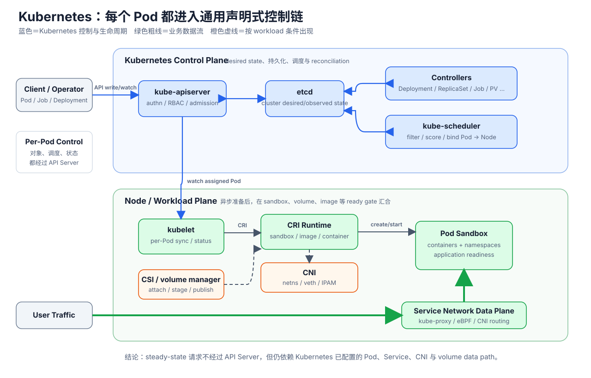
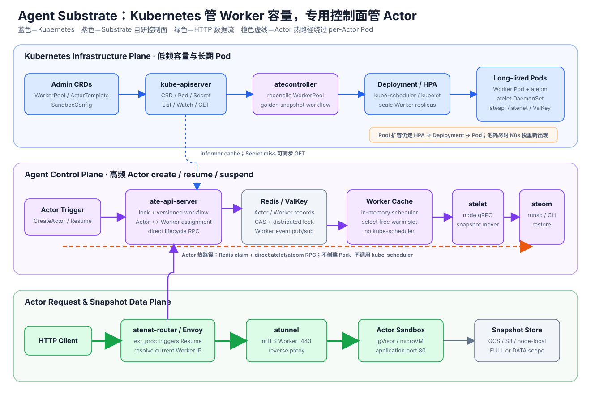
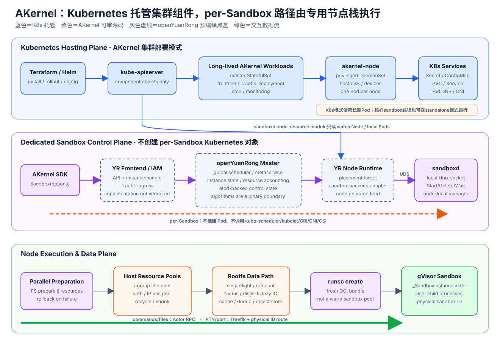
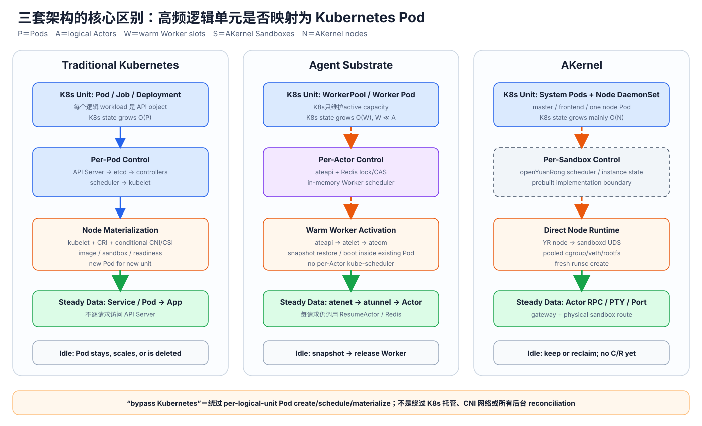

# Kubernetes、Agent Substrate 与 AKernel：Control Plane、Data Plane 与 Kubernetes Bypass 源码级架构对比

> 调研时间：2026-08-04 17:33:36（Asia/Shanghai）  
> 文档时间戳：20260804T093336Z  
> Agent Substrate commit：`cbdeb7dbe003a55a16960a301bc595d9aa38b1ad`  
> AKernel commit：`5684c858cd835db053adef1265419af64e67bd04`  
> sandboxd submodule：`60e6a33e1f2b1ae04c10586c238f6d0200d0c315`  
> distill-fs submodule：`5f3d6d3979a4ed76d4bb6722d7c1ce6db7126634`  
> Kubernetes 证据：官方文档，访问时间 2026-08-04  
> 方法：固定版本源码用于判断当前实现；architecture/README用于判断设计意图；若二者冲突，以源码为准。本次没有部署集群或运行benchmark。

## 1. 结论摘要

### 1.1 三套架构解决的不是同一层问题

三者最本质的差异是：**一个高频逻辑执行单元是否被映射成 Kubernetes Pod**。

| 系统 | 高频逻辑单元 | Kubernetes直接管理的执行单元 | 高频创建/激活由谁完成 |
|---|---|---|---|
| 传统 Kubernetes | Pod / Job中的Pod | 每个Pod | API Server、etcd、controllers、scheduler、kubelet、runtime |
| Agent Substrate | logical Actor | 预热Worker Pod，数量为active capacity | ateapi + Redis + Worker cache + atelet/ateom |
| AKernel | Sandbox / openYuanRong instance | 长期master/frontend/node Pod | openYuanRong专用控制面 + sandboxd |

如果记：

- `P`：Kubernetes Pods；
- `A`：Substrate logical Actors；
- `W`：Substrate warm Worker slots；
- `S`：AKernel Sandboxes；
- `N`：AKernel nodes；

那么控制对象规模大致是：

~~~text
Traditional Kubernetes:
  Kubernetes dynamic state = O(P)

Agent Substrate:
  Kubernetes dynamic capacity state = O(W)
  Substrate Actor state = O(A)
  目标关系：W << A

AKernel in Kubernetes mode:
  Kubernetes long-lived node/component state ≈ O(N)
  openYuanRong/sandboxd state = O(S)
~~~

这不是说 Substrate 或 AKernel 消灭了控制状态；它们把高频状态移进更窄的专用控制面。

### 1.2 Kubernetes 的准确定位

Kubernetes 是一个通用、声明式 workload control plane：

- API Server提供统一对象接口和访问控制；
- etcd持久化cluster state；
- controllers把observed state收敛到desired state；
- scheduler为未绑定Pod选择Node；
- kubelet、CRI、CNI、CSI把Pod spec物化到节点；
- Service、EndpointSlice、Ingress/Gateway、NetworkPolicy和storage plugin建立运行期数据通路。

Pod已经Ready后，普通HTTP/RPC请求通常**不会逐请求经过API Server、etcd、scheduler或controller**。流量走已经建立的Pod network、Service规则、Ingress/proxy和application process。

所以本文中的“绕过 Kubernetes”只表示绕过：

- per-execution API object创建；
- per-execution scheduler placement；
- per-execution kubelet/CRI/CNI/CSI materialization；
- per-execution status/routing convergence。

它不表示传统 Kubernetes 把每个业务请求送到API Server。

### 1.3 Agent Substrate 的准确定位

Agent Substrate 是 Kubernetes 上方的第二套 Actor control plane：

- Kubernetes管理ActorTemplate、WorkerPool、SandboxConfig和长期Worker Pods；
- atecontroller把WorkerPool reconcile成Deployment；
- Kubernetes scheduler和kubelet只负责创建/维持Worker capacity；
- ateapi把Actor、Worker assignment、snapshot metadata放在Redis/ValKey；
- Resume从内存Worker cache选择一个已运行Worker；
- ateapi直接调用atelet，atelet再通过Unix socket调用Worker Pod内ateom；
- ateom用gVisor或Cloud Hypervisor启动、checkpoint或restore sandbox；
- atenet/Envoy和atunnel按Actor identity路由HTTP请求。

它绕过的是per-Actor Pod lifecycle，不是Kubernetes基础设施：Worker Pods、Pod IP、CNI network、NetworkPolicy、Service、Secret、certificate projection和capacity scale仍依赖Kubernetes。

### 1.4 AKernel 的准确定位

AKernel在Kubernetes集群模式下同样采用二级控制面：

- Kubernetes管理master StatefulSet、frontend/Traefik Deployment、privileged node DaemonSet、etcd、Service、Secret和ConfigMap；
- Python SDK通过openYuanRong native instance API提交Sandbox；
- openYuanRong frontend/master/global scheduler选择node；
- node runtime通过本地Unix socket调用sandboxd；
- sandboxd直接准备rootfs、cgroup、veth/IP和OCI bundle，再调用`runsc create`；
- 每个Sandbox不是Kubernetes Pod，不经过kube-scheduler、kubelet、CRI、通用CNI或CSI。

但必须保留源码边界：openYuanRong 0.9.1 runtime/control plane以预编译tarball下载，核心scheduler、queue、instance transaction和failure recovery不在AKernel仓库。AKernel当前可以源码证明的是SDK adapter、部署接线、sandboxd节点路径和data path，不能虚构openYuanRong内部算法。

### 1.5 最简短的横向判断

| 判断 | Kubernetes | Agent Substrate | AKernel |
|---|---|---|---|
| 通用性 | 最高 | Agent/Actor专用 | Agent Sandbox专用 |
| per-unit Kubernetes object | 是 | 否；Actor在Redis | 否；Sandbox在YR/sandboxd |
| 完整warm execution slot | 可自行构建warm Pod pool | 是，WorkerPool | 当前没有；只池化部分host resources |
| idle execution state | Pod继续占资源或由应用持久化后删除 | snapshot后释放Worker | keep或reclaim；当前无公开execution C/R |
| 高频scheduler可审计 | kube-scheduler开源 | Worker cache scheduler开源 | openYuanRong scheduler不可审计 |
| 节点执行路径 | kubelet→CRI→runtime | atelet→ateom→runtime | YR node→sandboxd→runsc |
| 最成熟能力 | 治理、恢复、生态、异构plugin | Actor multiplex与snapshot wake | direct node path、资源池、rootfs data path |
| 最大当前缺口 | per-Pod control cost和通用链路方差 | early、HA/一致性/身份/GC等未完成 | 控制面黑盒、无full warm pool、无C/R/remap |

## 2. 本文如何定义 Control Plane 与 Data Plane

### 2.1 不能只做二元划分

如果把所有node component都称为data plane，会混淆kubelet、CRI、CNI和CSI的控制职责。本文采用四层模型：

| 层 | 定义 | 典型组件 |
|---|---|---|
| Cluster control plane | 保存逻辑对象、做全局placement和lifecycle decision | API Server、etcd、controllers、scheduler、ateapi、Redis、openYuanRong master |
| Node actuation plane | 把全局决定变成节点上的runtime/network/storage状态 | kubelet、CRI runtime、atelet、ateom、sandboxd、runsc |
| Workload request data plane | 处理用户HTTP/RPC/terminal/packet | Service/Ingress、Envoy、atunnel、Traefik、Actor RPC、application |
| State/artifact data plane | 传输rootfs、snapshot、volume和artifact bytes | OCI registry、CSI backend、object store、distill-fs、snapshot store |

同一组件可能跨层：

- CNI command负责network setup，但它安装的veth/eBPF/overlay进入packet data path；
- kube-proxy watch Service/EndpointSlice属于node control，它编程的iptables/IPVS/nftables规则属于packet data plane；
- atelet既是node actuator，也是snapshot data mover；
- Traefik既承载API入口，也承载PTY/port-forward数据流。

### 2.2 “依赖 Kubernetes”有五种不同含义

本文分别标记：

1. **Deployment dependency**：组件是不是由Kubernetes Pod/Service/Secret/PVC承载；
2. **Synchronous control dependency**：一次create/resume是否同步访问API Server或等待scheduler/kubelet；
3. **Asynchronous truth dependency**：是否依赖Kubernetes informer/watch缓存和后台reconcile；
4. **Packet/data dependency**：请求是否经过Kubernetes配置的Pod IP、CNI、Service或Ingress；
5. **Recovery/capacity dependency**：扩容、Pod替换、node failure是否仍交给Kubernetes。

“热路径绕过Kubernetes”通常只否定第2项，并不自动否定其他四项。

### 2.3 完成语义必须统一

三套create API的返回含义不同：

| 操作 | 返回时保证什么 |
|---|---|
| Kubernetes `POST Pod` | API object已接受/持久化；通常尚未Running/Ready |
| Substrate `CreateActor` | SUSPENDED Actor record已创建；尚无Worker和application process |
| AKernel `Sandbox()` | openYuanRong instance可以响应`ping`；不等于任意用户service ready |

所以架构和性能比较应使用统一终点：

~~~text
request submitted
  → logical object accepted
  → placement/capacity acquired
  → sandbox/runtime ready
  → application ready
  → first useful response completed
~~~

## 3. 四张架构图

### 3.1 Kubernetes control/data plane

图的关键是：Pod创建经过声明式控制链；Pod Ready后的普通流量不访问API Server，但仍走Kubernetes准备的网络和storage data path。

### 3.2 Agent Substrate control/data plane

图的关键是：Kubernetes负责Worker capacity cadence，Redis/ateapi负责Actor cadence。Actor request/wakeup绕过per-Actor Pod，但仍运行在Kubernetes Worker Pod和CNI network之上。

### 3.3 AKernel control/data plane

图的关键是：Kubernetes只看到长期AKernel components；每个Sandbox由openYuanRong和sandboxd直接创建。灰色虚线明确标识了不可从AKernel仓库审计的openYuanRong核心。

### 3.4 三套高频路径对齐

这张图中的橙色虚线不是“完全不依赖Kubernetes”，而是“逻辑Actor/Sandbox不会再次创建Pod”。

## 4. 传统 Kubernetes 完整架构

### 4.1 Cluster control plane

#### kube-apiserver

API Server是所有Kubernetes object操作的统一入口：

- TLS和authentication；
- authorization/RBAC；
- admission、quota、policy与validation；
- REST create/get/list/watch/update/delete；
- exec/log/attach/port-forward等subresource；
- 向etcd持久化serialized object state。

正常controller、scheduler和kubelet通过API Server交互，不直接让业务请求访问etcd。

#### etcd

etcd保存Kubernetes API state：

- workload desired/observed metadata；
- Pod spec/status；
- Deployment/ReplicaSet/Job；
- Service/EndpointSlice；
- ConfigMap/Secret/PVC/PV；
- Lease和其他API objects。

etcd不是container filesystem、image registry或application database；业务数据通常不放在Kubernetes etcd。

#### controllers

Controller通过list/watch/cache/workqueue/reconcile让observed state趋近desired state。例如：

~~~text
Deployment desired replicas
  → Deployment controller manages ReplicaSet
  → ReplicaSet controller creates/deletes Pods
  → EndpointSlice controller projects ready endpoints
~~~

这些是多个异步control loops，不是一个进程内同步函数调用栈。

#### kube-scheduler

Scheduler只处理未绑定Pod：

1. 过滤不满足resource、affinity、taint、volume等条件的nodes；
2. 对feasible nodes打分；
3. 选择node并通过API Server执行binding。

它不启动container、不配置CNI，也不参与已运行application的每个请求。显式设置`nodeName`等特殊路径可绕过常规scheduler。

### 4.2 Node control与actuation

#### kubelet

kubelet持续把分配到本node的Pod spec与实际runtime state对齐：

- pod worker / SyncPod；
- image与container lifecycle；
- volume desired/actual state；
- startup/liveness/readiness probe；
- restart与termination；
- Pod/Node status和Lease。

kubelet是node reconcile agent，不是application request proxy。

#### CRI

CRI是kubelet到container runtime的gRPC接口：

- `RunPodSandbox`；
- image pull/status；
- create/start/stop/remove container；
- exec/attach/port-forward；
- runtime/container status。

containerd或CRI-O再调用OCI runtime、snapshotter和CNI。CRI不是API Server直接调用runtime的协议。

#### CNI

CNI负责Pod sandbox network setup/teardown：

- netns、veth；
- IPAM；
- route、overlay/underlay；
- implementation-specific eBPF或network policy。

创建后每个packet不会重新执行一次CNI ADD。Packet走CNI已建立的kernel/eBPF/overlay data path。`hostNetwork`等路径又可能绕过普通CNI setup。

#### CSI

CSI可能涉及：

~~~text
controller side:
  provision / ControllerPublishVolume

node side:
  NodeStageVolume / NodePublishVolume
~~~

CSI lifecycle完成后，application read/write走mount、block、network FS或FUSE data path，不会每次I/O重新调用CSI controller。没有PVC/外部volume的Pod不支付完整CSI路径。

### 4.3 Workload request data plane

#### Pod IP直连

~~~text
client Pod
  → CNI-established network / kernel
  → destination Pod IP
  → application socket
~~~

API Server、etcd、scheduler和controllers不逐请求参与。

#### ClusterIP Service

控制路径：

~~~text
Service + EndpointSlice objects
  → kube-proxy or eBPF agent watches API
  → program node forwarding rules/maps
~~~

数据路径：

~~~text
packet to ClusterIP
  → iptables/IPVS/nftables/eBPF
  → selected Pod IP
  → application
~~~

常见Linux模式中，kube-proxy进程不是逐packet userspace proxy；它编程kernel规则。实现也可以完全替换kube-proxy。

#### Ingress/Gateway/service mesh

Ingress/Gateway resource经controller转换为load balancer/proxy config。普通请求走：

~~~text
external LB / Ingress proxy
  → Service or Pod
  → application
~~~

Service mesh sidecar/ambient proxy可能位于每个request路径，但它属于workload/network data plane，不代表请求经过kube-apiserver。

### 4.4 典型Pod创建路径

Deployment路径：

~~~text
client / autoscaler
  → API Server + admission + etcd
  → Deployment controller
  → API Server + ReplicaSet
  → ReplicaSet controller
  → API Server + Pod
  → kube-scheduler bind
  → kubelet
      ├─ volume preparation / CSI（条件性）
      ├─ CRI RunPodSandbox → CNI（条件性）
      ├─ image/rootfs
      ├─ Create/Start containers
      └─ probes/status
  → EndpointSlice / Service data-plane convergence（条件性）
  → application Ready
~~~

不同Pod和不同controller可以并发流水，单Pod仍需在volume、sandbox/network、image、init和readiness gate汇合。

Direct Pod POST跳过Deployment/ReplicaSet controllers，但仍通常保留：

- API persistence/admission；
- scheduler/binding；
- kubelet/CRI；
- condition-specific CNI/CSI/image；
- status/readiness/routing convergence。

### 4.5 Warm Pod exec与Pod内daemon

对已经运行的Pod执行`pods/exec`：

~~~text
client
  → API Server exec subresource
  → kubelet
  → CRI Exec
  → child process inside existing container
~~~

它不重新调度Pod，也不重新配置CNI/CSI，但exec连接仍经过Kubernetes management path。

如果client直接调用Pod内常驻daemon，则连exec API也不需要：

~~~text
client → application daemon → child process/tool
~~~

Substrate和AKernel都更接近后一类“长期host + 专用daemon”，只是host和logical object抽象不同。

### 4.6 Steady state仍有后台Kubernetes活动

即使业务请求不进API Server，仍可能有：

- kubelet sync、PLEG、probe和restart；
- Pod/Node status与Lease；
- EndpointSlice、Service、NetworkPolicy、Ingress config更新；
- kube-proxy/CNI agent同步规则；
- HPA/VPA/rollout；
- ConfigMap/Secret projected volume刷新；
- CSI health、expand、attach/mount reconciliation。

所以控制面短时不可用时，已有Pod和已有network rules可能继续服务，但新建、healing、reschedule和config propagation会退化。Kubernetes没有对所有plugin/topology给统一SLA。

### 4.7 Kubernetes架构的核心取舍

优势：

- durable API objects、watch、owner reference和finalizer；
-成熟RBAC/admission/quota/audit；
-通用scheduler和autoscaling；
- CRI/CNI/CSI生态；
- controller自动补偿故障；
- declarative rollout与self-healing。

成本：

-一个逻辑执行单元通常对应多个API object和controller transition；
-高并发burst共享API Server、etcd、workqueue、scheduler、kubelet、runtime、CNI和storage；
-eventual convergence增加tail latency和方差；
-通用语义比专用Actor wake路径更宽。

## 5. Agent Substrate 完整架构

### 5.1 双控制面，而不是“替代 Kubernetes”

Agent Substrate明确把控制分成两种时间尺度：

~~~text
Kubernetes infrastructure plane
  slow / coarse / durable configuration
  WorkerPool, ActorTemplate, SandboxConfig
  Deployment, Worker Pod, atelet, Services, certificates

Substrate Actor plane
  fast / fine / high-churn lifecycle
  Actor, Worker assignment, lock, version, snapshot metadata
  Redis/ValKey + ateapi workflows
~~~

所有Substrate组件仍作为Kubernetes workloads运行。“beside Kubernetes”表示专用Actor control plane和Kubernetes control plane并列协作。

### 5.2 Kubernetes负责的部分

#### CRD和低频声明配置

- `ActorTemplate`：OCI containers、sandbox class、snapshot policy、selector和environment；
- `WorkerPool`：replicas、Pod resources、node placement、ateom image和sandbox class；
- `SandboxConfig`：gVisor/microVM runtime binary、kernel、firmware等assets。

Actor、Atespace、Worker assignment和ActorSnapshot不是Kubernetes CRD，而是Substrate database records。

#### atecontroller仍是Kubernetes controller

atecontroller使用controller-runtime：

- WorkerPool controller把WorkerPool变成Deployment；
- NetworkPolicy controller为Worker boundary生成policy；
- ActorTemplate controller通过Golden Actor的Resume/Warm/Suspend生成golden snapshot。

Golden Actor复用普通WorkerPool，不创建独立Golden Pod。

#### Worker capacity仍走Kubernetes

~~~text
WorkerPool.spec.replicas / HPA
  → atecontroller
  → Deployment replicas
  → kube-scheduler
  → kubelet / runtime / CNI
  → long-running Worker Pod
~~~

WorkerPool扩容不是毫秒级Actor wake的一部分；池耗尽时，Actor request parking也不能保证新Pod在budget内Ready。

#### 其他Kubernetes依赖

- atelet DaemonSet；
- ateapi、atecontroller、atenet、ValKey Deployment/Service；
- Pod/Service DNS和Pod IP；
- CNI network和WorkerPool NetworkPolicy；
- ServiceAccount、Secret、pod certificate和trust bundle projection；
- Kubernetes informer提供Pod/CRD source of truth。

### 5.3 自研高频Actor control plane

#### ate-api-server

ateapi提供：

- Actor/Atespace CRUD；
- Resume/Suspend/Pause/Delete；
- Worker list；
- ActorSnapshot和tag；
- Actor identity相关API。

其内部包含：

- Redis persistence；
- Worker cache；
-专用scheduler；
- versioned Actor/Worker CAS；
- Actor distributed lock；
- step-based lifecycle workflow；
- atelet dialer；
- Kubernetes informer listers。

ateapi启动时必须完成Kubernetes informer首次同步；它不是独立于Kubernetes metadata的自治数据库。

#### Redis / ValKey

Redis保存：

~~~text
actor:<atespace>:<name>
worker:<namespace>:<pool>:<pod>
actor-snapshot:<atespace>:<name>
actor-snapshot-tag:<atespace>:<name>
lock:actor:<atespace>:<name>
~~~

职责包括：

- Actor状态和UID/version；
- Worker Pod投影、IP和assignment；
- snapshot logical identity和physical locator；
-单记录optimistic CAS；
- lifecycle lock；
- Worker Pub/Sub。

Actor与Worker是两个Redis keys；当前assignment不是跨记录原子事务。实现是先CAS Worker、再CAS Actor，并通过后续扫描和workflow重试修复中间状态。

#### Worker cache与scheduler

ateapi从Redis Worker events维护进程内cache。Resume时scheduler从cache中过滤：

- Worker `ACTIVE`；
- assignment为空；
- sandbox class匹配；
- template和Actor selector匹配；
- PAUSED local snapshot node constraint匹配。

这一步不调用kube-scheduler。当前实现复制并线性扫描Worker集合，不能假定大规模下一直O(1)。

### 5.4 Worker、atelet和ateom

#### Worker record来自Kubernetes Pod watch

Worker Pod由Kubernetes创建后，ateapi Pod informer将它异步投影成Redis Worker record。Pod terminating时Worker变为DRAINING；Pod删除时record被清理，仍绑定的Actor可能变为CRASHED。

所以Redis Worker不是独立capacity truth，它是Kubernetes Worker Pod的专用投影。

#### atelet

atelet每node一个DaemonSet，负责：

- runtime asset下载/cache；
- OCI image/bundle准备；
- snapshot下载、上传和压缩；
- node-side volume准备；
-按Worker Pod UID定位目标ateom；
-通过hostPath中的Unix socket直接调用ateom。

ateapi到atelet使用Pod informer定位atelet Pod IP后直接gRPC；atelet到ateom不创建Service。

#### ateom

ateom是Worker Pod中的主sandbox driver：

- gVisor版调用`runsc create/start/checkpoint/restore`；
- microVM版使用Kata + Cloud Hypervisor、virtio-fs和memory snapshot；
-嵌入atunnel server；
-一个Worker同时只激活一个Actor；
-激活前完成readiness和network switch。

Worker是Pod，ateom是Pod内process/container，atunnel是ateom内嵌server；不能把三者画成三个独立Pods。

### 5.5 Actor request data plane

#### Wildcard DNS

Actor没有per-Actor Service或DNS object：

~~~text
<actor>.<atespace>.actors.resources.substrate.ate.dev
  → wildcard CoreDNS template
  → fixed atenet-router Service
~~~

DNS controller后台仍查询Kubernetes Services并更新CoreDNS/kube-dns ConfigMap。

#### atenet-router / Envoy

每个HTTP请求：

1. Envoy ext_proc从Host解析ActorRef；
2. request进入bounded parking lot；
3. router调用ateapi `ResumeActor`；
4. ateapi返回当前Worker Pod IP；
5. Envoy设置ORIGINAL_DST为`WorkerIP:443`；
6. 请求通过mTLS到atunnel。

即使Actor已经RUNNING，每个请求仍调用ResumeActor。它绕过Kubernetes API，却没有绕过ateapi和Redis。

#### atunnel

atunnel验证：

- router mTLS identity；
-原始Host对应当前active Actor；
-当前Worker只接受该Actor。

随后把请求代理到gVisor private veth IP或microVM guest interaction IP的port 80。业务HTTP可以并发；lifecycle lock不是Ray式request mailbox。

### 5.6 Actor lifecycle路径

#### Create

~~~text
CreateActor
  → validate ActorTemplate from informer cache
  → Redis SETNX Actor record
  → STATUS_SUSPENDED
~~~

没有Pod、Worker、application process或kube-scheduler。

#### Running request

~~~text
Client → atenet → ResumeActor
  → Redis lock/GetActor
  → ActorTemplate informer cache
  → status already RUNNING
  → return current Worker IP
  → atunnel → Actor
~~~

#### Suspended resume

~~~text
atenet → ateapi ResumeActor
  → Redis Actor lock
  → Redis Actor + snapshot metadata
  → in-memory Worker scheduler
  → Redis CAS claim Worker
  → Redis CAS Actor = RESUMING
  → direct gRPC atelet
  → object store snapshot + OCI/runtime preparation
  → UDS ateom Restore/Run
  → readiness + atunnel Activate
  → Redis Actor = RUNNING
  → return Worker IP
~~~

#### Suspend

~~~text
SuspendActor
  → Actor lock + status SUSPENDING
  → atelet → ateom checkpoint
  → snapshot bytes to object store
  → immutable ActorSnapshot metadata in Redis
  → clear Worker assignment and Actor location
  → STATUS_SUSPENDED
~~~

FULL scope保存runtime state；DATA scope只保存durable data并在恢复时cold boot。Pause使用node-local snapshot并限制下一次placement locality。

### 5.7 明确绕过的Kubernetes步骤

- 不创建per-Actor Pod/Deployment/Job；
- 不为Actor创建Service/EndpointSlice；
- Actor state不写Kubernetes etcd；
- Actor placement不调用kube-scheduler；
- Actor resume不等待kubelet创建Pod sandbox；
- 不为每次Actor activation重新调用CNI；
- atelet到ateom使用hostPath UDS，不需要Service；
- router到Worker使用Pod IP和atunnel，不更新per-Actor Kubernetes route。

### 5.8 仍在热路径或后台依赖Kubernetes的部分

#### 热路径读取本地informer cache

Resume读取ActorTemplate；fresh boot还读取WorkerPool、SandboxConfig；dialer用Pod informer定位Worker和atelet。它们通常不发live API request，但cache来源是Kubernetes watch。

#### Secret cache miss

ActorTemplate env使用`secretKeyRef`时，30秒cache miss/expire会同步执行Kubernetes Secret GET。这是最明确的live kube-apiserver resume依赖。

#### Bearer token模式

默认router manifest使用mTLS。若使用Kubernetes ServiceAccount bearer token，当前JWT verifier可能每次做OIDC discovery/JWKS fetch，重新引入issuer网络依赖。

#### 后台reconcile

- Worker Pod add/delete投影；
- atenet router周期List ActorTemplates和Kubernetes `/version` health；
- DNS controller周期查询Service、更新CoreDNS ConfigMap；
- certificate/Secret projection；
- WorkerPool/HPA capacity scale。

### 5.9 State/artifact data plane

Redis只保存metadata和locator，不保存大snapshot bytes。真正数据路径是：

~~~text
ateom checkpoint
  → atelet compress/upload
  → GCS or S3 object storage
  → manifest published last

resume:
  object store
  → atelet download
  → runtime restore / demand paging
~~~

Object storage latency、OCI cache、snapshot size和runtime restore仍在cold resume关键路径，绕过Kubernetes不会消除它们。

### 5.10 当前实现边界

- architecture开头明确大量内容仍是aspirational；
- Actor/Worker跨key assignment不是原子事务；
- external volume plugin仍是mock；
- snapshot GC未实现；
- Actor identity authorization绑定不完整；
- scheduler当前线性扫描；
- Worker event Pub/Sub依赖periodic relist修复；
- Worker loss通常把active Actor标为CRASHED，不会自动从snapshot重新拉起；
- 100ms p95、10亿Actors是North Star，不是benchmark结果；
- autoscaling依赖外部Kubernetes HPA/metrics，不是Substrate内部闭环。

## 6. AKernel 完整架构

### 6.1 两种部署形态

AKernel README和bootstrap支持：

- standalone：单机all-in-one，openYuanRong master/node和sandboxd本地运行；
- Kubernetes cluster：长期master/frontend/node/etcd/Traefik组件由Helm部署。

因此AKernel核心sandboxd并非概念上必须依附Kubernetes。但本文与Substrate对比时主要分析Kubernetes cluster mode，因为这才涉及“哪些依赖K8s、哪些bypass K8s”。

### 6.2 Kubernetes负责的部分

#### 长期workloads

Helm chart创建：

- master StatefulSet；
- frontend Deployment或OpenKruise CloneSet；
- Traefik Deployment/Service；
- akernel-node privileged DaemonSet；
- etcd StatefulSet/Service；
- monitoring components；
- ConfigMap、Secret、component TLS和image pull secret；
- optional PVC/ephemeral PVC或hostPath。

Kubernetes负责这些组件的placement、restart、rollout、Pod networking和Service discovery。

#### privileged node Pod

akernel-node每node一个，内部运行：

- openYuanRong node runtime；
- sandboxd；
- distill-fs和image helpers；
- gVisor runsc；
- OTEL collector等node services。

它是privileged container，mount host disk、shared memory、config和Secret。Sandbox在这个长期Pod/host context内创建，不是新的Kubernetes Pod。

#### Node/Pod watch

node ServiceAccount的ClusterRole只有Nodes/Pods `get/list/watch`。sandboxd resource manager：

- list/watch local Node；
- list/watch调度到该Node的Pods；
-计算Kubernetes已分配resource；
-把available CPU/memory通过`/var/run/resource.sock`提供给openYuanRong external collector。

所以per-Sandbox路径不创建Kubernetes对象，但cluster capacity view仍异步依赖kube-apiserver。

### 6.3 openYuanRong专用控制面

可观察路径：

~~~text
AKernel SDK
  → Traefik
  → openYuanRong frontend / IAM
  → master / metaservice / global scheduler
  → selected node runtime
  → unix:///run/sandboxd/sandboxd.sock
  → sandboxd Start
~~~

AKernel SDK：

1. 初始化`yr` client、token和TLS；
2. 构造InvokeOptions：CPU、memory、limits、idle/schedule timeout、rootfs、mount、port、name、node affinity；
3. 调`_SandboxInstance.options(...).invoke()`；
4. 等待`ping`；
5. 查询real/physical instance ID。

不可从AKernel仓库证明：

- global scheduler filter/score/queue；
- fairness、preemption和batch；
- instance registry transaction；
- etcd object layout和write amplification；
- resource reservation与rollback；
- logical→physical identity generation；
- master/node failure recovery；
- idle timeout precise semantics；
- client 0.7.51与runtime 0.9.1 protocol compatibility implementation。

这些都属于openYuanRong预编译边界，而不是AKernel已开源实现。

### 6.4 sandboxd node actuation plane

sandboxd public API包含：

- Start；
- Delete；
- Wait；
- List；
- Stats；
- ListAvailableRuntimes。

当前没有Pause/Resume/Fork/Checkpoint/Restore。

Start路径：

~~~text
validate request + Reserve Sandbox ID
  → parallel
      ├─ fsMgr.Prepare(rootfs, mounts)
      └─ prepareStartResources
           → parallel
               ├─ cgroup allocate
               └─ veth/IP allocate
  → join / rollback on error
  → construct OCI/runtime request
  → runtime handler StartSandbox
  → optional DNAT
  → commit FS and metadata
  → return physical Sandbox ID
~~~

这是显式、窄、节点本地的imperative path，不依赖Kubernetes controller收敛。

### 6.5 Host resource与rootfs data plane

#### cgroup pool

-启动时预填idle pool；
-fast path从queue pop；
-删除Sandbox后recycle；
-达到max时ResourceExhausted；
-后台grow/shrink。

CPU可见路径转换成cgroup shares，memory转换成hard limit。所有Sandbox child processes共享Sandbox cgroup，没有per-command cgroup。

#### veth/IP pool

-预创建veth/IP；
-fast allocate/recycle；
-删除pacing避免RTNL contention；
-达到max fail-fast。

这是host network resource pool，不是完整network namespace或warm sandbox pool。

#### rootfs reuse

-相同RootfsConfig并发首次materialization合并；
-backend/mount使用refcount；
-默认Python EROFS rootfs烘焙到node image；
- Nydus/distill-fs提供lazy read、chunk cache、dedup和peer方向；
-普通OCI fallback仍可能完整fetch/extract。

Image/rootfs不是per-Sandbox CSI volume。Kubernetes只负责node Pod自身的hostPath/PVC；sandboxd直接建立内部rootfs和mount。

#### fresh runsc

每次Start仍创建：

- Sandbox metadata和OCI bundle；
- writable memory overlay；
- runsc sandbox/gofer/control socket；
- runtime/actor process；
- sandbox network；
- optional DNAT。

当前代码每Sandbox执行新的`runsc create`。它没有Substrate式完整warm Worker slot，也没有golden process-memory restore。

### 6.6 AKernel request/data paths

#### Small command和filesystem RPC

~~~text
SDK Commands/Filesystem
  → openYuanRong instance handle
  → _SandboxInstance method.invoke
  → subprocess.run/Popen or file operation
  → result via yr.get
~~~

Sandbox创建后，这条路径不调用Kubernetes或sandboxd Exec。`_SandboxInstance`保存`_cwd`和`_procs`内存map，属于incarnation-local actor state。

#### PTY和大文件copy

PTY和large copy通过frontend `/terminal/ws`以及physical instance ID：

~~~text
SDK WebSocket
  → Traefik / frontend
  → physical Sandbox route
  → terminal or copy stream
~~~

它们不经过`_SandboxInstance` method queue，也不经过Kubernetes exec subresource。

#### Port forwarding

SDK在create时声明ports；请求通过gateway按Sandbox ID/port路由。具体frontend/router实现位于openYuanRong binary边界，但可见API不是per-Sandbox Kubernetes Service。

#### Rootfs reads

~~~text
Sandbox page/file access
  → overlay/rootfs mount
  → local EROFS / Nydus / distill-fs
  → cache / peer / object storage or OCI registry
~~~

这是AKernel很重要的artifact data plane，和control-plane create latency必须分开测量。

### 6.7 明确绕过的Kubernetes步骤

- 不创建per-Sandbox Pod/Job/Deployment/CRD；
- 不调用kube-scheduler为Sandbox placement；
- 不让kubelet为Sandbox执行SyncPod；
- 不通过CRI创建Sandbox；
- 不调用通用CNI为每个Sandbox创建Pod network；
- 不通过CSI为每个Sandbox发布rootfs/mount；
- 不为每个Sandbox创建Service/EndpointSlice；
- Sandbox command不使用`pods/exec`；
- sandboxd直接调用runsc并管理cgroup/veth/rootfs。

### 6.8 仍依赖Kubernetes的部分

#### 集群承载

master、frontend、etcd、Traefik和node Pod的可用性、placement、rollout、network和Secret依赖Kubernetes。

#### Packet path

SDK首先访问Traefik/frontend Kubernetes Service；frontend到node以及Pod IP通信依赖Kubernetes/CNI提供的cluster network。Sandbox内部veth由sandboxd管理，但外层node Pod和gateway仍位于Kubernetes network。

#### Capacity truth

sandboxd持续watch Node/Pods，并把可调度capacity暴露给openYuanRong。API Server短时不可用时cache可能继续使用，但Node/Pod变化无法及时同步。

#### Node lifecycle和cluster scale

node DaemonSet是否存在、node加入/离开、cloud node provisioning、host disk/PVC和component recovery仍由Kubernetes/cloud承担。

#### Governance

Kubernetes RBAC只看长期component objects；内部Sandbox不天然成为Kubernetes policy/quota/audit object。AKernel必须自己补tenant admission、resource accounting、image/mount allowlist、identity、network policy和audit。

### 6.9 State、idle与failure边界

AKernel当前：

- public `Sandbox.id`是physical ID；
- optional name/detached提供有限lifetime语义；
- `_SandboxInstance` state是Python heap内的cwd和Popen表；
- CommandHandle是instance handle + PID；
- filesystem writable overlay不作为execution snapshot发布；
- idle timeout被传给openYuanRong，但判定和动作不可审计；
- sandboxd没有execution C/R接口；
- daemon `Restart=always`不等于Actor/Sandbox state恢复；
- README中的fork launch和checkpoint/restore标为planned。

所以当前AKernel绕过Kubernetes后补回了专用placement入口、node actuation和resource pools，但尚未补齐Substrate Actor那种logical identity、snapshot lineage、Worker remap和request-triggered wake。

## 7. 统一职责矩阵：到底是谁在控制什么

下表把“组件是否跑在Kubernetes里”和“每个逻辑执行单元是否由Kubernetes控制”分开。前者是部署关系，后者才是本文讨论的per-unit bypass。

| 职责 | 传统Kubernetes | Agent Substrate | AKernel（Kubernetes mode） |
|---|---|---|---|
| 用户API入口 | kube-apiserver；上层平台也可再封装 | ateapi提供Actor API；atenet提供HTTP入口 | Python SDK/openYuanRong frontend；Traefik提供公网入口 |
| 持久控制状态 | etcd中的Kubernetes objects | Actor/Worker/Snapshot在Redis/ValKey；template/pool/config在Kubernetes CRD | openYuanRong/etcd部分不可审计；sandboxd保存节点运行时状态；Kubernetes只保存长期组件对象 |
| 全局placement | kube-scheduler按Pod做filter/score/bind | ateapi从已有Worker cache中为Actor选slot；Worker Pod仍由kube-scheduler放置 | openYuanRong global scheduler选node；内部算法为预编译黑盒；长期node Pod由kube-scheduler放置 |
| capacity scaling | Deployment/StatefulSet/Job controller、HPA/VPA及cluster autoscaler | WorkerPool→Deployment/HPA→Pod；Actor wake本身不扩Pod | node DaemonSet与master/frontend replicas由Kubernetes；内部Sandbox容量由openYuanRong与sandboxd资源视图约束 |
| 节点执行器 | kubelet及volume/network managers | atelet直接调用目标Worker内ateom | openYuanRong node runtime通过UDS调用sandboxd |
| sandbox runtime | CRI runtime→OCI runtime或VM runtime | ateom→gVisor，或Kata/Cloud Hypervisor | sandboxd→gVisor `runsc` |
| 网络setup | kubelet/CRI调用CNI；Service controller与kube-proxy/eBPF agent编程路由 | Kubernetes/CNI先准备Worker Pod network；ateom再准备Actor内部network；不做per-Actor CNI ADD | Kubernetes/CNI准备外层node Pod；sandboxd池化并分配内部veth/IP；不做per-Sandbox CNI ADD |
| 请求路由 | Pod IP、Service、EndpointSlice、Ingress/Gateway | wildcard DNS→atenet/Envoy→Worker Pod IP:443→atunnel→Actor | SDK Actor RPC，或Traefik/frontend→physical Sandbox ID→PTY/copy/declared port |
| rootfs/image | kubelet/CRI image pull、runtime snapshotter；可叠加lazy-pull | atelet准备OCI bundle和runtime assets；Worker仅是承载slot | sandboxd FS manager；EROFS/Nydus/distill-fs/cache/refcount；每次仍fresh `runsc create` |
| volume/storage lifecycle | Kubernetes object + CSI/controller/node plugin（使用外部volume时） | snapshot bytes走GCS/S3；external volume plugin当前仍不完整 | node Pod的PVC/hostPath由Kubernetes；Sandbox rootfs/mount由sandboxd直接管理，无per-Sandbox CSI |
| execution checkpoint | Kubernetes本身不定义通用process checkpoint；由runtime/application扩展 | FULL/DATA snapshot、Suspend/Pause/Resume是Actor一等生命周期 | sandboxd public API当前无checkpoint/restore/pause/resume |
| identity/security | ServiceAccount、RBAC、admission、audit、Secret、NetworkPolicy | Kubernetes保护基础设施；Substrate另做Actor/Atespace和mTLS，但授权边界仍在完善 | Kubernetes保护组件；内部Sandbox tenant policy、quota、audit和network policy需要专用实现 |
| observability | Event、status、metrics、logs和生态系统 | Kubernetes Pod可观测性 + Substrate workflow/runtime metrics | Kubernetes component metrics + openYuanRong/sandboxd/OTEL；跨层trace仍需统一 |
| idle处理 | Pod保留资源；或由上层保存state后scale-to-zero/delete | Suspend/Pause保存snapshot并释放Worker slot；请求触发Resume | SDK传`idle_timeout`给openYuanRong；具体判定与恢复语义不可从当前源码验证 |
| unit failure recovery | controllers重建Pod，但application state需自己恢复 | workflow有retry/CAS；Worker丢失通常使active Actor进入CRASHED，当前不自动恢复 | openYuanRong恢复协议不可审计；sandboxd没有公开execution C/R，node重启后的透明恢复不能由源码证明 |

三个容易混淆的结论是：

1. Substrate和AKernel都没有移除Kubernetes；它们缩小了Kubernetes管理对象的粒度和变化频率。
2. Substrate的完整warm unit是Worker sandbox slot；AKernel当前池化的是cgroup、veth/IP、rootfs materialization等组成部分，不是完整的已创建`runsc` sandbox。
3. Kubernetes的成熟self-healing针对Kubernetes objects；当Actor/Sandbox不再是Pod以后，generation、租约、补偿、审计和tenant policy必须由新控制面重新实现。

## 8. Control path逐步对比

### 8.1 五种操作不能只比较API返回时间

| 操作 | 关键控制步骤 | API返回时的最小保证 | 到first useful response还缺什么 |
|---|---|---|---|
| Kubernetes Deployment create | admission/etcd→Deployment controller→ReplicaSet controller→Pod→scheduler→kubelet | Deployment object已接受；异步创建尚未结束 | placement、node actuation、image/rootfs、network、probe、route和application init |
| Kubernetes direct Pod create | admission/etcd→scheduler→kubelet | Pod object已接受 | placement之后的全部节点与application步骤 |
| Substrate CreateActor | template cache validation→Redis `SETNX` Actor=`SUSPENDED` | logical identity存在 | Worker assignment、snapshot/image、runtime restore/start、readiness和route |
| Substrate ResumeActor | Actor lock→Worker cache schedule→Worker/Actor CAS→atelet→ateom→readiness | 成功时Actor已在一个Worker上RUNNING并返回Worker IP | atenet/atunnel转发以及本次application响应 |
| AKernel Sandbox create | SDK→openYuanRong placement→node UDS→sandboxd FS/resource并行准备→fresh runsc | SDK在create path中等待instance `ping`并取得physical ID | 特定用户service的init/readiness与首个业务请求；openYuanRong内部阶段不可见 |

因此不能拿Kubernetes `POST Pod`、Substrate `CreateActor`和AKernel构造`Sandbox()`的wall time直接画一张柱状图；三者的完成语义不同。公平指标应定义为：

~~~text
TTUA (time to useful answer)
  = client submit
  → admission / identity created
  → placement or slot acquired
  → runtime available
  → application ready
  → first representative request completed
~~~

同时单独报告`T_accept`、`T_place`、`T_runtime`、`T_app_ready`和`T_first_response`，才能解释优化来自哪里。

### 8.2 Kubernetes Deployment与Direct Pod

Deployment路径的“声明式税”来自多个事实的组合，而不是某一个固定RPC：

- 每层controller读取desired/observed state后再写新对象；
- scheduler、kubelet、EndpointSlice和plugin各自通过watch/cache异步推进；
- 高burst时API Server、etcd、workqueue和node runtime共享队列；
- 调用者要等待多个独立状态收敛到Ready；
- 通用admission、policy、quota、affinity、volume和probe语义扩大了关键路径及尾延迟。

Direct Pod减少Deployment/ReplicaSet两级object和controller，但不会自动跳过admission/etcd、scheduler、kubelet、CRI以及条件性的CNI/CSI。因此它是重要baseline，却不等价于Substrate或AKernel的本地imperative path。

### 8.3 Substrate把Create和Activate分离

`CreateActor`只创建SUSPENDED logical record，成本接近metadata transaction。真正activation由`ResumeActor`完成：

~~~text
Redis Actor lock/read
  → in-process Worker cache filter/schedule
  → CAS Worker assignment
  → CAS Actor=RESUMING + Worker location
  → ateapi direct gRPC atelet
  → snapshot/OCI/runtime assets
  → atelet UDS ateom restore/run
  → readiness + atunnel activate
  → Actor=RUNNING
~~~

优化点是复用已经被Kubernetes调度并完成CNI setup的Worker capacity，而且direct RPC携带明确的完成/错误语义；代价是Redis、object store、runtime restore和专用workflow成为新的关键路径。Worker和Actor是不同Redis key，当前不是一个跨key原子提交。

### 8.4 AKernel把Pod materialization换成node-local Start

AKernel cluster mode的visible path是：

~~~text
SDK options/invoke
  → openYuanRong frontend/master/global scheduler
  → selected node runtime
  → /run/sandboxd/sandboxd.sock
  → ReserveID
  → parallel(FS Prepare, parallel(cgroup, veth/IP))
  → OCI request + runsc create/start
  → physical ID + SDK ping
~~~

sandboxd的显式并行、pool和rollback缩短并稳定了node actuation；rootfs singleflight/refcount减少重复materialization。但每个Sandbox仍fresh创建runsc sandbox，所以它优化的是通用Kubernetes链路和host preparation，不等价于“从完整内存snapshot恢复一个warm process”。此外，openYuanRong placement与状态提交阶段不可见，不能把端到端收益全部归因给sandboxd。

### 8.5 关键路径上的同步屏障

| 屏障 | Kubernetes Pod | Substrate Resume | AKernel create |
|---|---|---|---|
| durable metadata write | API Server→etcd，多对象路径可有多次 | Redis Actor/Worker/lock/version，多次操作 | openYuanRong未知；sandboxd主要节点本地 |
| global placement | kube-scheduler | 无；只在现有Worker cache中选slot | openYuanRong scheduler |
| capacity already warm | 不要求 | 必须有free Worker，否则parking/retry或失败 | 要有node resource；只有host子资源池化 |
| runtime create/restore | CRI/runtime create | ateom fresh run或snapshot restore | fresh runsc create |
| network setup | 常见为per-Pod CNI | Worker CNI已完成，Actor内部switch/activate | 外层Pod CNI已完成，内部veth/IP池分配 |
| route convergence | readiness + EndpointSlice/Ingress（按访问方式） | 返回Worker IP并由Envoy ORIGINAL_DST，无per-Actor K8s route | physical ID route；内部实现部分在openYuanRong binary |
| kube-apiserver同步访问 | 是 | 通常否；informer cache，Secret miss例外 | 否；但capacity cache后台watch Node/Pod |

## 9. Workload与state data path逐步对比

### 9.1 运行中请求是否重新进入control plane

| 请求 | 稳态路径 | 每请求重新进入哪套控制面 |
|---|---|---|
| Kubernetes PodIP | client→CNI/kernel→Pod socket | 通常没有 |
| Kubernetes Service/Ingress | LB/proxy/kernel Service rules→Pod | 代理可能在路径；不进入API Server/etcd/scheduler |
| Substrate Actor HTTP | wildcard DNS→atenet/Envoy ext_proc→`ResumeActor`→WorkerIP:443→atunnel→Actor:80 | **是，进入Substrate ateapi/Redis**；不进入Kubernetes API |
| AKernel small command/filesystem | SDK→openYuanRong instance method→sandbox process | 进入openYuanRong Actor/RPC路径；不进入Kubernetes API或sandboxd Exec |
| AKernel PTY/large copy/port | WebSocket/HTTP→Traefik/frontend→physical Sandbox route | 经过专用gateway/router；不使用Kubernetes `pods/exec`或per-Sandbox Service |

Substrate为“请求到来自动唤醒Actor”支付了逐请求`ResumeActor`检查。其优点是router始终拿到当前Worker incarnation，不需要为每个Actor创建/更新Kubernetes Service；缺点是ateapi和Redis可用性会影响已有Actor的新HTTP请求。长连接建立后是否继续服务，则取决于连接是否还需要重新路由。

AKernel的小命令沿openYuanRong Actor方法路径串行化/调度，PTY和大copy为避免方法返回载荷限制而走physical-ID stream path。它们都不经过Kubernetes management API，但外层Traefik/frontend及node Pod网络仍可能是Kubernetes Service/CNI data path。

### 9.2 网络控制与packet forwarding要分开

~~~text
Kubernetes:
  CNI ADD / Service watch / rule programming     [setup/control]
  packet → veth/eBPF/iptables/IPVS → Pod         [data]

Substrate:
  Worker Pod CNI + atunnel activation            [setup/control]
  request → Envoy → Worker Pod IP → atunnel      [data]

AKernel:
  outer node Pod CNI + sandboxd veth allocation  [setup/control]
  request → frontend/node → sandbox veth/runsc   [data]
~~~

“不调用per-unit CNI”只消除了插件执行、IPAM和route setup的activation成本；packet仍必须通过已经存在的network path。Substrate复用Worker Pod IP，AKernel复用长期node Pod/host并在内部自己维护IP池，因此两者都要承担IP回收、stale route、identity绑定和network isolation正确性。

### 9.3 Rootfs、snapshot与业务I/O是另一条data plane

| 系统 | Rootfs/image | Stateful restore | 不能被control-plane bypass消除的成本 |
|---|---|---|---|
| Kubernetes | registry→CRI/runtime snapshotter→mount；实现可lazy pull | Kubernetes无统一process C/R | image bytes、unpack/lazy faults、volume attach/mount、application init |
| Substrate | atelet准备OCI bundle与runtime assets | GCS/S3 snapshot→download/decompress→ateom restore；LOCAL pause受node locality限制 | object-store RTT/throughput、snapshot大小、runtime compatibility、post-restore page faults |
| AKernel | FS manager→local EROFS/Nydus/distill-fs→cache/peer/registry | 当前公开sandboxd接口无execution restore | cold image/rootfs chunk、fresh runsc、writable overlay、application init |

所以“创建控制对象很快”与“第一次import大型Python/模型很快”是两件事。Benchmark必须同时采集control-plane bytes/ops与rootfs/snapshot bytes/page faults。

## 10. Kubernetes依赖矩阵

符号：`强`表示该阶段正常工作直接依赖Kubernetes；`异步`表示依赖已有watch/cache、Pod/CNI/Service状态，但通常不在同步调用栈；`否`表示该阶段的per-unit操作不依赖Kubernetes；`条件`表示取决于配置；`N/A`表示系统本身就是Kubernetes。

| 阶段/故障 | 传统Kubernetes | Agent Substrate | AKernel cluster mode | AKernel standalone |
|---|---|---|---|---|
| 安装与长期组件部署 | 强 | 强：CRD/controller/API/router/Worker均为K8s workloads | 强：master/frontend/node/etcd/Traefik | 否 |
| 每个逻辑unit create | 强：Pod/API/etcd | 否：Redis Actor record；template来自informer cache | 否：openYuanRong+sandboxd；不创建Pod | 否 |
| 每个unit placement | 强：kube-scheduler | 否：Worker cache scheduler；仅Worker capacity预先由K8s调度 | 否：openYuanRong scheduler | 否 |
| 每个unit runtime/network setup | 强/条件：kubelet、CRI、CNI、CSI | 否：atelet/ateom；复用Worker Pod network | 否：sandboxd/runsc/veth；复用node Pod/host | 否 |
| 已运行unit普通请求 | 通常只依赖既有network rules | 异步：atenet/Worker/CNI仍存在；每请求依赖ateapi/Redis，不live-call K8s | 异步：frontend/node Pod/CNI/Service；内部RPC不live-call K8s | 否 |
| idle wake | 需上层另行构建；若重建Pod则强 | 异步/条件：Actor path不调scheduler；informer cache，Secret miss可能live GET | 当前无可验证的C/R wake | 当前无可验证的C/R wake |
| warm capacity扩容 | Deployment/HPA/cluster autoscaler | 强：WorkerPool→Deployment/HPA→Pod | 强：扩node/component；内部Sandbox不建Pod | 外部运维 |
| Worker/node Pod替换 | controller/kubelet | 强：K8s替换Worker/atelet；Actor恢复仍需Substrate | 强：K8s替换node DaemonSet Pod；内部Sandbox恢复语义未知 | systemd/process supervisor |
| kube-apiserver短时不可用 | existing data path可继续；create/heal/config退化 | existing caches和Pods可能继续；watch/Secret miss/capacity变化退化 | existing components可能继续；Node/Pod capacity view变旧，组件healing退化 | 无影响 |

### 10.1 Substrate的依赖是“双层真相”

Kubernetes是Worker Pod是否存在的基础设施真相；Redis是Actor assignment和lifecycle真相。ateapi用Pod informer把前者投影为Worker record。两者短暂不一致时需要version/CAS、relist和workflow补偿。它没有在per-Actor path等待Kubernetes收敛，却不能忽略Kubernetes删掉Worker这一事实。

### 10.2 AKernel的依赖是“外层承载 + capacity observation”

cluster mode下，Kubernetes看见node DaemonSet Pod，却看不见该Pod内部每个Sandbox。sandboxd list/watch local Node和Pods并计算可用CPU/memory，再通过resource socket供openYuanRong使用。这样降低了per-Sandbox API object数量，也产生两层resource accounting问题：Kubernetes只对node Pod做placement，专用scheduler必须避免内部Sandbox与其他host workloads超卖同一资源。

## 11. “Bypass Kubernetes”的四级精确定义

### 11.1 四个彼此独立的级别

| Bypass级别 | 含义 | Substrate | AKernel cluster mode |
|---|---|---|---|
| B1：object bypass | 不为每个unit写Pod/Job/Service/CRD | 是 | 是 |
| B2：scheduler bypass | unit placement不调用kube-scheduler | 是：选已有Worker | 是：openYuanRong选node |
| B3：actuation bypass | 不走kubelet→CRI→per-unit CNI/CSI | 是：atelet→ateom | 是：sandboxd→runsc/veth/FS |
| B4：infrastructure/data bypass | 运行与请求完全不依赖K8s workloads、CNI、Service、Secret、watch或recovery | 否 | cluster mode否；standalone大体是 |

因此准确表述应是：

> Agent Substrate和AKernel cluster mode实现了B1–B3，即绕过per-Actor/per-Sandbox Kubernetes声明、调度与物化路径；它们没有实现B4，仍把Kubernetes用作较粗粒度的基础设施控制面。

### 11.2 对象规模与状态写放大

设logical population分别为`P/A/S`，warm workers为`W`，AKernel nodes为`N`：

~~~text
Kubernetes:
  K8s high-churn objects and status ≈ O(P)

Agent Substrate:
  K8s capacity objects/status ≈ O(W)
  dedicated Actor records/workflows ≈ O(A)

AKernel cluster mode:
  K8s long-lived components ≈ O(N)
  dedicated Sandbox/runtime records ≈ O(S)
~~~

这解释了为什么专用控制面可能更快：Kubernetes不再为每次高频逻辑创建生成Pod spec/status、binding、event、EndpointSlice变化和多个controller观察结果；专用API可以直接执行“claim warm slot→restore→activate”。但总状态没有从`O(A)`或`O(S)`消失，它只是从etcd/Kubernetes watch graph迁移到Redis、openYuanRong和node daemon。

### 11.3 Declarative tax不是“声明式一定慢”

Liu等对serverless实践的观察可以概括为：在高并发细粒度启动下，通用声明对象、持久状态同步和多级reconciliation的固定成本会暴露出来。这里的工程结论不是删除desired state，而是按频率分层：

~~~text
slow/coarse desired state:
  cluster, node, WorkerPool, deployment, policy, certificates
        → Kubernetes

fast/fine lifecycle:
  Actor/Sandbox assignment, wake, command, suspend
        → specialized control plane
~~~

专用imperative RPC还可把错误和rollback放在一个有界workflow中，而不必让调用者观察多个object最终收敛。不过一旦新控制面要跨进程、跨node、跨故障域运行，它仍需要durability、idempotency、generation、lease、retry和reconciliation；否则只是用更快的happy path交换更弱的failure semantics。

### 11.4 没有被bypass掉的工作

- image/rootfs/snapshot bytes仍要读取；
- runtime或VM仍要create/restore；
- application仍要初始化并达到readiness；
- network packet仍要转发和隔离；
- capacity不足仍要扩Worker Pod或node；
- node故障仍要重新placement并恢复state；
- authn/authz、quota、audit、policy和billing仍要执行；
- 专用database和scheduler本身也有CPU、network、持久化和HA成本。

## 12. 架构trade-off

### 12.1 总体矩阵

| 维度 | Kubernetes | Agent Substrate | AKernel |
|---|---|---|---|
| 抽象粒度 | Pod/Job/Service等通用资源 | logical Actor + reusable Worker slot | Sandbox/openYuanRong instance + direct node runtime |
| hot-path宽度 | 最宽，通用admission/schedule/actuation | 窄：Redis workflow + cached slot + direct RPC | 窄：专用placement + node-local preparation + runsc |
| warm启动上限 | 取决于平台是否自建warm pool | 架构内建WorkerPool和golden/snapshot路径 | 当前仅池化host子资源，没有full warm runtime |
| scale-to-zero state | 应用/平台自行实现 | Actor snapshot是一等对象 | 当前执行状态C/R未实现 |
| 通用workload适配 | 最高 | 受Actor HTTP/runtime/snapshot模型约束 | 面向agent command/PTY/filesystem/port，通用性低于Pod |
| consistency可见性 | API conventions、etcd、controller源码完整 | Redis CAS/lock/workflow可审计，但跨key原子性和HA仍不成熟 | sandboxd可审计；openYuanRong核心不可审计 |
| isolation | 多runtime、多plugin、policy生态 | gVisor或microVM；Worker Pod为外层边界 | gVisor；privileged node Pod扩大host-side TCB |
| governance | RBAC/admission/quota/audit成熟 | 基础设施复用K8s；Actor层需补齐 | component层复用K8s；Sandbox层需补齐 |
| failure recovery | controller self-healing成熟，应用state另论 | Actor workflow有补偿；Worker-loss自动恢复不足 | openYuanRong未知，sandboxd无公开C/R/remap |
| 运维复杂度 | 单一但庞大的通用控制面 | Kubernetes + Redis + Substrate双控制面 | Kubernetes + openYuanRong + sandboxd，多层且含binary黑盒 |
| 性能可解释性 | 生态差异大，但组件可观测 | 源码较完整，可分解Actor workflow | node path清晰；端到端scheduler/transaction难归因 |

### 12.2 Kubernetes：用通用语义换较宽路径

Kubernetes最适合需要跨团队标准API、强治理、异构runtime/storage/network和成熟rollout/recovery的场景。它的问题不是稳态packet经过control plane，而是把大量毫秒级、短生命周期执行映射成Pod时，通用对象图和eventual convergence的固定成本可能主导总延迟。

### 12.3 Substrate：最完整的logical Actor/physical Worker分离

Substrate三者中最明确地实现了：

- stable Actor identity与ephemeral Worker location分离；
- create与activate分离；
- Worker capacity与Actor population分离；
- snapshot lineage支撑idle释放与wake；
- router按logical identity触发resume并取得当前incarnation。

它的主要风险是新控制面仍处于早期：Redis跨key一致性、Worker failure、snapshot GC、identity授权、external volume和autoscaling闭环均未达到Kubernetes同等成熟度。每请求进入ateapi也使Redis/ateapi成为业务入口可用性的一部分。

### 12.4 AKernel：node path强，logical lifecycle弱

AKernel当前最扎实的开源部分是sandboxd：host资源池、并行准备、直接runsc、rootfs复用和lazy data path。这些可直接降低node actuation成本。相对薄弱的是跨node control state与stateful lifecycle：

- logical ID没有与physical Sandbox incarnation充分解耦；
- 没有公开checkpoint/restore和Worker remap；
- 没有完整warm runtime slot；
- openYuanRong scheduler/queue/transaction/recovery不可审计。

因此AKernel现阶段更像“为agent优化的快速Sandbox node substrate + 预编译分布式Actor control plane”，而Substrate更像“显式建模logical Actor lifecycle的Kubernetes sidecar control plane”。

## 13. Failure与control-plane outage对比

### 13.1 故障不会因为缩短happy path而消失

| 故障 | Kubernetes | Agent Substrate | AKernel cluster mode |
|---|---|---|---|
| kube-apiserver短时不可用 | 已有Pod和既有转发规则通常继续；新create、binding、healing和config传播停止或退化 | 已有Pod/CNI/cache可继续；Worker watch、template更新、Secret cache miss和capacity scale退化 | 已运行component/Sandbox可能继续；Node/Pod capacity view变旧，K8s component healing和scale退化 |
| etcd不可用 | API写/强一致读不可用；已有workload data path通常不立即停止 | Kubernetes基础设施变更受影响；Actor metadata在Redis，未直接丢失 | Kubernetes对象与openYuanRong自身是否共用/如何使用etcd需按部署确认；二进制内部语义不可审计 |
| Redis/ValKey不可用 | N/A | Actor create/resume/suspend和每请求router resume失败；已建立的直连/长连接可能继续，但新HTTP路由受影响 | N/A |
| kube-scheduler不可用 | 新未绑定Pod不能正常placement；已有Pod继续 | existing free Worker仍可由Substrate分配；新Worker扩容Pod不能placement | existing node Pod内仍可创建Sandbox；新增/替换AKernel component Pod受影响 |
| Worker Pod消失 | Pod controller按desired replicas替换 | K8s可补一个空Worker，但原active Actor通常进入CRASHED；当前不保证从snapshot自动恢复并重放请求 | N/A；最相近的是akernel-node Pod/node消失 |
| ateapi重启 | N/A | Redis保留logical state；内存Worker cache需从watch/Redis重建；in-flight workflow依赖lock/version/retry恢复 | N/A |
| snapshot object store不可用 | 只影响使用该backend的application/platform restore | SUSPENDED Actor的FULL restore、snapshot publish失败；RUNNING Actor的现有内存执行可暂时不受影响 | 当前无execution snapshot；Nydus/distill-fs/registry backend故障可能使未缓存rootfs read失败 |
| openYuanRong master/frontend不可用 | N/A | N/A | 新Sandbox和SDK control/RPC可能失败；Sandbox process是否继续运行与已有stream是否存活需实测，源码不足以给出HA保证 |
| sandboxd或akernel-node Pod重启 | kubelet会重建Pod | N/A | `Restart=always`/DaemonSet只能重建daemon；没有公开checkpoint/remap就不能推出旧Sandbox透明恢复 |
| 物理node永久丢失 | controller重新创建Pod；无外部持久state的进程状态丢失 | Worker和local pause丢失；external snapshot可作为恢复材料，但当前Worker-loss自动恢复不足 | K8s可在别处启动node component；原Sandbox内存/本地overlay丢失，openYuanRong恢复行为不可验证 |
| warm capacity耗尽 | Pending Pod等待capacity/autoscale | parking lot有界等待/重试或`no free workers`；HPA扩Pod是更慢的另一时间尺度 | sandboxd cgroup/veth池可grow但有上限；node resource不足时需openYuanRong换node或扩cluster |

表中“可能继续”只指数据结构和进程没有被故障立即销毁，不是可用性SLA。Service实现、DNS TTL、连接复用、certificate、storage和plugin都可能改变结果，必须用故障注入验证。

### 13.2 专用控制面新增的三个一致性问题

#### logical record与physical incarnation

Substrate显式保存Actor UID/version、status和Worker Pod UID；router每次重新解析当前Worker。AKernel SDK公开的是physical ID，logical name、physical incarnation和失败后的generation没有在开源层形成同等明确的持久模型。没有generation fencing时，迟到的delete/stop/stream可能误作用于新incarnation。

#### assignment与resource reservation

Substrate先更新Worker assignment再更新Actor record，源码中明确处理“进程在两次更新之间crash”的恢复扫描。AKernel sandboxd对节点内FS、cgroup和veth有rollback，但openYuanRong global reservation与node commit是否构成幂等transaction不可见。分布式scheduler必须能区分：请求未到node、node已创建但reply丢失、master已提交但client timeout。

#### capacity truth

Kubernetes scheduler依据Pod requests与Node state；Substrate只在已经存在的Worker集合中做assignment；AKernel把Kubernetes local Pod requests从Node capacity中扣除后报告内部可用资源。后两者都需要处理watch lag、node lease失效、double allocation和stale worker/node record，否则低延迟scheduler可能建立在过期capacity上。

### 13.3 控制面分层后的可用性结论

分层可以隔离部分故障：kube-scheduler不可用时，Substrate仍可使用已有Worker，AKernel仍可使用已有node Pod；kube-apiserver短时不可用时，专用database与node daemon也可能继续工作。但它也叠加了新的故障域：

~~~text
Substrate availability
  = Kubernetes infrastructure
  × Redis/ValKey
  × ateapi/atenet/atelet/ateom
  × snapshot/object store（cold resume时）

AKernel cluster availability
  = Kubernetes infrastructure
  × openYuanRong frontend/master/node/metastore
  × sandboxd/runsc
  × rootfs/artifact backend（cold read时）
~~~

这里的乘号表示依赖关系，不是对独立故障概率的数学假设。

## 14. 对AKernel架构的设计建议

### 14.1 保留Kubernetes作为coarse infrastructure plane

现有方向是合理的：让Kubernetes负责node membership、长期component deployment、Secret/certificate、rollout与machine autoscaling；让AKernel负责高频Sandbox placement和node actuation。没有必要为了证明bypass而重做Kubernetes全部基础设施能力。

需要把边界形成正式contract：

- Kubernetes allocatable与AKernel internal allocatable如何换算；
- node Pod request/limit与内部Sandbox总cgroup limit的关系；
- drain/cordon/eviction如何阻止新Sandbox并迁移旧Sandbox；
- DaemonSet restart前如何quiesce、checkpoint或声明terminal loss；
- Kubernetes NetworkPolicy与内部veth tenant policy如何组合。

### 14.2 将openYuanRong黑盒边界变成可验证模块

论文若把“programmable datacenter-scale scheduler/control plane”作为贡献，至少应公开或替换以下部分：

- Sandbox/Actor durable record schema；
- scheduler filter/score、queue、fairness和admission；
- resource reservation/commit/rollback protocol；
- logical ID→node/physical incarnation mapping；
- generation/lease/fencing；
- master/node/client timeout后的幂等恢复；
- node loss、master failover和metastore outage语义；
- per-stage metrics与trace context。

否则论文能严格归因的贡献主要停留在sandboxd node path和SDK/data path，不能把预编译runtime的行为当作AKernel源码贡献。

### 14.3 分离logical Sandbox/AProc ID与physical incarnation

建议建立：

~~~text
LogicalSandboxID
  ├─ desired spec + tenant + policy
  ├─ lifecycle generation
  ├─ latest durable snapshot/rootfs lineage
  └─ current placement
       ├─ node ID
       ├─ PhysicalSandboxID
       └─ incarnation lease/fencing token
~~~

SDK、PTY、port routing和CommandHandle都应首先解析logical ID，再携带generation访问physical incarnation。旧incarnation的迟到reply、stop和stream必须被fencing拒绝。

### 14.4 增加完整warm slot，而不只池化子资源

当前cgroup/veth/rootfs pool减少了准备时间，但fresh `runsc create`和application init仍在路径。可以分两级池：

1. **host resource pool**：保留现有cgroup、veth、rootfs/refcount；
2. **runtime slot pool**：预创建runsc sandbox/gofer/基础init，按runtime、kernel、rootfs/template分桶。

claim时用generation清理旧state并注入tenant spec；release时执行确定性的scrub。需要同时评估内存常驻、cache污染、side channel和版本组合爆炸，不能把warm pool视为零成本。

### 14.5 增加checkpoint-on-idle与request-triggered wake

若目标是“idle environment快速释放CPU/内存并在新请求到来时返回”，需要一等生命周期：

~~~text
RUNNING
  → QUIESCING
  → SNAPSHOTTING
  → SUSPENDED(snapshot lineage, no runtime allocation)
  → RESUMING(new physical incarnation)
  → RUNNING
~~~

要求至少包括：application quiesce contract、filesystem一致性、snapshot兼容版本、publish-last manifest、失败rollback、concurrent request parking、同一logical Sandbox的singleflight resume，以及恢复后的route原子切换。Substrate的workflow和logical/physical分离可直接作为设计参考，但其跨key一致性和Worker-loss缺口不应照搬。

### 14.6 补齐专用policy、audit与resource accounting

per-Sandbox不是Kubernetes object以后，需要在AKernel API/control plane明确实现：

- tenant authentication与Sandbox-level authorization；
- CPU/memory/rootfs/mount/port/image admission和quota；
- hostPath、device、network egress allowlist；
- immutable lifecycle audit log；
- usage metering与billing attribution；
- global、tenant、node三级backpressure；
- deletion/finalization与artifact GC。

否则性能收益可能以失去Kubernetes已有治理语义为代价。

### 14.7 统一可观测完成语义

每个create/resume请求都应生成一条跨SDK、frontend、scheduler、node、sandboxd、runtime和application的trace，并报告：

~~~text
accepted
scheduled
node_dispatch_started
fs_ready
cgroup_ready
network_ready
runtime_created/restored
application_ready
route_published
first_useful_response
~~~

这既是性能分析基础，也是识别“reply丢失但Sandbox已创建”等分布式灰色失败的必要条件。

## 15. 能否部署并做公平性能对比

### 15.1 结论：可以做原型对比，但要公开实验边界

三者都可以在有root权限的Linux服务器上部署做性能对比：

- Kubernetes baseline可使用单机或多机集群；
- Agent Substrate以Kubernetes为必需基础设施，可先选择gVisor sandbox class；若测Cloud Hypervisor/microVM则host还需`/dev/kvm`、Kata/CH assets和相应权限；
- AKernel可以用standalone，也可以用Helm cluster mode；为了比较“beside Kubernetes”，应优先使用cluster mode，并满足privileged node Pod、runsc、openYuanRong runtime和rootfs backend要求。

但当前源码版本都不是“下载后二进制一键得到生产SLA”的等价产品。Substrate文档明确包含aspirational部分，AKernel的openYuanRong核心是预编译依赖。因此实验应记录commit、镜像digest、kernel、runtime版本、patch和所有失败run，不能只报告成功路径p50。

### 15.2 最小可比的四个system variants

| Variant | 用途 | 应控制的变量 |
|---|---|---|
| K8s direct Pod | 通用声明式baseline；去除Deployment/ReplicaSet额外层 | 同一node、image、runtime、无不必要CSI/sidecar |
| K8s warm Pod + direct daemon | 区分“warm reuse收益”与“自研scheduler收益” | 预建相同数量slot，client直调daemon，不走`pods/exec` |
| Agent Substrate | logical Actor + warm Worker + snapshot wake | WorkerPool容量、sandbox class、snapshot scope、router路径 |
| AKernel | dedicated scheduler + sandboxd + fresh runsc | node数、cgroup/veth pool、rootfs cache、standalone/cluster mode |

若只比较Kubernetes cold Pod、Substrate warm snapshot和AKernel cached rootfs，结果同时混入capacity temperature、runtime和artifact cache三种差异，无法支撑control-plane结论。

### 15.3 两组必须分开的实验

#### A. 已有capacity内的activation

预先固定nodes、Worker slots或host pools，禁用capacity autoscale，测试per-unit create/wake。这回答专用control path能降低多少延迟。

#### B. capacity不足时的expansion

从无free Worker、node资源不足或zero worker/node开始，允许HPA/cluster autoscaler扩容。这回答完整系统在真实burst下何时进入更慢的Kubernetes/machine provisioning路径。

两组不能混成一个平均数，因为Substrate的核心优化正是把Actor activation与Worker capacity expansion分到两个时间尺度。

### 15.4 Workload与矩阵

至少使用四类workload：

1. `noop`：最小process，隔离control/runtime固定成本；
2. Python import：中等rootfs metadata/page-cache压力；
3. stateful counter：验证snapshot、logical identity和failure recovery；
4. large model/data：观察lazy rootfs、snapshot bytes和first-token/first-useful-response。

每类测试：

~~~text
temperature: cold node / warm image / warm rootfs / warm runtime / snapshot
burst:       1 / 10 / 100 / 1000 concurrent units
duration:    short-lived / idle-wake cycles / sustained
failure:     API outage / Redis outage / node loss / object-store delay
~~~

### 15.5 指标

#### 用户可见延迟

- `T_accept`、`T_schedule`、`T_runtime`、`T_app_ready`、TTUA；
- p50/p95/p99/p99.9，不只平均值；
- request parking time、timeout和error rate；
- suspend latency、snapshot publish latency和resume latency。

#### 控制面开销

- API/Redis/openYuanRong request count与bytes；
- etcd/Redis write count、watch events和object数；
- controller/workqueue depth、scheduler queue/scan candidates；
- kubelet/CRI/CNI calls；ateapi→atelet、YR→sandboxd RPC；
- control-plane CPU、RSS、network和disk fsync。

#### 节点与artifact开销

- image/rootfs/snapshot bytes、cache hit ratio和page faults；
- runsc create/restore时间；
- cgroup/veth allocate time与pool miss；
- application CPU/memory working set与idle retained bytes；
- node density、interference和cleanup/GC backlog。

### 15.6 公平性规则

- 使用同一物理机型、kernel、NUMA和CPU frequency policy；
- 尽可能使用同一隔离runtime；若Substrate测microVM而AKernel测gVisor，结果必须分表；
- 固定application image与ready protocol；
- 明确是否包含DNS、TLS、gateway、SDK和首个业务请求；
- 分别报告cache cold/warm；每轮重置方法可复现；
- Kubernetes baseline禁用与其他系统不对等的sidecar/volume，另设“生产配置”组；
- 对Substrate固定`W`并报告pool exhaustion；对AKernel报告各resource pool水位；
- 同时运行K8s warm-daemon baseline，防止把“预热”误归因于Actor API；
- 报告失败、重试、orphan和cleanup时间，不能只保留成功样本。

## 16. 最终判断

### 16.1 一句话架构定位

~~~text
Kubernetes
  = 通用声明式cluster control plane
    + node reconciliation/actuation
    + 由plugin和kernel构成的数据通路

Agent Substrate
  = Kubernetes管理粗粒度Worker capacity
    + Redis/ateapi管理高频logical Actor
    + atelet/ateom直接restore到warm Worker

AKernel
  = Kubernetes管理粗粒度长期components（或standalone完全不用K8s）
    + openYuanRong管理Sandbox placement/RPC
    + sandboxd直接池化host资源并fresh创建runsc sandbox
~~~

### 16.2 哪个系统真正绕过了什么

- Kubernetes没有bypass自己；Direct Pod是缩短声明链，不是离开Kubernetes。
- Agent Substrate在Actor create/resume上绕过per-Actor Pod、kube-scheduler、kubelet、CRI/CNI/CSI和per-Actor Service；Worker capacity、Pod network、Secret/certificate和recovery仍依赖Kubernetes。
- AKernel cluster mode在Sandbox create/command上绕过per-Sandbox Kubernetes object与完整Pod materialization；长期master/frontend/node、外层network、capacity observation和node lifecycle仍依赖Kubernetes。
- AKernel standalone在部署层也可不依赖Kubernetes，但这同时放弃了Kubernetes的component placement、rollout和self-healing，需要由运维或专用系统补回。

### 16.3 对AKernel最重要的比较结论

AKernel不应只把贡献表述为“比Kubernetes少几个RPC”。更有价值的架构论点是：

1. 以长期node substrate承载大量Sandbox，把高频unit lifecycle从`O(S)`个Kubernetes对象移到专用控制面；
2. sandboxd通过并行FS/resource preparation、cgroup/veth pool和rootfs reuse缩短node actuation；
3. Nydus/distill-fs把artifact bytes从create control path解耦成lazy data path；
4. 下一步用logical identity、durable lifecycle、full warm slot和checkpoint-on-idle补齐stateful Agent语义；
5. 用公开可审计的scheduler/transaction/failure model证明专用控制面不仅fast-path快，而且在burst与故障下正确。

Substrate给AKernel最直接的启示不是照搬“Actor”这个名字，而是把logical state、physical slot、snapshot lineage、request wake和route切换设计成一个闭环。AKernel的机会则是把这一闭环与已存在的高效sandboxd/rootfs data plane结合起来。

## 17. 源码证据索引

以下行号针对本文开头固定的commit。链接使用本地相对路径，便于在当前AKernel工作区直接打开。

### 17.1 Agent Substrate

| 结论 | 源码证据 |
|---|---|
| architecture目标、Actor/Worker模型与数据流 | [`docs/architecture.md:1`](../../agent-substrate/substrate/docs/architecture.md#L1)、[`docs/architecture.md:34`](../../agent-substrate/substrate/docs/architecture.md#L34)、[`docs/architecture.md:148`](../../agent-substrate/substrate/docs/architecture.md#L148)、[`docs/architecture.md:298`](../../agent-substrate/substrate/docs/architecture.md#L298) |
| ActorTemplate、WorkerPool、SandboxConfig是Kubernetes CRD | [`actortemplate_types.go:295`](../../agent-substrate/substrate/pkg/api/v1alpha1/actortemplate_types.go#L295)、[`workerpool_types.go:22`](../../agent-substrate/substrate/pkg/api/v1alpha1/workerpool_types.go#L22)、[`sandboxconfig_types.go:21`](../../agent-substrate/substrate/pkg/api/v1alpha1/sandboxconfig_types.go#L21) |
| atecontroller使用controller-runtime，WorkerPool物化为Deployment | [`cmd/atecontroller/main.go:63`](../../agent-substrate/substrate/cmd/atecontroller/main.go#L63)、[`workerpool_apply.go:58`](../../agent-substrate/substrate/cmd/atecontroller/internal/controllers/workerpool_apply.go#L58) |
| ateapi同时接Kubernetes informer、Redis和Actor API | [`cmd/ateapi/main.go:122`](../../agent-substrate/substrate/cmd/ateapi/main.go#L122) |
| Actor/Worker/Resume等API不是Kubernetes API | [`ateapi.proto:23`](../../agent-substrate/substrate/pkg/proto/ateapipb/ateapi.proto#L23)、[`ateapi.proto:161`](../../agent-substrate/substrate/pkg/proto/ateapipb/ateapi.proto#L161)、[`ateapi.proto:218`](../../agent-substrate/substrate/pkg/proto/ateapipb/ateapi.proto#L218) |
| CreateActor只写SUSPENDED record | [`create_actor.go:99`](../../agent-substrate/substrate/cmd/ateapi/internal/controlapi/create_actor.go#L99) |
| Resume从Worker cache选slot，先写Worker再写Actor | [`workflow_resume.go:222`](../../agent-substrate/substrate/cmd/ateapi/internal/controlapi/workflow_resume.go#L222)、[`workflow_resume.go:280`](../../agent-substrate/substrate/cmd/ateapi/internal/controlapi/workflow_resume.go#L280) |
| Resume继续调用node workflow | [`workflow_resume.go:395`](../../agent-substrate/substrate/cmd/ateapi/internal/controlapi/workflow_resume.go#L395) |
| Suspend/checkpoint lifecycle | [`workflow_suspend.go:202`](../../agent-substrate/substrate/cmd/ateapi/internal/controlapi/workflow_suspend.go#L202) |
| 专用scheduler和Worker cache | [`scheduling.go:89`](../../agent-substrate/substrate/cmd/ateapi/internal/scheduling/scheduling.go#L89)、[`workercache.go:37`](../../agent-substrate/substrate/cmd/ateapi/internal/workercache/workercache.go#L37) |
| Redis keys、CAS、lock与persistence | [`ateredis.go:15`](../../agent-substrate/substrate/cmd/ateapi/internal/store/ateredis/ateredis.go#L15)、[`ateredis.go:639`](../../agent-substrate/substrate/cmd/ateapi/internal/store/ateredis/ateredis.go#L639)、[`ateredis.go:756`](../../agent-substrate/substrate/cmd/ateapi/internal/store/ateredis/ateredis.go#L756)、[`ateredis.go:1006`](../../agent-substrate/substrate/cmd/ateapi/internal/store/ateredis/ateredis.go#L1006) |
| fresh boot读取Kubernetes-backed workload spec/Secret | [`workload_spec.go:279`](../../agent-substrate/substrate/cmd/ateapi/internal/controlapi/workload_spec.go#L279) |
| 每个HTTP请求调用ResumeActor并把ORIGINAL_DST设为Worker IP:443 | [`extproc.go:136`](../../agent-substrate/substrate/cmd/atenet/internal/router/extproc.go#L136)、[`extproc.go:167`](../../agent-substrate/substrate/cmd/atenet/internal/router/extproc.go#L167)、[`extproc.go:179`](../../agent-substrate/substrate/cmd/atenet/internal/router/extproc.go#L179)、[`extproc.go:190`](../../agent-substrate/substrate/cmd/atenet/internal/router/extproc.go#L190) |
| atunnel授权并转发到Actor | [`internal/atunnel/server.go:175`](../../agent-substrate/substrate/internal/atunnel/server.go#L175)、[`server.go:230`](../../agent-substrate/substrate/internal/atunnel/server.go#L230) |
| snapshot下载与OCI preparation并行，再通过UDS调用ateom restore | [`cmd/atelet/main.go:519`](../../agent-substrate/substrate/cmd/atelet/main.go#L519)、[`main.go:556`](../../agent-substrate/substrate/cmd/atelet/main.go#L556)、[`main.go:596`](../../agent-substrate/substrate/cmd/atelet/main.go#L596) |
| ateom hostPath socket布局 | [`internal/ateompath/ateompath.go:22`](../../agent-substrate/substrate/internal/ateompath/ateompath.go#L22)、[`ateompath.go:43`](../../agent-substrate/substrate/internal/ateompath/ateompath.go#L43) |

### 17.2 AKernel与sandboxd

| 结论 | 源码证据 |
|---|---|
| standalone/cluster部署与总体入口 | [`README.md:140`](../../akernel/README.md#L140) |
| node镜像下载并打包openYuanRong等预编译runtime | [`builder/node.Dockerfile:9`](../../akernel/builder/node.Dockerfile#L9)、[`node.Dockerfile:127`](../../akernel/builder/node.Dockerfile#L127)、[`runtime.Dockerfile:76`](../../akernel/builder/runtime.Dockerfile#L76) |
| SDK依赖openYuanRong client | [`sdk/python/pyproject.toml:29`](../../akernel/sdk/python/pyproject.toml#L29) |
| SDK初始化、构造options、invoke和physical ID | [`_openyuanrong.py:42`](../../akernel/sdk/python/akernel_sdk/_openyuanrong.py#L42)、[`_openyuanrong.py:113`](../../akernel/sdk/python/akernel_sdk/_openyuanrong.py#L113)、[`_openyuanrong.py:146`](../../akernel/sdk/python/akernel_sdk/_openyuanrong.py#L146)、[`sandbox.py:187`](../../akernel/sdk/python/akernel_sdk/sandbox.py#L187)、[`sandbox.py:218`](../../akernel/sdk/python/akernel_sdk/sandbox.py#L218)、[`sandbox.py:256`](../../akernel/sdk/python/akernel_sdk/sandbox.py#L256) |
| actor method中的cwd/Popen表和command state | [`_instance.py:15`](../../akernel/sdk/python/akernel_sdk/_instance.py#L15)、[`_instance.py:28`](../../akernel/sdk/python/akernel_sdk/_instance.py#L28)、[`_instance.py:190`](../../akernel/sdk/python/akernel_sdk/_instance.py#L190)、[`_instance.py:226`](../../akernel/sdk/python/akernel_sdk/_instance.py#L226) |
| filesystem和PTY走不同data path | [`filesystem.py:158`](../../akernel/sdk/python/akernel_sdk/filesystem.py#L158)、[`_pty_transport.py:41`](../../akernel/sdk/python/akernel_sdk/_pty_transport.py#L41) |
| Kubernetes node DaemonSet是privileged长期Pod并mount runtime resources | [`node/daemonset.yaml:6`](../../akernel/deploy/akernel/charts/core/templates/node/daemonset.yaml#L6)、[`daemonset.yaml:47`](../../akernel/deploy/akernel/charts/core/templates/node/daemonset.yaml#L47)、[`daemonset.yaml:131`](../../akernel/deploy/akernel/charts/core/templates/node/daemonset.yaml#L131) |
| node RBAC仅list/watch Node和Pod | [`rbac.yaml:3`](../../akernel/deploy/akernel/charts/core/templates/rbac.yaml#L3) |
| master与Traefik/frontend部署接线 | [`master/akernel_master.yaml:121`](../../akernel/deploy/akernel/charts/core/templates/master/akernel_master.yaml#L121)、[`traefik/configmap.yaml:79`](../../akernel/deploy/akernel/charts/core/templates/traefik/configmap.yaml#L79) |
| node bootstrap同时启动sandboxd/openYuanRong node | [`yr_node_bootstrap.sh:7`](../../akernel/builder/scripts/yr_node_bootstrap.sh#L7)、[`yr_node_bootstrap.sh:70`](../../akernel/builder/scripts/yr_node_bootstrap.sh#L70)、[`yuanrong.service:8`](../../akernel/builder/systemd_services/yuanrong.service#L8) |
| sandboxd public API无Pause/Resume/Checkpoint/Restore | [`sandbox-api.proto:21`](../../akernel/src/sandboxd/api/runtime/v1/sandbox-api.proto#L21)、[`sandbox-api.proto:87`](../../akernel/src/sandboxd/api/runtime/v1/sandbox-api.proto#L87) |
| Start并行准备FS和resources、rollback、构造runtime request | [`server.go:816`](../../akernel/src/sandboxd/internal/server/server.go#L816)、[`server.go:866`](../../akernel/src/sandboxd/internal/server/server.go#L866)、[`server.go:937`](../../akernel/src/sandboxd/internal/server/server.go#L937) |
| cgroup和veth/IP并行分配 | [`start_resources.go:31`](../../akernel/src/sandboxd/internal/server/start_resources.go#L31) |
| CPU shares和memory hard limit转换 | [`server.go:767`](../../akernel/src/sandboxd/internal/server/server.go#L767) |
| cgroup、network pool与FS reuse | [`cgroup.go:140`](../../akernel/src/sandboxd/pkg/cgroupmanager/cgroup.go#L140)、[`interface.go:129`](../../akernel/src/sandboxd/pkg/networkmanager/interface.go#L129)、[`fsmanager.go:106`](../../akernel/src/sandboxd/internal/server/fsmanager.go#L106) |
| sandboxd直接调用runsc | [`runsc/client.go:75`](../../akernel/src/sandboxd/pkg/runtime/runsc/client.go#L75)、[`runtime/handler.go:32`](../../akernel/src/sandboxd/pkg/runtime/handler.go#L32) |
| resource manager通过socket暴露capacity | [`resourcemanager/module.go:31`](../../akernel/src/sandboxd/pkg/resourcemanager/module.go#L31)、[`module.go:66`](../../akernel/src/sandboxd/pkg/resourcemanager/module.go#L66)、[`module.go:111`](../../akernel/src/sandboxd/pkg/resourcemanager/module.go#L111) |
| resource manager list/watch local Node与Pods | [`k8s_watch.go:121`](../../akernel/src/sandboxd/pkg/resourcemanager/k8s_watch.go#L121)、[`k8s_watch.go:136`](../../akernel/src/sandboxd/pkg/resourcemanager/k8s_watch.go#L136)、[`k8s_watch.go:282`](../../akernel/src/sandboxd/pkg/resourcemanager/k8s_watch.go#L282) |

### 17.3 Kubernetes

Kubernetes部分以官方文档为准：

- [Kubernetes Components](https://kubernetes.io/docs/concepts/overview/components/)：control plane、node components；
- [Kubernetes API](https://kubernetes.io/docs/concepts/overview/kubernetes-api/)：API object与API Server；
- [Controllers](https://kubernetes.io/docs/concepts/architecture/controller/)：control loop与desired/observed state；
- [kube-scheduler](https://kubernetes.io/docs/concepts/scheduling-eviction/kube-scheduler/)：filter、score与binding；
- [Kubelet Sync Loop](https://kubernetes.io/docs/reference/node/kubelet-sync-loop/)：node reconciliation；
- [Container Runtime Interface](https://kubernetes.io/docs/concepts/containers/cri/)：kubelet到runtime；
- [Network Plugins](https://kubernetes.io/docs/concepts/extend-kubernetes/compute-storage-net/network-plugins/)：CNI integration；
- [CSI Volumes](https://kubernetes.io/docs/concepts/storage/volumes/#csi)：storage lifecycle；
- [Virtual IPs and Service Proxies](https://kubernetes.io/docs/reference/networking/virtual-ips/)：Service control/data path；
- [EndpointSlices](https://kubernetes.io/docs/concepts/services-networking/endpoint-slices/)：backend projection；
- [Ingress](https://kubernetes.io/docs/concepts/services-networking/ingress/)：external HTTP routing。

## 18. 参考资料

1. Liu 等，*The Gap Between Serverless Research and Real-world Systems*，2023，Chapter 3 “Challenge II: Declarative Tax”。本地文件：[`References/Liu 等 - 2023 - The Gap Between Serverless Research and Real-world.pdf`](../References/Liu%20等%20-%202023%20-%20The%20Gap%20Between%20Serverless%20Research%20and%20Real-world.pdf)。
2. Google Agent Sandbox/Agent Substrate源码，本次固定commit见文首；设计文档：[`docs/architecture.md`](../../agent-substrate/substrate/docs/architecture.md)。
3. The New Stack, [Kubernetes Wasn't Built for AI Agents — Here's What Google Built Instead](https://thenewstack.io/kubernetes-ai-agent-runtime/)。该文用于理解“control plane beside Kubernetes”的背景表述；具体实现判断以本地固定commit源码为准。
4. Kubernetes官方文档，具体页面列于17.3节。
5. AKernel与sandboxd源码，本次固定commit见文首。
6. 既有调研：[`Agent Substrate的Kubernetes declarative tax与AKernel对比`](./20260803T121206Z-agent-substrate-kubernetes-declarative-tax-vs-akernel-survey.md)。
7. 既有调研：[`Kubernetes CRI/CNI/CSI pipeline vs AKernel resource pooling`](../../AKernel-Programmable-Datacenter-Scale-Infrastructure-for-Agents/refs/surveys/20260801-170226-kubernetes-cri-cni-csi-pipeline-vs-akernel-resource-pooling.md)。
8. 既有调研：[`Kubernetes nested agent vs AKernel process handle`](../../AKernel-Programmable-Datacenter-Scale-Infrastructure-for-Agents/refs/surveys/20260724-172804-kubernetes-nested-agent-vs-akernel-process-handle-and-stateful-agent-lifecycle.md)。
9. Moritz 等，*Ray: A Distributed Framework for Emerging AI Applications*，OSDI 2018。本地文件：[`References/Moritz 等 - 2018 - Ray A Distributed Framework for Emerging AI Applications.pdf`](../References/Moritz%20等%20-%202018%20-%20Ray%20A%20Distributed%20Framework%20for%20Emerging%20AI%20Applications.pdf)。本文不把Substrate Actor、openYuanRong Actor和Ray Actor视为自动等价；三者的mailbox、durability、placement和failure semantics须分别按源码判断。
