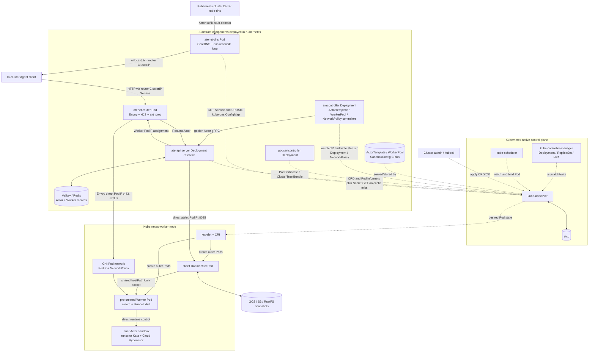
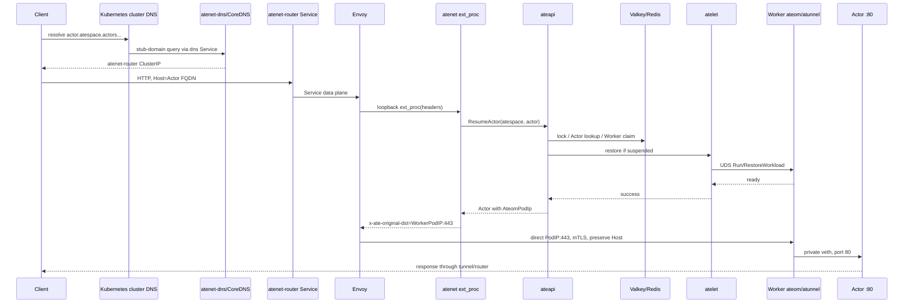

# Agent Substrate 中的 Kubernetes Controller 与架构边界：ActorTemplate、atecontroller 及组件分层调研

> 调研时间：2026-08-10 16:43:29（Asia/Shanghai）  
> 文档时间戳：`20260810T084329Z`  
> Agent Substrate commit：`cbdeb7dbe003a55a16960a301bc595d9aa38b1ad`  
> 参考仓库：本地 `agent-substrate/substrate`，并交叉阅读已有 Survey、项目 README、architecture/glossary/API guide、部署清单和源码。  
> 证据边界：源码用于判断“当前实现”；README、architecture 和 roadmap 用于判断设计意图。没有在真实 Kubernetes/GKE 集群上复现实验，因此不把 north-star target 或 README demo 数字当作独立 benchmark。

## 1. 先回答问题

### 1.1 为什么 ActorTemplate controller 是 Kubernetes controller

因为 Kubernetes controller 的本质不是“创建 Pod”，而是一个持续运行的 reconciliation control loop：它观察一个声明式对象的 desired state 和当前状态，执行幂等副作用，使外部世界逐渐接近 desired state，并把观察结果写回 status。Kubernetes 官方定义 controller 为“watch cluster state and try to move the current state closer to the desired state”。

`ActorTemplate` 是 `ate.dev/v1alpha1` 的 namespaced Custom Resource。它的 `spec` 声明镜像、容器、卷、sandbox class、worker selector 和 snapshot 配置；`status` 保存 Phase、GoldenActorID、等待时间、GoldenSnapshot 和 Conditions。`atecontroller` 通过 controller-runtime 的 `.For(&ActorTemplate{})` 监听它，读取对象后调用 `ateapi` 创建/恢复/挂起 golden Actor，最后更新 `ActorTemplate.status`。

因此它的控制链是：

```text
ActorTemplate.spec (Kubernetes API)
    -> atecontroller informer/workqueue -> Reconcile
    -> ateapi: CreateActor / ResumeActor / SuspendActor
    -> Actor、Worker、Snapshot (Valkey/Redis + runtime + object store)
    -> ActorTemplate.status (observed state)
```

这类 controller 可以称为 **Kubernetes-triggered external-system controller**：触发源和持久化的声明式接口在 Kubernetes，主要副作用在 Agent Substrate 专用控制面。它不是 kube-controller-manager 内置 controller，也不是 kube-scheduler。

### 1.2 Kubernetes controller 应该怎样理解

不要把 controller 理解成一次 RPC 或一个“创建资源”的脚本。更准确的伪代码是：

```text
while process is alive:
    event = watch/list resource
    enqueue(namespace/name)
    object = read latest object
    action = compare(spec, status, external state)
    perform idempotent action
    update status or requeue
```

它是最终一致的、可重试的控制回路。事件可能重复、乱序，进程可能在外部副作用后崩溃，网络也可能暂时不可用；所以 reconcile 必须能够安全地再次执行。controller-runtime 的 `Reconciler` 契约允许修改 Kubernetes 对象，也允许修改外部系统。

### 1.3 是否需要补 Kubernetes 知识

需要，但目标是掌握 Agent Substrate 所依赖的最小闭环，而不是先学完整 Kubernetes 生态。必须能读懂：API object (`metadata/spec/status`)、CRD、list/watch/informer/workqueue、controller-runtime、Deployment/Pod 调度链、Service/Endpoint、RBAC/ServiceAccount、ownerReference/finalizer、HPA/Cluster Autoscaler。暂时不必深入所有存储插件、Ingress 实现细节或 kube-scheduler plugin 开发。

### 1.4 atenet 跟 Kubernetes 有关系吗

有，而且关系可以分成三层：

1. **强依赖 Kubernetes 部署与治理**：`atenet-dns`、`atenet-router` 都是 Deployment/Service，使用 ServiceAccount、RBAC、Pod certificate 和 ConfigMap；
2. **复用 Kubernetes 网络基础设施**：Actor DNS 先经过 cluster DNS 和 ClusterIP Service，router 到 Worker 依赖 CNI PodIP 和 NetworkPolicy；
3. **旁路 per-Actor Kubernetes 控制路径**：ext_proc 调 `ateapi.ResumeActor`，从 Substrate store 得到 Worker PodIP，再由 Envoy 直连 Worker `atunnel:443`；不为每个 Actor 创建 Pod、Service、EndpointSlice 或 Ingress。

所以不能笼统说“atenet 在 Kubernetes 外部”，也不能说它“绕过 Kubernetes 网络”。准确说法是：**atenet 嵌入 Kubernetes 的部署、DNS、Service 和 Pod 网络，但旁路 Kubernetes 的 per-Actor object、placement 和 backend convergence。**

## 2. 调研方法与版本边界

### 2.1 主要源码位置

| 主题 | 本地证据 |
|---|---|
| `atecontroller` 进程 | `agent-substrate/substrate/cmd/atecontroller/main.go` |
| ActorTemplate reconcile | `agent-substrate/substrate/cmd/atecontroller/internal/controllers/actortemplate_controller.go` |
| WorkerPool reconcile | `agent-substrate/substrate/cmd/atecontroller/internal/controllers/workerpool_controller.go`、`workerpool_apply.go` |
| CRD 类型 | `agent-substrate/substrate/pkg/api/v1alpha1/actortemplate_types.go`、`workerpool_types.go`、`sandboxconfig_types.go` |
| generated CRD | `agent-substrate/substrate/manifests/ate-install/generated/ate.dev_actortemplates.yaml` 等 |
| Actor API 与调度 | `agent-substrate/substrate/cmd/ateapi/internal/controlapi`、`internal/scheduling`、`internal/store` |
| 节点和 sandbox runtime | `cmd/atelet`、`cmd/ateom-gvisor`、`cmd/ateom-microvm` |
| 网络和唤醒路由 | `cmd/atenet`、`cmd/atenet/internal/router` |
| 术语与设计意图 | `docs/glossary.md`、`docs/architecture.md`、`docs/api-guide.md` |

### 2.2 固定版本和成熟度

本 Survey 以 `cbdeb7dbe003a55a16960a301bc595d9aa38b1ad` 为 Substrate 源码版本。`docs/architecture.md` 开头明确说明大量内容是 aspirational；README 也标注 early development。因此下文会把“源码已实现”“部署清单存在”“roadmap 计划”分开陈述。

## 3. Kubernetes 的最小心智模型

### 3.1 Object 是持久化的 intent record

典型 Kubernetes object 至少有：

```text
metadata: name/namespace/uid/resourceVersion/labels/ownerReferences
spec:     用户或上层控制器声明的 desired state
status:   控制器观察到的 current state
```

API Server 负责鉴权、schema、版本转换、持久化到 etcd，并提供 REST/list/watch。CRD 注册新的 API 类型，但 CRD 本身只提供结构化存储；领域行为来自 custom controller。

因此下面两件事不同：

```text
kubectl apply -f ActorTemplate.yaml
  = 把意图写入 API Server

ActorTemplate controller
  = 把意图转换成 golden Actor/snapshot 等可观察结果
```

### 3.2 List/Watch、Informer 和 workqueue

典型实现链为：

```text
API Server list/watch
  -> SharedInformer 的最终一致本地 cache
  -> Add/Update/Delete event handler
  -> workqueue 中的 NamespacedName
  -> Reconcile 重新 GET 最新 object
```

event handler 通常只入队 key，不在回调中执行长 RPC。队列负责去重和失败退避；`Reconcile` 返回 error 会重新入队，`RequeueAfter` 可等待 readiness、外部任务或时间条件。Controller 不应依赖某个事件携带的旧对象，而应每次重新读取最新对象。

### 3.3 Controller、scheduler、kubelet 不是同一个东西

```text
用户写 CR/Pod
  -> API Server / etcd
  -> custom controller 创建或更新 child object
  -> kube-scheduler 为未绑定 Pod 选择 Node
  -> kubelet 观察本节点 PodSpec
  -> CRI/container runtime 创建容器
  -> CNI/CSI/Service 等插件物化网络和存储
```

Controller 是“使状态收敛”的通用模式；scheduler 只负责 Pod placement；kubelet 只负责节点上的 Pod 执行。一个 controller 可以创建 Deployment，也可以只更新外部系统和自己的 status。

### 3.4 最终一致、幂等与删除语义

Controller 不是跨系统事务。常见安全机制包括稳定 UID/name、AlreadyExists/NotFound 容错、optimistic concurrency、Phase/Condition、重试和补偿。

- `ownerReferences` 表示 Kubernetes 对象父子关系，垃圾回收器可以级联删除。
- `finalizers` 让 controller 在外部资源清理完成前阻塞删除。
- 代码拥有 `resources=.../finalizers` 的 RBAC 权限，不等于实际启用了 finalizer。

这些概念对 ActorTemplate 很重要：它的 golden Actor 和 snapshot 不在 Kubernetes，因此删除 CR 是否清理外部资源不能由 Kubernetes garbage collector 自动推断。

## 4. ActorTemplate controller 的源码级拆解

### 4.1 输入对象：不可变模板，状态在 status

`ActorTemplateSpec`（`pkg/api/v1alpha1/actortemplate_types.go:301-359`）包含：

- `PauseImage` 和 workload `Containers`；
- `SnapshotsConfig`；
- `SandboxClass`（`gvisor` 或 `microvm`）；
- `WorkerSelector`；
- `Volumes`。

`Spec` 有 `self == oldSelf` 校验，注释明确为 immutable；新版本应创建新的 ActorTemplate。`ActorTemplateStatus`（约 361-375 行）包含 `Phase`、`GoldenActorID`、`TakeGoldenSnapshotAt`、`GoldenSnapshot` 和 `Conditions`。

### 4.2 Reconcile 状态机

```text
PhaseInitial
  1. 确保保留的 ate-golden atespace
  2. ateapi.CreateActor(golden actor, 引用当前模板)
  3. 写 status.GoldenActorID
  4. -> PhaseResumeGoldenActor

PhaseResumeGoldenActor
  1. ateapi.ResumeActor
  2. 没有 golden snapshot 时执行 cold boot
  3. 写 status.TakeGoldenSnapshotAt
  4. -> PhaseWaitGoldenActor

PhaseWaitGoldenActor
  1. 未到时间：RequeueAfter
  2. 到时：ateapi.SuspendActor
  3. 读取返回的 LatestSnapshot
  4. 写 GoldenSnapshot、Ready condition
  5. -> PhaseReady

PhaseReady
  -> no-op
```

源码中的 readiness 行为是：所有容器有 `readyz` 时，`ResumeActor` 等待其返回 200 后即可进入零秒 warm-up；否则使用默认 20 秒 fallback。它没有名为 `WarmActor` 的独立 RPC。

### 4.3 为什么“调用 ateapi”仍然是 Kubernetes reconciliation

`SetupWithManager` 使用：

```go
ctrl.NewControllerManagedBy(mgr).
    For(&atev1alpha1.ActorTemplate{}).
    Complete(r)
```

`Reconcile` 首先从 Kubernetes client 读取 `ActorTemplate`；NotFound 表示对象已删除，直接返回；错误返回触发重试。每个 Phase 都由 `status.Update` 记录进度。副作用虽是 gRPC `ateapi`，仍然是“根据 K8s desired object 驱动外部状态并写 observed status”的控制回路。

这正是 custom controller 的扩展价值：CRD 给用户一个 Kubernetes-native API，controller 把 Agent Substrate 的领域知识（golden boot、snapshot、sandbox class）编码进去。它不要求 Kubernetes API Server 直接保存 Actor 的每次运行状态。

### 4.4 与 WorkerPool controller 的对照

| 维度 | ActorTemplate controller | WorkerPool controller |
|---|---|---|
| 主输入 | `ActorTemplate` CR | `WorkerPool` CR |
| 主要副作用 | `ateapi` golden Actor / snapshot | Server-Side Apply `Deployment` |
| child watch | 没有 `Owns(...)` | `.Owns(&appsv1.Deployment{})` |
| 高频实例 | 不创建每个 Actor 的 CR/Pod | Deployment 代表 warm capacity |
| status | golden snapshot readiness | Deployment replicas/selector |
| 控制时间尺度 | 模板创建时的低频初始化 | WorkerPool 扩缩容和模板同步 |

WorkerPool apply 还设置 `WorkerPool -> Deployment` owner reference，因此 WorkerPool 删除时可以由 Kubernetes garbage collector 级联清理 Deployment。ActorTemplate 当前删除分支只检测 `DeletionTimestamp` 后返回，没有添加/移除 finalizer，也没有删除 golden Actor 或 snapshot 的清理逻辑；这是当前实现的明确缺口，而不是 Kubernetes controller 定义的限制。

## 5. Agent Substrate 的完整架构分层

### 5.1 先区分“设计意图”和“当前实现”

[`docs/architecture.md`](../../agent-substrate/substrate/docs/architecture.md) 给出的主线是：Kubernetes 保存低频、声明式 system configuration，Substrate 数据库存储高频 dynamic instance state。其原文在 205-254 行把资源分为：

```text
Kubernetes CRD / declarative configuration
  - ActorTemplate
  - WorkerPool

Substrate database / dynamic records
  - Actor
  - Worker
```

这条分层与源码一致。Architecture 还把 `ate-api-server` 定义为 Actor control plane，把 `atelet + ateom` 定义为 node supervisor，把 `atenet + atunnel` 定义为 agent-aware networking stack。不过该文档开头明确说大量设计仍是 aspirational；因此下面的组件、连接和热路径以 commit `cbdeb7d...` 的源码及安装 manifest 为准。

### 5.2 三个容易混淆的“manager/controller”层次

```text
kube-controller-manager（Kubernetes 原生进程）
  ├─ Deployment controller
  ├─ ReplicaSet controller
  ├─ Node controller
  ├─ HPA controller
  └─ 其他内置 controllers

atecontroller（Agent Substrate 独立 Deployment/进程）
  └─ controller-runtime Manager
      ├─ ActorTemplateReconciler
      ├─ WorkerPoolReconciler
      └─ NetworkPolicyReconciler

atenet-router / atenet-dns 内名为 Controller 的对象
  └─ 当前是 ticker 驱动的普通 Go reconciliation loop
     不是 kube-controller-manager 模块，也没有注册到 atecontroller Manager
```

所以 `atecontroller` 和 `kube-controller-manager` 在“都通过 API Server 做 reconciliation”这个控制模式上平级，但部署归属不同：后者是 Kubernetes native control-plane component；前者是通常运行在 `ate-system` Pod 中的 custom control-plane extension。ActorTemplate controller 只是 `atecontroller` 进程内部的一个 controller。

### 5.3 Kubernetes Control Plane 与 Substrate 的完整关系图

下图中，虚线表示 Kubernetes API/configuration/inventory 的低频同步，实线表示 Actor 请求、resume、snapshot 或转发路径。`atecontroller` 不能画进 `kube-controller-manager`，`ateapi` 也不能画成 Kubernetes API Server 的子模块。



该图表达的是“双控制面但非完全独立”：

- Kubernetes 负责节点、外层 Pod、Service/DNS、CNI、NetworkPolicy、RBAC、证书投影和容量治理；
- Substrate 负责 Actor/Worker 高频记录、Actor placement、checkpoint/restore、动态 backend selection；
- ateapi 通过 informer 从 Kubernetes 同步模板和 physical worker inventory，因此是 Kubernetes-aware specialized control plane；
- Actor 热路径不创建 per-Actor Kubernetes 对象，但仍在 Kubernetes 已建立的 Pod 网络和安全边界上运行。

### 5.4 组件边界总表

| 组件/对象 | 当前部署/代码形态 | 与 Kubernetes 的准确关系 | 主要职责 | Actor 热路径角色 |
|---|---|---|---|---|
| API Server + etcd | Kubernetes 原生 control plane | 保存 CRD、Deployment、Pod、Service、RBAC 等；提供 list/watch | 集群声明状态和 API | 稳态 Actor lifecycle 通常不写对象；后台 informer 仍依赖它 |
| kube-controller-manager | Kubernetes 原生进程 | 内置 Deployment/ReplicaSet/HPA 等 controller | 将 Deployment/HPA 等收敛成 Pod 数量 | Worker 扩缩容时参与；不调度普通 Actor |
| kube-scheduler | Kubernetes 原生进程 | 为未绑定的外层 Pod选择 Node | Worker/atelet/control-plane Pod placement | Worker Pod 创建时参与；Actor resume 不参与 |
| kubelet + CRI | 每节点 | 创建 atelet、Worker 和其他 Substrate 外层 Pod | 外层 Pod/container lifecycle | 不创建内层 Actor sandbox |
| CNI / Service data plane | 每节点/网络插件 | 提供 PodIP、ClusterIP 可达性并执行 NetworkPolicy | 外层 Pod 网络 | DNS/router/ateapi/Worker 通信持续依赖 |
| `ActorTemplate` | namespaced CRD | 存于 Kubernetes API/etcd | immutable workload/snapshot blueprint | ateapi 通常从 informer cache 读取 |
| `WorkerPool` | namespaced CRD，带 scale subresource | `atecontroller` 将其变为 Deployment/NetworkPolicy | warm Worker capacity | 扩缩容为后台路径 |
| `SandboxConfig` | cluster-scoped CRD | ateapi 从 informer/lister 解析 runtime assets | pin gVisor/microVM assets | fresh boot/restore 配置来源 |
| `atecontroller` | `ate-system` 中独立 Deployment | custom controller manager，不在 kube-controller-manager 内 | reconcile ActorTemplate、WorkerPool、NetworkPolicy | 只在模板/golden 和容量路径 |
| `ateapi` | Deployment + Service | 作为 Pod 运行；watch CRD/Worker/atelet Pod，偶尔读 Secret | Actor API、Valkey 状态、Worker claim、workflow | 核心热控制面 |
| Valkey/Redis | K8s StatefulSet 或外部托管服务 | 不是 Kubernetes etcd | Actor/Worker/Atespace、lock、CAS、snapshot metadata | 核心热状态存储 |
| `atenet-dns` | `dns` Deployment/Service；CoreDNS + controller 两容器 | 读 Service，改 `kube-system/kube-dns` ConfigMap | 将 Actor DNS suffix 指向固定 router Service | DNS 查询路径；无 per-Actor lookup |
| `atenet-router` | Deployment/Service；Envoy + router 两容器 | K8s 提供部署、Service、CNI、RBAC 和证书；后台 list CR | Host -> ActorRef、ResumeActor、Worker 动态路由 | 每个新请求进入 |
| `podcertcontroller` | 独立 Deployment/custom controller | 使用 PodCertificateRequest/ClusterTrustBundle API；为项目提供 polyfill signer | Substrate 组件 mTLS identity | 间接安全依赖 |
| `atelet` | 每节点 DaemonSet Pod | 由 K8s 部署；ateapi 用 Pod informer 定位其 PodIP | OCI/runtime assets、snapshot I/O、驱动目标 ateom | Resume/Suspend 热路径 |
| `ateom` / `atunnel` | Worker Pod 中唯一外层 container 及其子系统 | 外层 Pod 由 kubelet创建；内层 Actor 对 K8s 不可见 | run/restore/checkpoint sandbox，终止 router mTLS | 节点执行和最终 ingress |
| runsc / Kata / Cloud Hypervisor | ateom 直接调用的 runtime | **当前 Actor sandbox 不通过 Kubernetes RuntimeClass/CRI 创建** | 内层隔离和 checkpoint/restore | Actor execution |
| GCS/S3/RustFS | 集群外对象存储或 K8s workload | K8s 提供 Pod 网络/凭据；snapshot bytes 不进 etcd | checkpoint data | Suspend/Resume I/O |
| `kubectl-ate` | 集群外 CLI | 可操作 CRD，也调用 ateapi | 管理和调试 | 不在服务请求路径 |

“部署在 Kubernetes 中”“使用 Kubernetes API”“属于 Kubernetes 核心”和“每次请求经过 Kubernetes control plane”是四个不同判断。`atenet-router` 是最好的例子：它作为 Kubernetes Pod/Service 部署，也周期访问 API Server，但每次 Actor backend selection 不查询 Kubernetes 对象，而是调用 ateapi。

### 5.5 atecontroller 如何与 kube-controller-manager 串联

WorkerPool 路径会真正进入 Kubernetes 内置 controller 链：

```text
WorkerPool CR
  -> atecontroller / WorkerPoolReconciler
  -> Server-Side Apply Deployment
  -> kube-controller-manager
       -> Deployment controller -> ReplicaSet
       -> ReplicaSet controller -> Worker Pod
  -> kube-scheduler -> Node binding
  -> kubelet / CRI / CNI -> warm Worker Pod (ateom)
```

`WorkerPoolReconciler` 的 `.Owns(Deployment)` 使 Deployment 变化重新入队；Deployment 的 ownerReference 指向 WorkerPool。可选 HPA 以 WorkerPool `/scale` subresource 为目标，更新 `WorkerPool.spec.replicas` 后仍经上述链路扩容。

NetworkPolicy 路径为：

```text
WorkerPool CR
  -> atecontroller / NetworkPolicyReconciler
  -> ingress-only NetworkPolicy
     destination: ate.dev/worker-pool=<pool> Pods
     allowed source: namespace=ate-system AND app=atenet-router
  -> supporting CNI/network plugin enforces policy
```

`atecontroller` 只创建 policy object，不亲自过滤数据包；是否实际 enforcement 取决于集群网络插件。当前代码不管理 egress policy。

ActorTemplate 路径不同：它从 CR 进入 atecontroller 后直接调用 ateapi 创建/恢复/挂起 golden Actor，并更新 CR status；普通 Actor 不会再交给 kube-controller-manager 创建 Pod。

### 5.6 atenet 与 Kubernetes：先给出结论

`atenet` 与 Kubernetes 是：**部署、发现和网络承载强依赖；per-Actor 唤醒、位置解析和最后一跳旁路 Kubernetes control plane。**

它不是 kube-controller-manager 内置 controller，不是 CNI，也不是集群 CoreDNS 本身。一个 `atenet` binary 有 `dns` 和 `router` 两个子命令；当前 manifest 把它们部署为两个独立 Deployment：

```text
ate-system/dns Pod
  ├─ coredns container
  └─ atenet dns-controller container

ate-system/atenet-router Pod
  ├─ atenet router container（xDS + ext_proc）
  └─ Envoy container
```

#### 5.6.1 atenet-dns 如何嵌入 Kubernetes DNS

当前 `atenet dns` 不是 informer/workqueue controller，而是每 10 秒运行一次的 ticker reconcile：

1. 从 Kubernetes API GET `ate-system/atenet-router` Service 的 ClusterIP；
2. GET `ate-system/dns` Service 的 ClusterIP；
3. 生成专用 CoreDNS Corefile，使合法的 `<actor>.<atespace>.actors.resources.substrate.ate.dev` A 查询统一返回 router ClusterIP；
4. 将 Corefile 写入两个容器共享的 `emptyDir`，通过共享 PID namespace 给 CoreDNS 发送 `SIGUSR1` 触发 reload；
5. 更新 `kube-system/kube-dns` ConfigMap：`stubDomains[actors.resources.substrate.ate.dev] = [atenet-dns ClusterIP]`。

因此 DNS 数据路径是：

```text
in-cluster client
  -> Kubernetes cluster DNS / kube-dns
  -> suffix 命中 stubDomains
  -> ate-system/dns ClusterIP Service
  -> atenet 自带 CoreDNS
  -> wildcard A response = atenet-router ClusterIP
```

这里没有 per-Actor DNS record，也不检查 Actor 是否存在。DNS controller 的 API Server GET/UPDATE 是每 10 秒后台配置路径；普通 DNS query 由 DNS/Service 数据面处理，不逐查询访问 API Server。

实现边界必须注明：代码显式寻找 `kube-system/kube-dns` ConfigMap，找不到就 warn 并跳过；这对应 GKE/kube-dns 的 stubDomains 约定，不能泛化成自动支持所有 Kubernetes DNS 发行版。README 提到 `ate-system:dns` ConfigMap，但当前 manifest 实际使用共享 `emptyDir`，源码也不创建该 ConfigMap。

#### 5.6.2 atenet-router 如何嵌入并旁路 Kubernetes

当前安装清单把 router 与 Envoy 放在同一 Pod：

- `atenet-router` ClusterIP Service 的 80/443 映射到 Envoy 8080/8443；
- Envoy 从同 Pod `127.0.0.1:18000` 获取 xDS；
- Envoy 把请求 header 通过同 Pod `127.0.0.1:50051` 送给 ext_proc；
- router 通过 `api.ate-system.svc:443` 连接 ateapi；当前 `api` 是 headless Service，DNS 返回 ready ateapi Pod 地址供 gRPC client-side load balancing，而不是经 ClusterIP VIP；
- PodCertificate 和 ClusterTrustBundle projected volumes 提供 router 到 ateapi、router 到 Worker atunnel 的 mTLS identity。

当前公开 manifest 暴露的是 `ClusterIP` Service，DNS 返回的也是 cluster-internal router IP。因此本节描述的是 in-cluster client 路径；若要从集群外访问，还需要额外的 LoadBalancer、Ingress/Gateway 或其他入口，当前清单没有自动提供这一层。

当前 manifest 传入 `--standalone`。这里的 standalone 只表示 router 不动态创建另一套 Envoy ConfigMap/Deployment/Service，因为 Envoy 已由 manifest 作为 sidecar 静态部署；它不表示脱离 Kubernetes。没有设置 `--actor-templates-file` 时，router 仍创建 in-cluster Kubernetes client，每 5 秒 `List` ActorTemplate，并周期 GET API Server `/version` 做 health check。

router 内部 `Controller` 也不是 controller-runtime Reconciler：它是 5 秒 ticker loop。尽管 README 写 “Watches ActorTemplates”，当前源码执行的是全量 `List`；而且 `reconcile()` 当前丢弃 ready template 列表，xDS 是 catch-all Actor route。真正的 per-request Actor 校验、唤醒和 Worker 定位来自 `ateapi.ResumeActor`，不是 ActorTemplate list 或 EndpointSlice。

### 5.7 Actor HTTP 请求的准确网络路径



逐请求关键事实：

- ext_proc 总是调用 `ResumeActor`；ateapi 返回 `resumed=false` 时表示 Actor 已运行；
- Worker IP 最初来自 Kubernetes `Pod.status.podIP`，由 ateapi 的 WorkerPod informer/WorkerPoolSyncer 复制进 Valkey Worker record；
- Envoy 最终使用 `ORIGINAL_DST` 直连 Worker PodIP `:443`，不为 Actor 创建 Service/EndpointSlice；
- Worker 的 `atunnel` 保留并校验原始 Host，再转发到当前 Actor 私有 veth 的 `:80`；Worker Pod `:80` 不再是直达 Actor 的入口；
- NetworkPolicy 允许 router Pod 到 Worker Pod，实际流量仍依赖 CNI 提供的 PodIP 可达性。

所以 atenet 绕过的是 **per-Actor Kubernetes route/control state**，不是 Kubernetes 网络本身：入口仍走 router ClusterIP Service，DNS 仍接入 cluster DNS，最后一跳仍运行在 CNI Pod network 上，只是不走 per-Actor Service VIP/kube-proxy 或等价 Service load-balancing path。

### 5.8 ateapi、atelet、ateom 与 Kubernetes 的准确边界

`ateapi` 不是完全独立于 Kubernetes：

- watch 全集群 ActorTemplate、WorkerPool、SandboxConfig；
- watch带 `ate.dev/worker-pool` 标签的 Worker Pods；
- watch `ate-system` 中的 atelet Pods；
- 将 Worker Pod 的 namespace/name/UID/PodIP/NodeName 同步为 Valkey Worker record；
- 根据 Worker 的 NodeName 从 informer cache 找同节点 atelet Pod，再直连 atelet PodIP `:8085`；
- resume 时通常从 lister/cache 读取模板和拓扑，但 Secret env cache miss/expire 时会直接 GET Kubernetes Secret；
- 可验证 Kubernetes ServiceAccount token/OIDC。

因此最准确的定位是：

> `ateapi` 是 Kubernetes-aware 的专用 Actor 控制面：Kubernetes 是配置和 physical inventory source，Valkey/Redis 是高频 Actor/Worker coordination store。

节点边界也必须画准确：

```text
kubelet / CRI
  ├─ 创建 atelet DaemonSet 外层 Pod
  └─ 创建 Worker 外层 Pod
       └─ ateom container
            ├─ atunnel :443
            └─ 直接驱动 inner runtime
                 ├─ runsc
                 └─ Kata + Cloud Hypervisor
```

Kubernetes 只看到外层 Worker Pod 和 ateom container。当前实现没有通过 `runtimeClassName`/CRI 为每个 Actor 创建 sandbox；`sandboxClass` 是 Substrate 自定义字段。Actor application containers、private netns/veth、readiness 和 checkpoint/restore 由 ateom 管理，对 kubelet 不可见。atelet 与 ateom 通过按 Worker Pod UID 定位的 shared hostPath Unix socket 通信，不经过 Service。

### 5.9 “嵌入、依赖、旁路”矩阵

| 阶段 | 使用的 Kubernetes 组件 | Substrate 自有路径 | 明确绕过什么 |
|---|---|---|---|
| 安装 | API Server、CRD、RBAC、Deployment、DaemonSet、Service | 安装各 Substrate binary | 无 |
| WorkerPool 扩缩容 | atecontroller、API Server/etcd、kube-controller-manager、scheduler、kubelet、CRI、CNI | WorkerPool abstraction | 无，完整走外层 Pod lifecycle |
| ActorTemplate 准备 | API Server/etcd、atecontroller CR watch/status | ateapi + golden Actor + snapshot | 不为模板实例创建专属长期 Pod |
| CreateActor | 模板通常来自 informer cache | ateapi + Valkey 创建 SUSPENDED record | 不创建 Pod/CR/Service，不调度 |
| ResumeActor | CR/Pod topology 通常来自 informer；Secret cache miss 可能 live GET | Valkey lock/CAS、Worker claim、atelet/ateom restore | 不创建/bind Actor Pod，不重新执行 kubelet/CRI/CNI materialization |
| SuspendActor | 复用已有 Pod network/identity | ateapi -> atelet -> ateom checkpoint -> object store | 不更新 per-Actor K8s object/PVC lifecycle |
| DNS 后台配置 | API Server、Service、kube-dns ConfigMap | atenet DNS reconcile | 不涉及 Actor record |
| 单次 DNS 查询 | cluster DNS、dns ClusterIP Service | custom CoreDNS wildcard | 不创建/查询 per-Actor DNS object；不访问 API Server |
| 单次 HTTP 路由 | router ClusterIP、Service dataplane、CNI、NetworkPolicy | Envoy/ext_proc -> ateapi/Redis -> Worker PodIP/atunnel | 不查 per-Actor K8s backend，不建 Service/Endpoint，不走 scheduler |
| ateapi 到 atelet | Pod informer 提供 atelet/Worker PodIP 与 Node mapping；CNI 网络 | direct mTLS PodIP `:8085` | 不通过 kubelet API，不为节点 RPC建 Service |
| atelet 到 ateom | K8s 预先挂载 shared hostPath | Unix socket | 完全不走 Kubernetes network |
| Actor 内层启动 | 外层 Worker Pod 已由 K8s 建立 | ateom 直接调用 runsc/Kata/Cloud Hypervisor | 不通过 Kubernetes RuntimeClass、CRI 或 kubelet readiness |
| Worker Pod 故障 | K8s 重建 Pod；Pod informer发出变化 | WorkerPoolSyncer释放/删除 stale Worker record并修正 Actor | Actor 恢复仍由 Substrate workflow完成 |

因此“Agent Substrate bypass Kubernetes”的严谨含义是：

> 它避免为每次 Actor create/resume/suspend 建立 Kubernetes object、执行 kube-scheduler placement，以及重新执行 kubelet/CRI/CNI 的 Pod materialization；它没有绕过 Kubernetes 已经建立的 Worker Pod、Pod network、Service/DNS、NetworkPolicy、证书投影和故障恢复基础设施。

## 6. 两条关键生命周期

### 6.1 ActorTemplate 创建：低频 Kubernetes-to-Substrate bridge

```text
用户 kubectl apply ActorTemplate
  -> API Server/etcd 持久化 CR
  -> atecontroller watch/cache 入队
  -> Reconcile Initial
       -> ateapi.CreateAtespace (ate-golden)
       -> ateapi.CreateActor (golden actor)
       -> ActorTemplate.status = ResumeGoldenActor
  -> Reconcile Resume
       -> ateapi.ResumeActor
       -> ateapi/atelet/ateom cold boot workload
       -> status = WaitGoldenActor + deadline
  -> Reconcile Wait
       -> 根据 TakeGoldenSnapshotAt RequeueAfter
       -> ateapi.SuspendActor
       -> atelet/ateom checkpoint + object store upload
       -> status.GoldenSnapshot = ...; Phase = Ready
```

注意：此路径会使用 Kubernetes API 作为模板控制入口，但 golden Actor 本身是 Valkey/Redis 中的 Substrate record；Worker Pod 只由 WorkerPool 提供的预热容量承载。

### 6.2 普通 Actor 唤醒：高频 Substrate hot path

```text
请求到达 Actor DNS/Router
  -> atenet-router 从 Host 解析 ActorRef
  -> 每个新请求调用 ateapi ResumeActor（已运行时返回 resumed=false）
  -> ateapi 在 Valkey/Redis 中加锁、选择空闲 Worker、CAS claim
  -> ateapi 用 K8s informer cache 将 Worker Node 映射到同节点 atelet Pod
  -> direct mTLS RPC 到 atelet PodIP:8085
  -> atelet 找到 Worker Pod 内 ateom socket
  -> ateom restore Actor latest snapshot 或 template GoldenSnapshot；两者皆无时 fresh boot
  -> readiness/atunnel 就绪
  -> ateapi 返回 Worker PodIP
  -> Envoy 直连 Worker PodIP:443 的 atunnel，再转发到 Actor:80
```

这条路径的目标是避免为每个逻辑 Actor 创建 Pod、等待 kube-scheduler、重新执行 kubelet/CRI/CNI materialization。模板和 Pod topology 主要来自 informer cache，但引用 Kubernetes Secret 的环境变量在 cache miss/expire 时可能同步 GET API Server。Kubernetes 仍然负责 Worker Pod 的容量、节点、网络和隔离；它不被“完全绕过”，只是从 per-Actor lifecycle owner 退到 coarse-grained capacity 和 network substrate。

## 7. 对象基数：为什么需要两个控制面

设 `A` 为逻辑 Actor 数，`W` 为 warm Worker Pod 数，`N` 为节点数：

```text
传统 Pod-per-agent：Kubernetes 动态对象约 O(A)
Agent Substrate：     Kubernetes Worker Pod 约 O(W)，Substrate Actor record 约 O(A)
设计目标：            W << A（依赖 agent 大量处于 idle/suspended）
```

这不是无条件收益：Actor records、snapshot metadata、Valkey keyspace、router cache、锁和 object-store I/O 都会随 `A` 增长。Substrate 的核心取舍是让高 churn 状态进入更适合高 QPS 的专用存储和控制回路，而让 Kubernetes 维持低 churn 的物理容量。

## 8. 哪些知识必须补，按什么顺序补

### 8.1 最小学习路径

1. **对象模型**：`apiVersion/kind/metadata/spec/status`、namespace、UID、resourceVersion、conditions。
2. **CRD**：schema、namespaced/cluster-scoped、status subresource、validation、RBAC。
3. **Controller-runtime**：Manager、cache/client、`For`、`Owns`、Request、RequeueAfter、error backoff、幂等 reconcile。
4. **Pod 物化链**：Deployment -> ReplicaSet -> Pod -> scheduler -> kubelet -> CRI/runtime；理解 CNI/CSI 和 readiness。
5. **治理和生命周期**：Service/EndpointSlice、ServiceAccount/Secret、ownerReferences、finalizers、Lease leader election。
6. **容量控制**：HPA、Cluster Autoscaler、节点 labels/taints/tolerations；再学习 RuntimeClass 作为比较项，但注意当前 Substrate Actor sandbox 并不由 RuntimeClass 创建。

### 8.2 读 Agent Substrate 时的映射练习

| Kubernetes 概念 | 在 Substrate 中对应的阅读问题 |
|---|---|
| CRD `spec/status` | ActorTemplate 的声明是什么，golden snapshot 的观察结果写在哪里？ |
| `.For` / `.Owns` | ActorTemplate 为什么只 watch 自身，WorkerPool 为什么还 watch Deployment？ |
| Deployment | WorkerPool 如何把 replicas 物化成 warm Worker Pods？ |
| Pod UID | atelet 如何定位具体 Worker Pod 内的 ateom socket？ |
| Service/DNS | atenet 如何提供 Actor 的稳定名字和唤醒路由？ |
| RuntimeClass/CRI | gVisor 和 microVM 在哪一层执行？ |
| etcd/watch | 为什么 Actor record 不放成每 Actor 一个 Kubernetes object？ |

### 8.3 不需要一开始学的内容

暂时不必从 scheduler plugin、Admission webhook 实现、所有 CSI provider 或 Kubernetes 源码全量开始。对本文问题，能解释“一个 CR 如何被 watch、入队、reconcile、更新 status，并最终创建/维护 Pod 或调用外部系统”就足够建立正确心智模型。

## 9. 当前实现的边界与需要审计的风险

1. **ActorTemplate 删除清理不完整**：Reconcile 检测到 `DeletionTimestamp` 后直接返回；源码没有添加 finalizer，也没有删除 golden Actor/snapshot 的动作。RBAC 中存在 finalizer update 权限不能证明清理已实现。
2. **atecontroller 的 leader election 不应臆测**：`main.go` 只传入 `ctrl.Options{Scheme: scheme}`，没有显式设置 `LeaderElection`/`LeaderElectionID`。部署若运行多副本，需要核对 controller-runtime 版本默认值和 manifest，尤其注意 `ResumeActor`/`SuspendActor` 重复副作用。
3. **状态机不是事务**：`CreateActor` 成功后 `status.Update` 失败会在重试中再次执行；当前 Initial 路径对 `AlreadyExists` 做了容错，但外部副作用和 status 之间仍可能出现中间态。
4. **源码和 architecture 的粒度不同**：architecture 中的 “worker Pod 是等待工作的 sandbox” 是设计意图；实际 worker Pod 由 ateom 外层容器承载，Agent application containers 由 ateom 在内层 runtime 创建，不能把它们画成普通 Pod sidecar。
5. **性能目标不是已验证结果**：README/architecture 的 sub-second、30x+、1000 wakeup/s 等应标记为项目目标或 demo 报告，论文中需要固定硬件、版本、负载和 tail-latency 实验。
6. **ActorTemplate controller 不是 Actor scheduler**：它只生成模板级 golden snapshot。普通 Actor 的并发 claim、worker placement、resume/suspend workflow 在 ateapi/Redis/atelet/ateom；把 ActorTemplate controller 画成全局调度器会误导读者。
7. **atenet 文档与当前代码有漂移**：README 写 router “watch ActorTemplates”，当前源码实际每 5 秒全量 `List`，并且 ready template 返回值当前未参与 per-request route；README 提到 `ate-system:dns` ConfigMap，当前 DNS Pod 使用 shared `emptyDir` Corefile。
8. **DNS 接入有发行版边界**：DNS controller 当前修改固定名称 `kube-system/kube-dns` 的 `stubDomains`；不能据此宣称自动支持所有 CoreDNS/Kubernetes 发行版。
9. **`--standalone` 不表示脱离 Kubernetes**：当前 router manifest 使用该参数仅为禁止代码动态创建另一套 Envoy Deployment/Service/ConfigMap；router 本身仍是 Kubernetes Pod，使用 ActorTemplate list、Service、CNI、RBAC 和 projected certificate。
10. **Actor runtime 不是 Kubernetes RuntimeClass**：当前 kubelet/CRI 只创建外层 Worker Pod；Pod 内 ateom 直接执行 runsc 或驱动 Kata/Cloud Hypervisor。论文图不能把每个 Actor 画成 RuntimeClass Pod。

## 10. 对 AKernel 论文的启示

### 10.1 可以借用的表述

Agent Substrate 提供一个清晰的参照：

> Kubernetes is the coarse-grained infrastructure control plane; Agent Substrate is a specialized high-frequency logical-Actor control plane layered beside it.

中文可以写成：

> Kubernetes 负责粗粒度的容量、节点、Pod 隔离和治理；Agent Substrate 负责高频的逻辑 Actor 生命周期。两者不是“是否使用 Kubernetes”的二元选择，而是按对象基数和时间尺度分层。

### 10.2 不能直接声称的内容

- 不能说 Agent Substrate “完全绕过 Kubernetes”；WorkerPool、Deployment、Pod、节点 runtime 和网络仍依赖它。
- 不能说 Kubernetes controller 必须创建 Kubernetes child object；ActorTemplate 是反例。
- 不能说 Actor 是 Kubernetes object；当前 Actor/Worker/Atespace 是 Substrate store records。
- 不能说 `atecontroller` 就等于 `ateapi`；前者是 K8s-facing low-frequency controller，后者是 Actor hot control plane。

### 10.3 AKernel 应与之比较的三条基线

1. Pod-per-agent 的 vanilla Kubernetes：展示 per-instance object/scheduling/runtime materialization 路径。
2. Kubernetes CRD + custom controller 的 Agent Sandbox：展示“可以在 K8s 上扩展 sandbox API”，但不自动获得 Substrate 的 Actor/Worker 解耦。
3. Agent Substrate：展示把逻辑 Actor state、worker claim、snapshot restore 放到专用控制面后，Kubernetes 对象基数可以从 `O(A)` 降到 `O(W)`。

## 11. 公开材料与引用入口

### Kubernetes 官方

1. Controllers: <https://kubernetes.io/docs/concepts/architecture/controller/>
2. Objects and desired/current state: <https://kubernetes.io/docs/concepts/overview/working-with-objects/>
3. Custom resources: <https://kubernetes.io/docs/concepts/extend-kubernetes/api-extension/custom-resources/>
4. API concepts, list/watch: <https://kubernetes.io/docs/reference/using-api/api-concepts/>
5. Kubernetes components: <https://kubernetes.io/docs/concepts/architecture/>
6. Deployments: <https://kubernetes.io/docs/concepts/workloads/controllers/deployment/>
7. Scheduling framework: <https://kubernetes.io/docs/concepts/scheduling-eviction/scheduling-framework/>
8. Service virtual IPs and proxies: <https://kubernetes.io/docs/reference/networking/virtual-ips/>
9. DNS customization: <https://kubernetes.io/docs/tasks/administer-cluster/dns-custom-nameservers/>
10. NetworkPolicy: <https://kubernetes.io/docs/concepts/services-networking/network-policies/>
11. Garbage collection and ownerReferences: <https://kubernetes.io/docs/concepts/architecture/garbage-collection/>
12. Finalizers: <https://kubernetes.io/docs/concepts/overview/working-with-objects/finalizers/>
13. Leases and leader election: <https://kubernetes.io/docs/concepts/architecture/leases/>
14. RuntimeClass: <https://kubernetes.io/docs/concepts/containers/runtime-class/>

### Agent Substrate 本地材料

固定版本公开源码入口：<https://github.com/agent-substrate/substrate/tree/cbdeb7dbe003a55a16960a301bc595d9aa38b1ad>

1. [Substrate README](../../agent-substrate/substrate/README.md)
2. [Architecture](../../agent-substrate/substrate/docs/architecture.md)
3. [Glossary](../../agent-substrate/substrate/docs/glossary.md)
4. [API Guide](../../agent-substrate/substrate/docs/api-guide.md)
5. [Roadmap](../../agent-substrate/substrate/docs/roadmap.md)
6. [`atecontroller` main](../../agent-substrate/substrate/cmd/atecontroller/main.go)
7. [ActorTemplate controller](../../agent-substrate/substrate/cmd/atecontroller/internal/controllers/actortemplate_controller.go)
8. [WorkerPool controller](../../agent-substrate/substrate/cmd/atecontroller/internal/controllers/workerpool_controller.go)
9. [WorkerPool Deployment builder](../../agent-substrate/substrate/cmd/atecontroller/internal/controllers/workerpool_apply.go)
10. [ActorTemplate API type](../../agent-substrate/substrate/pkg/api/v1alpha1/actortemplate_types.go)
11. [ateapi Control proto](../../agent-substrate/substrate/pkg/proto/ateapipb/ateapi.proto)
12. [atenet overview](../../agent-substrate/substrate/cmd/atenet/README.md)
13. [atenet DNS reconcile](../../agent-substrate/substrate/cmd/atenet/internal/dns/dns.go)
14. [atenet DNS wildcard Corefile](../../agent-substrate/substrate/cmd/atenet/internal/dns/corefile.go)
15. [atenet router controller](../../agent-substrate/substrate/cmd/atenet/internal/router/controller.go)
16. [atenet router request processor](../../agent-substrate/substrate/cmd/atenet/internal/router/extproc.go)
17. [atenet router xDS](../../agent-substrate/substrate/cmd/atenet/internal/router/xds.go)
18. [atenet DNS manifest](../../agent-substrate/substrate/manifests/ate-install/atenet-dns.yaml)
19. [atenet router manifest](../../agent-substrate/substrate/manifests/ate-install/atenet-router.yaml)
20. [ateapi WorkerPoolSyncer](../../agent-substrate/substrate/cmd/ateapi/internal/controlapi/syncer.go)
21. [ateapi Kubernetes informers](../../agent-substrate/substrate/cmd/ateapi/internal/controlapi/informer.go)
22. [WorkerPool NetworkPolicy controller](../../agent-substrate/substrate/cmd/atecontroller/internal/controllers/networkpolicy_controller.go)
23. [Worker Pod builder](../../agent-substrate/substrate/cmd/atecontroller/internal/controllers/workerpool_apply.go)
24. [atelet node supervisor](../../agent-substrate/substrate/cmd/atelet/main.go)
25. [atunnel request validation and proxy](../../agent-substrate/substrate/internal/atunnel/server.go)
26. [pod certificate signer controller](../../agent-substrate/substrate/cmd/podcertcontroller/internal/signercontroller/signercontroller.go)

### 关键源码证据索引

| 本文结论 | 固定版本源码 |
|---|---|
| atecontroller 的一个 Manager 注册三个 reconciler | [`main.go:87`](../../agent-substrate/substrate/cmd/atecontroller/main.go#L87) |
| ActorTemplate controller watch CR 并驱动 golden lifecycle | [`actortemplate_controller.go:65`](../../agent-substrate/substrate/cmd/atecontroller/internal/controllers/actortemplate_controller.go#L65)、[`actortemplate_controller.go:190`](../../agent-substrate/substrate/cmd/atecontroller/internal/controllers/actortemplate_controller.go#L190) |
| WorkerPool controller apply Deployment | [`workerpool_controller.go:81`](../../agent-substrate/substrate/cmd/atecontroller/internal/controllers/workerpool_controller.go#L81) |
| Worker Pod 只有 ateom 外层 container，使用 shared hostPath | [`workerpool_apply.go:58`](../../agent-substrate/substrate/cmd/atecontroller/internal/controllers/workerpool_apply.go#L58) |
| NetworkPolicy 只允许 atenet-router ingress Worker | [`networkpolicy_controller.go:89`](../../agent-substrate/substrate/cmd/atecontroller/internal/controllers/networkpolicy_controller.go#L89) |
| ateapi 创建 CRD/Worker/atelet Pod informer | [`ateapi/main.go:144`](../../agent-substrate/substrate/cmd/ateapi/main.go#L144)、[`informer.go:35`](../../agent-substrate/substrate/cmd/ateapi/internal/controlapi/informer.go#L35) |
| Worker PodIP/UID/NodeName 同步进 Substrate Worker record | [`syncer.go:110`](../../agent-substrate/substrate/cmd/ateapi/internal/controlapi/syncer.go#L110) |
| ateapi 按 Worker Node 找 atelet 并直连 PodIP:8085 | [`dialer.go:75`](../../agent-substrate/substrate/cmd/ateapi/internal/controlapi/dialer.go#L75) |
| Secret env 30 秒 cache miss 时 live GET API Server | [`workload_spec.go:34`](../../agent-substrate/substrate/cmd/ateapi/internal/controlapi/workload_spec.go#L34)、[`workload_spec.go:249`](../../agent-substrate/substrate/cmd/ateapi/internal/controlapi/workload_spec.go#L249) |
| DNS reconcile 读取两个 Service 并更新 kube-dns ConfigMap | [`dns.go:71`](../../agent-substrate/substrate/cmd/atenet/internal/dns/dns.go#L71)、[`dns.go:143`](../../agent-substrate/substrate/cmd/atenet/internal/dns/dns.go#L143) |
| DNS wildcard 返回 router ClusterIP | [`corefile.go:32`](../../agent-substrate/substrate/cmd/atenet/internal/dns/corefile.go#L32) |
| 当前 DNS Pod 为 CoreDNS + dns-controller 双容器 | [`atenet-dns.yaml:74`](../../agent-substrate/substrate/manifests/ate-install/atenet-dns.yaml#L74) |
| 当前 router Pod 为 atenet + Envoy 双容器且使用 standalone | [`atenet-router.yaml:102`](../../agent-substrate/substrate/manifests/ate-install/atenet-router.yaml#L102) |
| router 当前每 5 秒 reconcile，ActorTemplate source 是 List | [`controller.go:67`](../../agent-substrate/substrate/cmd/atenet/internal/router/controller.go#L67)、[`atstore.go:41`](../../agent-substrate/substrate/cmd/atenet/internal/router/atstore.go#L41) |
| ext_proc 每请求 ResumeActor，并设置 Worker PodIP:443 | [`extproc.go:136`](../../agent-substrate/substrate/cmd/atenet/internal/router/extproc.go#L136) |
| atunnel 每请求校验 Host 与 active Actor 后代理 | [`atunnel/server.go:230`](../../agent-substrate/substrate/internal/atunnel/server.go#L230) |
| atelet 按 Worker Pod UID 通过 Unix socket 连接 ateom | [`atelet/main.go:804`](../../agent-substrate/substrate/cmd/atelet/main.go#L804) |
| podcertcontroller 使用 informer/workqueue 处理 PodCertificateRequest | [`signercontroller.go:48`](../../agent-substrate/substrate/cmd/podcertcontroller/internal/signercontroller/signercontroller.go#L48) |
| ateom-gvisor 直接执行 runsc create/start/checkpoint/restore | [`runsc.go:74`](../../agent-substrate/substrate/cmd/ateom-gvisor/runsc.go#L74)、[`runsc.go:148`](../../agent-substrate/substrate/cmd/ateom-gvisor/runsc.go#L148)、[`runsc.go:219`](../../agent-substrate/substrate/cmd/ateom-gvisor/runsc.go#L219) |

### Controller 实现参考

1. controller-runtime Reconciler：<https://pkg.go.dev/sigs.k8s.io/controller-runtime/pkg/reconcile>
2. client-go SharedInformer：<https://pkg.go.dev/k8s.io/client-go/tools/cache>
3. client-go workqueue：<https://pkg.go.dev/k8s.io/client-go/util/workqueue>

### 历史 Survey

1. [Kubernetes、Agent Substrate 与 AKernel：Control Plane、Data Plane 与 Kubernetes Bypass](./20260804T093336Z-kubernetes-agent-substrate-akernel-control-data-plane-bypass-survey.md)
2. [Agent Sandbox、AX 与 Agent Substrate：功能边界、源码架构与相互关系](./20260805T025637Z-agent-sandbox-ax-agent-substrate-architecture-relationship-survey.md)
3. [Agent Substrate 的 ateapi、atelet、ateom、Worker Pod 与 Actor Sandbox](./20260804T111428Z-agent-substrate-ateapi-atelet-ateom-worker-sandbox-cardinality-survey.md)
4. [Agent Substrate Kubernetes Declarative Tax 与 AKernel 对比](./20260803T121206Z-agent-substrate-kubernetes-declarative-tax-vs-akernel-survey.md)

## 12. 一句话总结

`ActorTemplate controller` 之所以是 Kubernetes controller，是因为它把 Kubernetes CR 的声明式意图通过可重入 reconciliation 转换为 Substrate 的 golden Actor 和 snapshot，并将进度写回 CR status；它不需要创建 Pod 才成立。整个 Agent Substrate 是“运行在 Kubernetes 之上的双控制面”：Kubernetes 管理低频物理容量、外层 Pod、Service/DNS、CNI、NetworkPolicy 和身份设施；`atecontroller` 做声明式 API bridge，`ateapi` 管理高频逻辑 Actor，`atelet/ateom` 执行节点级 sandbox checkpoint/restore。`atenet` 位于两者边界：入口复用 Kubernetes DNS/Service/CNI，后端则通过 ateapi 和 direct Worker PodIP 动态定位 Actor，旁路 per-Actor Kubernetes object、scheduler 和 Service/Endpoint convergence。
