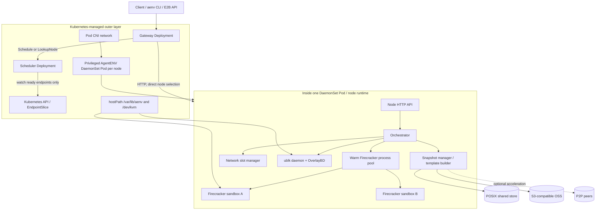
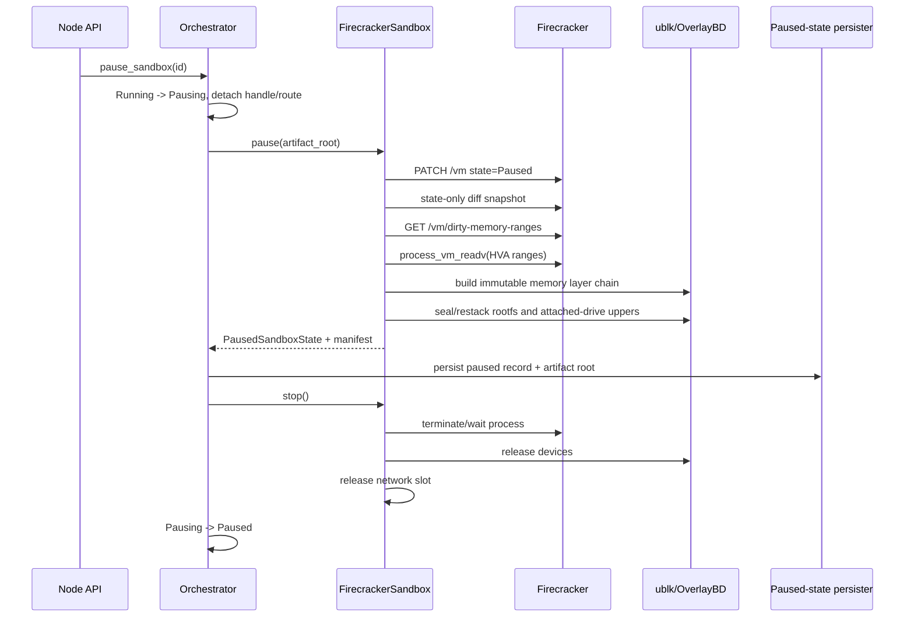

# AgentENV 的系统路径、Checkpoint/Restore 与 Agent Substrate Golden Template 对照调研

> 调研时间：2026-08-10（Asia/Shanghai）
> 文档时间戳：`20260810T143748Z`
> AgentENV commit：`6296bc4be7ad79eb3a278eb5264ef011c341adf5`
> Agent Substrate commit：`cbdeb7dbe003a55a16960a301bc595d9aa38b1ad`
> 证据边界：本文以固定 commit 的源码为“当前实现”证据，以项目 README/docs 为“作者声明或设计意图”证据。本文没有在目标硬件上独立复现性能，因此 `<50 ms`、`<100 ms` 等数字不作为实测结论。

## 1. 结论摘要

AgentENV 与 Agent Substrate/AKernel 的共同方向可以概括为：**Kubernetes 管外层节点容量和故障域，专用 runtime 管每个 sandbox/Actor 的高频生命周期。** 但“Pod 用于资源管理”仍不够精确：Kubernetes 只看见 AgentENV 的特权 DaemonSet Pod，而看不见 Pod 内的 Firecracker sandbox。当前实现没有发现 per-sandbox host cgroup，所以 Kubernetes 的 Pod request/limit 也不能自动变成每个 sandbox 的硬隔离、计费或准入。

AgentENV 最有研究价值的不是“包装 Firecracker API”，而是把以下机制串成同一条数据路径：

1. Firecracker VM state 与定制接口报告的 dirty memory ranges；
2. rootfs、附加盘和 memory 统一表示为 OverlayBD immutable layer chain；
3. ublk 把 layer stack 暴露为块设备；
4. file-backed memory 让恢复页按需 fault，并让同模板实例复用宿主 page cache；
5. network slot、ublk device、未配置 VM 的 Firecracker process 预热池削减非状态恢复开销；
6. POSIX/OSS snapshot repository 负责 committed snapshot 的持久化与分发，可选 P2P 只作为获取加速路径，不改变 repository truth。

源码审计还得到四个需要修正文档直觉的结论：

- AgentENV 的 `Paused` 不是“原 Firecracker 进程保持 pause”。快照和 paused record 成功后，旧 VMM、network slot 和 ublk runtime 会被 stop/release；恢复使用新进程或预启动但尚未配置 VM 的进程。
- 当前默认内存快照不是架构文档仍在描述的“Firecracker 先写 sparse `mem.bin`”路径。默认 `direct_overlaybd=true`，通过定制 Firecracker 的 `/vm/dirty-memory-ranges` 和 `process_vm_readv` 直接生成 OverlayBD memory layer。
- AgentENV 的 incremental snapshot 是跨代保留的 layer chain。它不是每次把增量合并成单个完整物理文件；默认在层数超过 32 时才尝试压实 runtime-owned suffix。
- AgentENV template 是 **committed snapshot 的用户/API wrapper**，不是 Dockerfile、PodTemplate，也不是共享 live parent VM。Substrate 的 golden snapshot 也是初始化后的基线，但它由 Kubernetes ActorTemplate controller 自动生产，并把 snapshot ID 写入 CR status；两者的控制面和持久化模型不同。

对 AKernel 的直接启示是：保留“两级控制路径”，吸收 AgentENV 的统一 block-layer state data plane，但必须补齐 per-sandbox cgroup、强 admission、snapshot compatibility gate、跨存储与元数据的 commit protocol，以及逻辑 Agent identity/location-transparent routing。不能把 AgentENV 当前 prototype scheduler 直接等同于 AKernel 所需的集群 OS 控制面。

## 2. 调研范围与证据等级

### 2.1 主要源码范围

| 主题 | AgentENV 源码入口 |
|---|---|
| HTTP API 与生命周期 | `src/api/impls/sandbox.rs`、`src/orchestrator/service.rs` |
| paused record | `src/orchestrator/persistence/file_backed.rs` |
| Firecracker pause/load | `src/sandbox/firecracker/sandbox.rs`、`instance.rs` |
| memory/rootfs layer | `src/sandbox/firecracker/overlaybd_snapshot.rs`、`process_vm_reader.rs` |
| ublk 与共享 memory device | `src/sandbox/ublk/device.rs` |
| template build | `src/template/builder.rs`、`runner.rs` |
| committed snapshot | `src/snapshot/manager.rs`、`repository/`、`types/` |
| 分布式控制面 | `services/gateway/`、`services/scheduler/` |
| Kubernetes 部署 | `deploy/k8s/base/` |
| benchmark harness | `benches/snapshot_benchmark.rs`、`tests/integration/fc.rs` |

Substrate 对照主要读取 `cmd/atecontroller/internal/controllers/actortemplate_controller.go`、`cmd/ateapi/internal/controlapi/workflow_resume.go`、gVisor/Cloud Hypervisor checkpoint 实现以及 `ActorTemplate` CRD 类型。

### 2.2 证据等级

| 等级 | 含义 | 本文用法 |
|---|---|---|
| A | 固定 commit 源码和测试直接支持 | “已实现”“默认路径” |
| B | 项目 docs/README 声明，与源码大体一致 | “项目声明”“设计语义” |
| C | roadmap、注释 TODO 或本文推演 | “计划”“建议”“尚需验证” |

特别注意：AgentENV 仓库迭代很快，`docs/src/internals/architecture.md` 的 memory snapshot 小节仍以 sparse `mem.bin` 为主，但默认配置和当前实现已经切到 direct OverlayBD。这是典型文档漂移，不能只读 architecture.md 判断当前路径。

## 3. AgentENV 的系统定位与边界

### 3.1 它选择的是“节点 runtime + microVM state data plane”

AgentENV 对外提供 E2B-compatible sandbox API，对内一台 running sandbox 对应一台 Firecracker microVM。每个节点进程拥有 orchestrator、Firecracker factory、network manager、ublk daemon client、snapshot manager、template builder 和本地 caches。多节点的 Gateway/Scheduler 是独立的 prototype 控制面。



### 3.2 哪些嵌入 Kubernetes，哪些绕开 Kubernetes

| 能力 | Kubernetes 参与方式 | AgentENV 自己完成 | 精确边界 |
|---|---|---|---|
| 节点 runtime 放置 | DaemonSet、kube-scheduler、kubelet | 无 | 一般每节点一个 runtime Pod |
| Gateway/Scheduler | Deployment、Service | 自己做 node routing/binding | AgentENV Scheduler 不是 kube-scheduler plugin |
| sandbox 创建 | 不创建 Pod/CR | Orchestrator 直接启动 Firecracker | per-sandbox 热路径绕过 API Server、scheduler、CRI |
| sandbox 网络 | CNI 给外层 Pod 网络 | netns、veth、tap、iptables | 不为每个 sandbox 调 CNI，不创建 Service/EndpointSlice |
| sandbox 存储 | hostPath 和 device access | ublk/OverlayBD、local cache、OSS/POSIX | 不为每个 sandbox 调 CSI/PVC |
| CPU/RAM shape | Pod 只给外层 envelope | `/machine-config` 配 VM vCPU/RAM | 未见 per-sandbox host cgroup；VM shape 不等于硬 host entitlement |
| sandbox 生命周期 | Kubernetes 看不见实例 | create/pause/resume/fork/delete | 故障恢复依赖 AgentENV 自己的 record/artifact 语义 |

部署清单中 runtime Pod 是 privileged，并挂载 `/dev/kvm` 和 hostPath。当前 manifest 只有 `8Gi` memory request，未设置 CPU request、CPU limit 或 memory limit。Firecracker 子进程继承 Pod cgroup；源码没有发现为每个 sandbox 创建 `cpu.max`、`memory.max` 或 cpuset 的路径。因此更严谨的陈述是：

> Kubernetes 管 DaemonSet Pod 的节点放置、生命周期和粗粒度 capacity envelope；AgentENV 管 Pod 内 microVM 的逻辑规格与热路径。当前两层之间尚缺强制的 per-sandbox host resource boundary。

### 3.3 多节点控制面为什么仍是 prototype

实际调用链是：

```text
Gateway
  -> Scheduler.Schedule(new sandbox) / LookupNode(existing sandbox)
  -> selected node HTTP API
  -> node Orchestrator
  -> FirecrackerSandbox + network + ublk + envd
```

当前默认 `round_robin`/`random` 策略忽略 CPU、memory、image 等 scheduling hint；resource filter 比较当前节点快照与阈值，没有把本次请求加入投影，因此不是严格 admission。binding 默认内存存储、TTL 30 秒；支持 Redis，但当前 Kubernetes manifest 没有启用。`RecordAssignment` 失败只记录 warning，不回滚已成功创建的 sandbox。README 还明确声明当前没有 authorization。

这些限制不否定 AgentENV 的节点数据面价值，但说明其集群控制面不能直接作为 AKernel 的调度、隔离和故障语义基线。

## 4. 三类状态必须先分开

AgentENV 容易因命名相似而混淆三套状态域：

| 状态/操作 | 用途 | 持久化域 | 源 sandbox 后续状态 |
|---|---|---|---|
| `pause` / `resume` | 同一 sandbox ID 的 idle parking | `persisted-sandboxes` paused record + private artifacts | pause 后 VMM stop；resume 后 paused record 删除 |
| committed snapshot/template | 创建可复用、可命名、可跨节点解析的基线 | snapshot repository catalog + immutable artifacts/layers | snapshot capture 后源 sandbox恢复运行 |
| `fork` | 从运行态一次派生 1..100 个同节点 child | 捕获一次临时状态，然后为 children 构造独立 runtime | 源短暂停后恢复；成功 child 独立运行 |

`docs/src/concepts/templates.md` 对 template 的定义很明确：template 是 committed snapshot 的 user-facing wrapper。`persistent snapshot` 与 `paused sandbox record` 不是同一张表，也不具有相同生命周期。AKernel 设计中也应避免用一个模糊的 `snapshot` 名词同时表示 idle checkpoint、发布模板和 branch lineage。

## 5. Pause：从 running VM 到可恢复 artifact

### 5.1 Orchestrator 级调用链



`pause_sandbox_inner` 先把 store 状态从 Running CAS 到 Pausing，保护 runtime image references，然后把 sandbox handle 和 proxy route 从 running set 中摘下。`sandbox.pause()` 成功后才写 paused record；随后调用 `sandbox.stop()`。因此 docs 中 “Paused: no resources consumed” 应收紧为：

- 不再保留该 sandbox 的 VMM/vCPU threads、KVM VM 和私有 guest RAM；
- 仍保留 paused metadata、rootfs/memory/drive artifacts 和 image references；
- 节点级 warm process/network/block pools 与 caches 仍可消耗 baseline 资源。

### 5.2 Firecracker pause 只是快照一致性点，不是最终 idle 状态

Firecracker `PATCH /vm Paused` 冻结 vCPU，但 VMM PID、address space 和 KVM resources 还存在。AgentENV 直到 persister 成功后才 stop 旧进程。因此“Firecracker paused”和“AgentENV sandbox Paused”是两个不同层次。

这一顺序也暴露了一致性问题：paused metadata、artifact directories、runtime image refs 和 VMM teardown 跨多个系统，没有单一事务。代码包含 rollback/cleanup，但 AKernel 仍需要显式定义 crash point 和恢复协议，而不是把 pause 看作一个原子 RPC。

## 6. 内存快照：当前默认 direct OverlayBD 路径

### 6.1 默认路径不是先落 `mem.bin`

`config/default.toml` 设置如下；注释仍把它标为 experimental，所以“默认启用”和“接口已稳定”不是一回事：

```toml
[memory_snapshot]
direct_overlaybd = true
```

对应源码路径：

```text
Firecracker Paused
  -> create_state_only_snapshot(vm_state.bin, Diff)
  -> GET /vm/dirty-memory-ranges
  -> ranges = {guest image offset, length, Firecracker HVA}
  -> ProcessVmReader(process_vm_readv, Firecracker PID)
  -> compact_to(...)
  -> sealed mem_overlaybd/overlaybd.commit
```

`vm_state.bin` 保存 vCPU/device/VMM state；memory bytes 不先写为同尺寸 sparse file。`dirty_ranges_to_segment_mappings` 检查 4-KiB 对齐、边界和 destination overlap，将 guest memory image offset 映射到 Firecracker host virtual address，再用 `ProcessVmReader` 读另一个进程的地址空间并直接构建 layer。

两个重要限定：

1. AgentENV pin 的版本是 `firecracker 1.15.1-patch-v1`。`/vm/dirty-memory-ranges` 出现在仓库 vendored schema 中，不能假定 stock Firecracker 都有同一接口和语义。
2. direct converter 当前把 `ProcessVmReader` 放入 async block I/O 流程，但底层 `process_vm_readv` 是同步 syscall；源码留有应移出 Tokio worker 的 TODO。这可能在大 dirty set 或高并发 pause 下影响 tail latency。

### 6.2 fallback 才是 sparse `mem.bin` 路径

关闭 `direct_overlaybd` 后：

```text
Firecracker SnapshotType::Diff
  -> vm_state.bin + sparse mem.bin
  -> seek_data/seek_hole scan
  -> package_raw_as_overlaybd
  -> overlaybd.commit
  -> delete mem.bin
```

这里 sparse holes 表示未 dirty/present pages，因此转换工作量与 data extents 更相关，而不是总 guest memory capacity。架构文档当前主要描述的是这条 fallback，写论文或 benchmark 时必须标注实际配置。

## 7. 真正的跨代增量：memory、rootfs 与 extra drives

### 7.1 Memory layer chain

从 snapshot 恢复后再次 pause 时，`build_mem_snapshot_image_config` 会加载 parent memory image config，继承 existing lowers，再追加本轮 memory layer。runtime-owned parent layers通过 hard link 优先迁入新 artifact generation；hard link 失败时使用 `cp --reflink=auto --sparse=always`。

```text
generation 0: [base-memory-layer]
generation 1: [base, delta-1]
generation 2: [base, adopted-delta-1, delta-2]
...
```

默认最大值是 32 层。总层数超过阈值时，代码只压实可控的 runtime-owned suffix；若 suffix 含 remote lower，不能直接 compact。测试还明确覆盖 remote lowers 使 chain 超过 32 的情况，所以“最大 32 层”不是无条件 invariant。

这与“每次只保存增量但立刻 merge 回一个完整物理 memory file”不同。AgentENV 保留 lineage，并把读时 overlay 交给 block layer。

### 7.2 Rootfs 和 attached-drive restack

可写 disk snapshot 不复制整个 ext4 image。ublk daemon 的 `restack_snapshot_device`：

1. seal 当前 writable upper；
2. 将它变成 newest immutable lower；
3. 让 live runtime 在原位置重新打开 fresh upper；
4. snapshot config 清空 `upper`，只引用 immutable lower chain。

因此 snapshot capture 后原 sandbox 可以继续运行，新写入进入新 upper，而已发布 generation 保持不可变。attached drives 复用同一思路。把 filesystem 和 memory 都变成 layer stack，是 AgentENV 相比只调用 Firecracker snapshot API 更关键的系统设计。

### 7.3 committed snapshot 中什么才是 truth

committed snapshot 的 durable truth 包含：

- snapshot record/context/startup/resource metadata；
- runtime versions：kernel、Firecracker、envd、tools drive；
- `vm_state.bin` 和 persisted Firecracker manifest；
- rootfs、memory、attached-drive immutable layers及其引用。

build workspace 中的 runtime `image.json`、upper files 和缓存是 staging/derived data，不应被当成 catalog truth。OSS repository 会上传 fixed artifacts 和 managed layers，再写 committed record；resolver 将其物化为 node-local runnable manifest，并可优先尝试 P2P 后回退 object storage。

## 8. Resume：demand paging、共享 page cache 与 warm pools

### 8.1 Resume 不是唤醒旧 PID

```mermaid
sequenceDiagram
    participant O as Orchestrator
    participant P as Paused persister
    participant S as Snapshot/runtime resolver
    participant U as ublk daemon
    participant F as Fresh or warm Firecracker process
    participant E as guest envd

    O->>P: mark record Resuming
    O->>S: build_from_paused_state
    S->>U: create/reuse read-only memory device
    S->>U: create rootfs and drive runtime uppers
    O->>F: acquire process + network slot
    O->>F: snapshot/load(vm_state, file-backed memory)
    F->>F: mmap memory ublk MAP_PRIVATE/COW
    O->>F: resume vCPUs
    O->>E: wait ready
    E-->>U: allow delayed background download
    O->>P: delete paused record; keep artifacts backing live runtime
    O->>O: Resuming -> Running
```

恢复从 `PausedSandboxState` 重建 `FirecrackerSnapshotConfig`，创建新 rootfs runtime upper、附加盘和 memory ublk。`FirecrackerInstance::load_snapshot_with_file_backend` 把只读 `/dev/ublkbN` 作为 `MemoryBackend::File` 交给 Firecracker。访问未 resident page 时由 host page fault 触发 block read；guest 写页通过 private COW 成为该 VM 私有状态，不修改 snapshot device。成功进入 Running 后 orchestrator只调用 `delete_record`：paused record被删除，但 artifact directory继续作为当前运行时的 snapshot backing，不能在此时一并删掉。

### 8.2 同模板共享的是什么

多个 sandbox 从同一 memory image config 启动时，`UblkDeviceManager.shared_mem_devices` 返回 refcounted `SharedMemDevice`。共享的是：

- 同一个 read-only memory backing device；
- Linux page cache 中已读入的 snapshot blocks/pages；
- immutable lower layers。

不共享的是：

- 一个 live parent VM；
- vCPU/device mutable state；
- 每个 VM 写后 COW 的 private pages；
- rootfs runtime writable upper。

因此它不是 SnowFlock 式 live VM fork，也不是 fork 一个 Firecracker PID。它更接近“很多独立 VM 映射同一个只读 checkpoint image，按需取页并在写时分叉”。

### 8.3 三类 warm 需要分开测

默认配置启用：

- warm network slots；
- warm OverlayBD block devices；
- warm Firecracker processes，预先 spawn 并等待 API socket，但尚未配置 machine/vCPU/RAM。

它们分别优化 netns/veth/tap/iptables、ublk setup 和 process spawn/socket wait。加上共享 memory device/page cache 后，所谓“warm resume”至少包含四个可独立变化的维度。benchmark 若不区分，会把 process warm、block warm 和 state cache hot 混成一个数字。

## 9. Template、snapshot 与 fork 的源码语义

### 9.1 Template build

```text
OCI/rootfs base or existing committed snapshot
  -> create/resume temporary Firecracker build sandbox
  -> execute RUN/ENV/WORKDIR-like build steps
  -> optional startCmd
  -> poll readyCmd every 2s until success/timeout
  -> probe kernel/Firecracker/envd/tools versions
  -> pause_to_dir and capture VM/rootfs/memory/drives
  -> stop temporary sandbox in both success and error paths
  -> publish committed snapshot
  -> bind optional human-readable alias
```

从已有 snapshot 继续 build 时，builder 禁止改变 CPU 和 memory，因为恢复的 vm_state/memory topology 已固定。template ID/alias 解析到一个 committed snapshot；创建 sandbox 时直接从该 snapshot 恢复。

### 9.2 从运行 sandbox 发布 snapshot

用户可以从 running sandbox 创建 persistent snapshot/template。实现会短暂捕获状态，随后让源 sandbox继续运行。该 snapshot进入 repository，可供后续多实例启动；它与仅供同 ID resume 的 paused state 是不同持久化域。

### 9.3 Fork

当前 OpenAPI 对 `count` 的校验是 1..100。orchestrator 为 child 预分配 ID，源 sandbox 一次 `fork(&child_ids)` 捕获共享基线，然后注册/启动 children。source 短暂停并恢复；children 使用独立 writable state。错误处理允许已成功 sibling 保留，因此 fork 不是所有 children 的原子事务。`docs/src/concepts/sandboxes.md` 仍写“up to 16”，这是与当前 API schema 不一致的旧说明，不能作为实现上限。

这对 Agent/RL branch workload 很合适，但当前语义限定同节点；跨节点 fork 仍需要 committed snapshot 发布、分发、admission 和 identity/routing 协议。

## 10. AgentENV template 与 Substrate golden snapshot 对照

### 10.1 Substrate golden snapshot 的生产与消费

ActorTemplate controller 的真实状态机是：

```text
ActorTemplate PhaseInitial
  -> 在 ate-golden Atespace 创建以 Template UID 命名的 golden Actor
  -> ResumeActor（此时没有 golden，走 cold boot）
  -> 所有 containers 有 readyz 时直接进入 capture；否则固定 warm-up 20s
  -> SuspendActor
  -> 将返回 snapshot name 写入 ActorTemplate.status.goldenSnapshot
  -> PhaseReady
```

普通 Actor 第一次 resume 时按优先级选择：

1. 自己的 `latestSnapshot`；
2. ActorTemplate 的 `goldenSnapshot`，且请求不是 `boot=true`；
3. 从 ActorTemplate spec cold boot。

因此 ActorTemplate controller 负责低频地**生产和发布模板级 snapshot 引用**，并不参与每个 Actor 的 resume 热路径。Substrate ateapi/atelet/ateom 负责消费该引用。

### 10.2 逐维比较

| 维度 | Substrate golden snapshot | AgentENV template snapshot |
|---|---|---|
| 创建触发 | ActorTemplate Kubernetes controller 自动 reconcile | 用户 pull/build、snapshot API 或 CLI |
| 构建实例 | 保留 Atespace 中的特殊 golden Actor | 临时 Firecracker build sandbox |
| 初始化 gate | readyz；缺失时固定等待 20s | build steps + optional startCmd/readyCmd |
| 控制面引用 | `ActorTemplate.status.goldenSnapshot` | snapshot repository record + ID/alias |
| 首次实例化 | ordinary Actor 无自身 snapshot 时 fallback 到 golden | sandbox直接从 template snapshot launch |
| 后续实例状态 | Actor `latestSnapshot` 优先于 golden | paused private state或新 committed snapshot |
| snapshot scope | `Full` 或 `Data`；golden 不必然含 memory | committed Firecracker state通常含 VM/memory/rootfs/drives |
| 内存物理模型 | gVisor checkpoint 或 CH snapshot；当前通常逻辑自包含 | OverlayBD incremental parent layer chain |
| 并发共享 | 恢复进独占 warm Worker slot | 同节点共享 read-only memory ublk/page cache |
| fork | 当前公开路径未见 Actor fork | running sandbox 同节点 fork 1..100 |
| runtime | gVisor 或 Kata/Cloud Hypervisor | Firecracker only |
| Kubernetes 关系 | CR status 和 controller直接参与模板控制面 | Kubernetes只承载外层 runtime/control-plane Pods |

### 10.3 两者都不是 Pod template，也不是 live clone

Substrate `goldenSnapshot` 是 CR status 中的 snapshot ID，不是 Deployment/PodTemplate。AgentENV template 是 catalog alias，不是 OCI image 本身。两者共同表达“初始化后的可复用执行基线”，但不要推导为共享同一可写 state 或共享一台持续运行的 parent VM。

### 10.4 两种 incremental 也不同

Substrate Cloud Hypervisor OnDemand restore 后再 checkpoint 时，可只产出 faulted-page sparse delta，但当前 merge 代码会把 delta overlay 回 restore source，形成一份逻辑完整的 `memory-ranges`。Substrate roadmap 才列出 incremental snapshots。

AgentENV 则持久化 parent OverlayBD layers并追加新 delta，读时通过 layer stack重建逻辑 memory image。它的 compaction 是控制 layer depth 的策略，而不是每一代的必经步骤。

## 11. 正确性、兼容性与安全边界

### 11.1 Snapshot compatibility 记录了版本，但 gate 仍不完整

AgentENV 在 build 时探测并保存 kernel、Firecracker、envd 和 tools-drive versions；节点间 CPU compatibility 通过 scheduler 汇总各节点 `cpu_config_json` 并取 CPUID/MSR bitwise intersection，再经 heartbeat 下发给 template builder/factory。

但源码审计未发现对所有 kernel/Firecracker/envd mismatch 的统一 restore reject gate。tools-drive version有较强的可恢复性检查，CPU intersection也只覆盖使用共同 template 构建之后的部分 portability 问题。AKernel 的 snapshot manifest至少应绑定并校验：

- runtime implementation、snapshot schema 和 binary digest；
- guest kernel/init/envd/tools ABI；
- CPU feature mask、vCPU topology、memory topology；
- rootfs/drive layer digests；
- identity injection、secret generation、network/policy version；
- architecture、page size以及必要 host kernel/KVM capabilities。

### 11.2 Crash consistency

值得特别指出的源码行为：启动加载 paused records 时，若 record lifecycle 停在 `Resuming`，file-backed persister 会将 record 和 artifact root直接丢弃。它避免把可能已经被消费/修改的 state错误地当作 Paused 重试，但代价是 node crash during resume 后该 sandbox不保证继续可恢复。

对 AKernel 而言，paused record、artifact visibility、snapshot catalog、scheduler binding 和 logical Agent state之间需要明确的 commit protocol。至少要定义 prepare/commit marker、幂等 artifact key、租约或 fencing token、恢复时 source snapshot 是否仍 immutable，以及 resume 完成前旧 record何时可回收。

### 11.3 Secret、identity 与外部副作用

C/R 会冻结进程内存和 open execution state，所以 secret rotation、credential expiry、network connection、wall clock/timer、随机数、外部锁和不可回滚 API side effects 都可能在 restore/fork 后产生语义问题。Substrate 已暴露一个典型案例：模板 Secret 值可能在 golden snapshot 创建时被冻结；Actor identity 不能只靠 frozen env var，因此需要实例级动态注入。

AgentENV 当前没有 authorization，不能把 microVM 隔离等同于多租户完整安全模型。AKernel 应把 snapshot scrub、resume-time credential reinjection、network policy revalidation、identity generation和 side-effect provenance做成 restore protocol，而不是上层约定。

### 11.4 Resource isolation

Firecracker `/machine-config` 限制 guest可见 vCPU/RAM，但不等于 host cgroup entitlement。共享 page cache、private RSS、ublk daemon memory和network overhead也需要归属/accounting。AKernel 至少需要：

- per-sandbox cgroup v2 subtree；
- CPU quota/weight/cpuset、`memory.max/high` 与 OOM attribution；
- block/network I/O accounting；
- pause/restore/fork reservation，避免 fan-out oversubscription；
- host cache与共享 layer的合理 charge model。

## 12. 性能声明应怎样解读

README 声称 snapshot-backed boot/resume `<50 ms`、pause `<100 ms`，heavy disk modification 下 snapshot `<100 ms`。仓库确实有 Criterion/default benchmark，覆盖：

- 128-MiB baseline snapshot creation；
- 1-GiB disk write；
- 1-GiB dirty memory（VM 配置约 1.5 GiB）；
- hot/cold resume；
- 50-way concurrent resume。

但仓库没有提交可引用的稳定结果表、机器配置、p50/p95/p99 和置信区间。更重要的是 `snapshot_resume` hot case刻意保留一个 live instance，使 shared memory ublk保持热；concurrent case也预热同一 memory device。benchmark直接调用 `FirecrackerSandbox`，不覆盖 Gateway/Scheduler、完整 orchestrator API、远端 repository和业务 `envd ready -> first useful action`。

所以本文只把性能数字记录为“项目声明，未独立复现”。论文中不能拿这些数字直接证明 AKernel SLO。

## 13. 对 AKernel 的路径建议

### 13.1 保留共同证明有效的两级控制路径

```text
Kubernetes / infrastructure manager, seconds-minutes
  -> node lifecycle, DaemonSet/WorkerPool capacity, failure domains,
     coarse resource envelope, rollout, autoscaling

AKernel sandboxd/runtime, microseconds-milliseconds
  -> create/restore/checkpoint/fork, per-sandbox cgroup,
     state layers, network slot, identity/policy injection

AKernel logical control plane, milliseconds-seconds
  -> Agent Process identity, placement, object locality,
     routing, admission, lineage, provenance, failure recovery
```

关键是不要只有上下两层。AgentENV 强在 node state data plane，Substrate 强在 logical Actor identity、parking 和 location-transparent routing；AKernel 需要中间的逻辑 OS control plane 把二者连起来。

### 13.2 把 template/seed/checkpoint 分成三层

建议最少定义：

| AKernel 概念 | 内容 | 更新方式 |
|---|---|---|
| image template | 静态程序、rootfs lower、tools | image build/publish |
| initialized golden state | 已启动 runtime/tool server/package cache 的租户无关基线 | controller/build pipeline生成、版本化 |
| Agent-specific checkpoint | workspace、memory/process state、policy/identity handles、lineage | Agent Process pause/fork/commit |

Secret、Actor/Realm identity和短期 token不得成为可跨租户共享 golden state 的静态字节；应在 resume 后通过受控 channel 动态注入并更新 manifest provenance。

### 13.3 借鉴统一 layer data plane，但不要只做 block store

AgentENV 说明 memory/rootfs/drive可以统一成 immutable layers，利于 snapshot、fork、dedup、lazy restore和对象存储分发。AKernel可以把这一机制下沉到 APlane/sandboxd，但上层仍要保留 Agent Object 语义：repo、artifact、browser profile、logs和checkpoint lineage不能只剩匿名 block digest。

建议 manifest 是 content-addressed DAG：

```text
AgentCheckpointManifest
  -> runtime/state schema
  -> VM/process state
  -> memory layer chain
  -> rootfs/workspace layer chain
  -> attached Agent Objects
  -> identity/policy reinjection descriptors
  -> parent checkpoint + branch provenance
```

### 13.4 不照搬 AgentENV 当前控制面弱点

AKernel 的 minimum bar 应包括：

1. admission 按“当前 usage + 本次 reservation + fork burst”判断；
2. per-sandbox cgroup执行调度决定；
3. scheduler binding持久化或可从 authoritative Agent record重建；
4. node lease/heartbeat 与 placement fencing；
5. snapshot compatibility和policy validation先于 load；
6. resume/publish/fork 的 crash consistency和幂等事务；
7. authentication、authorization、tenant隔离和审计。

## 14. 建议复现实验

### 14.1 必须拆开的变量

| 变量 | 取值建议 |
|---|---|
| Firecracker process | cold spawn / warm pool |
| network/ublk | cold / warm |
| memory backing | device absent / device present but cold cache / hot page cache |
| repository | local POSIX / shared POSIX / object store / P2P hit |
| resume fan-out | 1 / 8 / 16 / 50 |
| dirty set | 0 / 64 MiB / 1 GiB / working-set trace |
| layer depth | 1 / 8 / 32 / >32 remote chain / compacted |
| rootfs changes | metadata-heavy / random block / sequential 1 GiB |

### 14.2 指标

- pause request 到 durable paused record；
- snapshot publish 到 catalog visible；
- restore start 到 Firecracker vCPU running；
- restore start 到 envd ready；
- restore start 到 first useful action；
- page faults、bytes fetched、cache hit、ublk queue latency；
- Firecracker RSS/PSS、shared/private pages、cgroup memory.current；
- p50/p95/p99、failure/retry rate，不只 mean；
- fork source pause time和 N children全部 useful-ready 的 makespan。

### 14.3 对照组

- cold OCI/rootfs boot；
- Firecracker native full/diff snapshot + plain file；
- AgentENV direct OverlayBD；
- direct path关闭后的 sparse `mem.bin` fallback；
- AgentENV hot shared-memory-device路径；
- Substrate gVisor/CH golden restore（同硬件、同 workload、同 useful-ready定义）。

## 15. 源码证据索引

### 15.1 AgentENV

- [README 性能与安全声明](/home/hukeyang/AKernel/kvcache-ai/AgentENV/README.md:20)
- [默认 pools 与 direct memory snapshot](/home/hukeyang/AKernel/kvcache-ai/AgentENV/config/default.toml:169)
- [定制 Firecracker 版本](/home/hukeyang/AKernel/kvcache-ai/AgentENV/config/deps_manifest.toml:1)
- [pause/resume orchestrator](/home/hukeyang/AKernel/kvcache-ai/AgentENV/src/orchestrator/service.rs:973)
- [paused record 与 Resuming crash恢复语义](/home/hukeyang/AKernel/kvcache-ai/AgentENV/src/orchestrator/persistence/file_backed.rs:236)
- [direct/fallback memory snapshot选择](/home/hukeyang/AKernel/kvcache-ai/AgentENV/src/sandbox/firecracker/sandbox.rs:702)
- [Firecracker dirty ranges与 file-backed load](/home/hukeyang/AKernel/kvcache-ai/AgentENV/src/sandbox/firecracker/instance.rs:453)
- [memory/rootfs layer adoption、restack与compaction](/home/hukeyang/AKernel/kvcache-ai/AgentENV/src/sandbox/firecracker/overlaybd_snapshot.rs:333)
- [process_vm_readv reader](/home/hukeyang/AKernel/kvcache-ai/AgentENV/src/sandbox/firecracker/process_vm_reader.rs:1)
- [共享 read-only memory ublk](/home/hukeyang/AKernel/kvcache-ai/AgentENV/src/sandbox/ublk/device.rs:449)
- [template build capture/stop顺序](/home/hukeyang/AKernel/kvcache-ai/AgentENV/src/template/runner.rs:186)
- [snapshot-based build禁止改变 CPU/RAM](/home/hukeyang/AKernel/kvcache-ai/AgentENV/src/template/builder.rs:217)
- [snapshot runtime versions](/home/hukeyang/AKernel/kvcache-ai/AgentENV/src/snapshot/types/version.rs:12)
- [OSS repository publish](/home/hukeyang/AKernel/kvcache-ai/AgentENV/src/snapshot/repository/backends/oss/repository.rs:1)
- [OSS/P2P runtime resolve](/home/hukeyang/AKernel/kvcache-ai/AgentENV/src/snapshot/repository/backends/oss/resolver.rs:1)
- [fork API 1..100](/home/hukeyang/AKernel/kvcache-ai/AgentENV/src/api/openapi.yml:651)
- [snapshot benchmark的 hot/cold边界](/home/hukeyang/AKernel/kvcache-ai/AgentENV/benches/snapshot_benchmark.rs:265)
- [multi-generation和独立 resume集成测试](/home/hukeyang/AKernel/kvcache-ai/AgentENV/tests/integration/fc.rs:178)
- [Kubernetes DaemonSet](/home/hukeyang/AKernel/kvcache-ai/AgentENV/deploy/k8s/base/agentenv-daemonset.yaml:1)
- [Kubernetes discovery只读路径](/home/hukeyang/AKernel/kvcache-ai/AgentENV/services/scheduler/internal/kubernetes_discovery.go:64)
- [CPU intersection](/home/hukeyang/AKernel/kvcache-ai/AgentENV/services/scheduler/internal/cpu_template.go:41)

### 15.2 Agent Substrate

- [ActorTemplate golden controller状态机](/home/hukeyang/AKernel/agent-substrate/substrate/cmd/atecontroller/internal/controllers/actortemplate_controller.go:63)
- [普通 Actor snapshot选择优先级](/home/hukeyang/AKernel/agent-substrate/substrate/cmd/ateapi/internal/controlapi/workflow_resume.go:70)
- [restore或cold boot分支](/home/hukeyang/AKernel/agent-substrate/substrate/cmd/ateapi/internal/controlapi/workflow_resume.go:481)
- [ActorTemplate CRD类型](/home/hukeyang/AKernel/agent-substrate/substrate/pkg/api/v1alpha1/actortemplate_types.go:301)
- [Cloud Hypervisor memory delta merge](/home/hukeyang/AKernel/agent-substrate/substrate/cmd/ateom-microvm/internal/ch/merge.go:35)
- [incremental snapshots仍在roadmap](/home/hukeyang/AKernel/agent-substrate/substrate/docs/roadmap.md:54)

## 16. 公开资料与相关论文

### 16.1 项目与基础设施资料

1. [AgentENV GitHub repository](https://github.com/kvcache-ai/AgentENV)
2. [AgentENV pinned source commit](https://github.com/kvcache-ai/AgentENV/tree/6296bc4be7ad79eb3a278eb5264ef011c341adf5)
3. [Agent Substrate GitHub repository](https://github.com/agent-substrate/substrate)
4. [Agent Substrate pinned source commit](https://github.com/agent-substrate/substrate/tree/cbdeb7dbe003a55a16960a301bc595d9aa38b1ad)
5. [Firecracker snapshot support](https://github.com/firecracker-microvm/firecracker/blob/v1.15.1/docs/snapshotting/snapshot-support.md)
6. [Firecracker ballooning](https://github.com/firecracker-microvm/firecracker/blob/v1.15.1/docs/ballooning.md)
7. [Kubernetes DaemonSet](https://kubernetes.io/docs/concepts/workloads/controllers/daemonset/)
8. [Kubernetes controllers](https://kubernetes.io/docs/concepts/architecture/controller/)

### 16.2 论文脉络

1. Alexandru Agache et al. **Firecracker: Lightweight Virtualization for Serverless Applications.** NSDI 2020. [USENIX](https://www.usenix.org/conference/nsdi20/presentation/agache)
2. Dmitrii Ustiugov et al. **Benchmarking, Analysis, and Optimization of Serverless Function Snapshots.** ASPLOS 2021（SnapFaaS）. [DOI](https://doi.org/10.1145/3445814.3446714)
3. James Cadden et al. **SEUSS: Skip Redundant Paths to Make Serverless Fast.** EuroSys 2020. [arXiv](https://arxiv.org/abs/1910.01558)
4. Ao Li et al. **FaaSnap: FaaS Made Fast Using Snapshot-based VMs.** EuroSys 2022. [Paper](https://www.sysnet.ucsd.edu/~voelker/pubs/faasnap-eurosys22.pdf)
5. Horacio Andrés Lagar-Cavilla et al. **SnowFlock: Rapid Virtual Machine Cloning for Cloud Computing.** EuroSys 2009. [DOI](https://doi.org/10.1145/1519065.1519067)
6. Mohamed Alzayat et al. **Groundhog: Efficient Request Isolation in FaaS.** EuroSys 2023. [DOI](https://doi.org/10.1145/3552326.3567503)

这些工作提供了 cold start、snapshot、working-set loading和VM clone的技术背景，但 AgentENV/AKernel 的额外问题是：长期有状态 Agent 的 checkpoint lineage、object locality、idle parking、policy/identity更新和集群级资源控制。不能仅用单函数 cold-start benchmark覆盖这些语义。

## 17. 最终判断

AgentENV 的路径选择是清晰且有分量的：它把 Firecracker checkpoint从“两个本地文件”提升为可增量、可分发、可共享 cache、可服务于 template/fork 的统一块层状态系统。这与 Substrate/AKernel 的大方向一致：让 Kubernetes退到粗粒度 infrastructure manager，让专用 runtime接管高频 sandbox生命周期。

但两者各自解决的问题不同。Substrate golden snapshot体现的是 **Kubernetes-native template reconciliation + logical Actor lifecycle**；AgentENV template体现的是 **Firecracker initialized state + layered C/R data plane**。AKernel最合理的研究路线不是二选一，而是把 Substrate式逻辑控制面和AgentENV式状态数据面组合起来，再补上二者当前都不充分的 resource enforcement、compatibility、policy/provenance和crash consistency。这样论文贡献才不是“又一个更快的 sandbox”，而是一套可解释、可恢复、可调度的 Agent Process OS语义。
