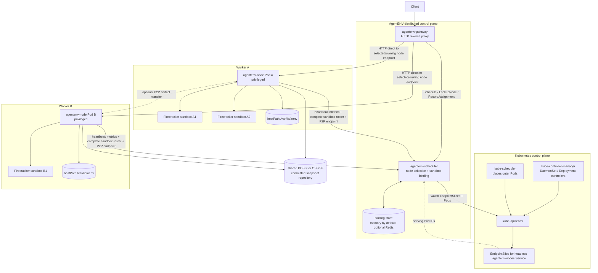
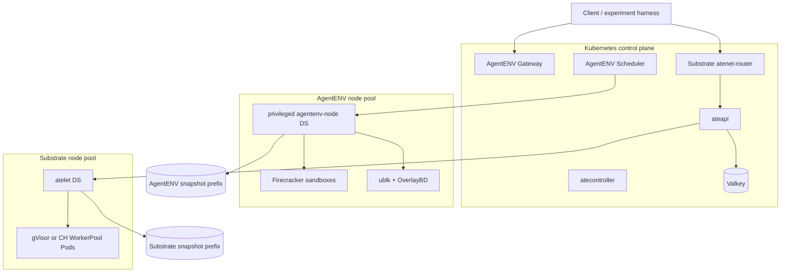

# AgentENV 与 Agent Substrate 部署前置条件、组件依赖和共存方案 Survey

> 调研时间：2026-08-12（Asia/Shanghai）
> 文档时间戳：`20260812T024137Z`
> AgentENV commit：`6296bc4be7ad79eb3a278eb5264ef011c341adf5`
> Agent Substrate commit：`cbdeb7dbe003a55a16960a301bc595d9aa38b1ad`
> 证据边界：本文以固定 commit 的 README、部署脚本、Kustomize 清单和源码为当前仓库证据。两项目都在快速演进；Agent Substrate 明确标注 early development，AgentENV 的分布式控制面和授权也尚未达到开箱即用的生产状态。

## 1. 结论摘要

如果目标是先验证两套系统，最稳妥的起点不是立即把它们装进同一生产 Kubernetes 集群，而是分两步：

1. 在 Linux 6.8+、有 `/dev/kvm` 和 `ublk_drv` 的宿主机上，以单节点 Docker 运行 AgentENV，验证 Firecracker create/pause/resume/template/fork。
2. 在 Kind 中以默认 gVisor 路径运行 Agent Substrate，验证 ActorTemplate、WorkerPool、golden snapshot、Actor suspend/resume 和 atenet 路由；gVisor 不要求 KVM。

两条路径都验证后，再使用不同 node pool 将它们放入同一集群。AgentENV 节点运行 privileged DaemonSet，直接管理 Firecracker、netns、iptables 和 ublk；Substrate 节点运行 atelet 与 WorkerPool Pods，runtime 是 gVisor 或 Kata/Cloud Hypervisor。两者都可使用 KVM，但 snapshot 格式、VMM、资源控制面和网络生命周期并不兼容，不能把它们视为同一个 runtime，也不能共享未定义格式的 snapshot。

最小实验环境可以是：

```text
一台 Linux 6.8+ x86_64 主机
├── Docker、kubectl、Go
├── /dev/kvm、ublk_drv
├── AgentENV 单节点 Docker
└── Agent Substrate Kind
    ├── gVisor WorkerPool
    ├── Valkey
    └── RustFS snapshot store
```

更接近集群实验的配置应使用两类节点：

```text
Kubernetes cluster
├── AgentENV node pool
│   ├── Linux 6.8+、/dev/kvm、ublk_drv
│   ├── privileged agentenv-node DaemonSet
│   └── local SSD /var/lib/aenv
└── Substrate node pool
    ├── atelet DaemonSet + WorkerPool Pods
    ├── gVisor，或 /dev/kvm + Kata/Cloud Hypervisor
    └── durable snapshot object storage
```

## 2. 两个系统分别部署什么

### 2.1 AgentENV

AgentENV 是以 Firecracker 为隔离边界的 sandbox service。单节点模式只有一个 node server；Kubernetes 模式部署：

| 组件 | Kubernetes 形态 | 职责 |
|---|---|---|
| `agentenv-node` | privileged DaemonSet | 每节点直接创建 Firecracker、netns、veth/tap、iptables 和 ublk device |
| `agentenv-gateway` | Deployment + ClusterIP Service | 客户端 HTTP 入口和按 sandbox ID 转发 |
| `agentenv-scheduler` | 单副本 Deployment + Service | 选择 node、维护 sandbox-to-node binding |
| `agentenv-nodes` | Headless Service | 让 scheduler 通过 EndpointSlice 发现 runtime Pods |

Kubernetes 只管理外层 runtime Pod。每个 AgentENV sandbox 不是 Pod，不经过 kube-scheduler、CRI、per-sandbox CNI 或 per-sandbox CSI。

### 2.2 Agent Substrate

Agent Substrate 是 Kubernetes-native Actor control plane。完整开发安装包含：

| 组件 | Kubernetes 形态 | 职责 |
|---|---|---|
| CRDs | `ActorTemplate`、`WorkerPool`、`SandboxConfig` | 声明 template、容量和 runtime assets |
| `atecontroller` | Deployment | reconcile WorkerPool 和 ActorTemplate，生成 Deployment/golden snapshot |
| `ateapi` | Deployment + Service | Actor/Atespace 生命周期和低延迟调度控制面 |
| `atelet` | DaemonSet | 节点侧镜像、snapshot 移动及对 worker runtime 的调用 |
| WorkerPool | 由 controller生成 Deployment | 提供可被 Actor claim 的 warm worker slots |
| `ateom-gvisor`/`ateom-microvm` | Worker Pod 内组件 | 运行、checkpoint、restore Actor |
| `atenet-dns` | Deployment + Service/CoreDNS | Actor 域名解析 |
| `atenet-router` | Deployment + Service/Envoy | 唤醒 Actor并转发到当前 Worker PodIP |
| Valkey | 本地为 TLS Valkey cluster；云上可用托管 Redis | Actor/Worker/Atespace control-plane state |
| Object store | Kind 为 RustFS；GKE 为 GCS；也支持 S3 路径 | durable snapshot bytes |
| `podcertcontroller` | Deployment | 为 ateapi、atelet、atenet、Valkey 等提供 Pod identity/service DNS certificates |

普通 Actor 不是 Kubernetes object，也不对应独立 Pod。Kubernetes 管 WorkerPool 的 warm Pod capacity，Substrate 在其内部完成 Actor claim、restore、suspend 和动态路由。

## 3. 共同基础条件

### 3.1 开发机工具

两项目合并调试建议准备：

| 工具 | AgentENV | Substrate | 说明 |
|---|---:|---:|---|
| Git | 必需 | 必需 | 获取固定版本源码 |
| Docker | Docker/Kubernetes部署需要 | Kind和 `ko` build需要 | Docker daemon需正常工作 |
| `kubectl` | Kubernetes模式需要 | 必需 | 应能访问目标 context |
| Kustomize | `kubectl` 内置即可 | 安装脚本使用 Kustomize | 先验证 `kubectl kustomize` |
| Go | 仅从源码/部分工具需要 | 本地安装明确必需 | `install-ate-kind.sh` 直接调用 `go env GOARCH` |
| Rust/Cargo | AgentENV 从源码构建需要 | 非必需 | 使用预构建镜像时可省略 |
| `gcloud` | 非必需 | GKE路径需要 | GKE/GCS/Redis/IAM bootstrap |
| `curl`、`jq` | 安装和验证常用 | 安装脚本常用 | AgentENV install script会检查 |

### 3.2 集群能力

共同需要：

- Linux worker nodes；
- 正常工作的 Kubernetes DNS、Service 和 Pod-to-Pod network；
- 能拉取项目及 workload OCI images；
- 能创建 CRD、ClusterRole/Binding、DaemonSet、Deployment、StatefulSet、Job 和 PVC 的 cluster-admin 等价权限；
- 足够的 CPU、内存和磁盘；snapshot、image layers 和 cache 会明显消耗本地 SSD与对象存储；
- 明确的 Ingress/LoadBalancer 或仅在开发时使用 `kubectl port-forward`。

Substrate README 目标支持 Kubernetes 最新 stable 及前一个 minor。其当前证书方案还依赖 `ClusterTrustBundle`、`ClusterTrustBundleProjection` 和 `PodCertificateRequest`；Kind 创建脚本显式开启这些 feature gates 和 `certificates.k8s.io/v1beta1`。在托管 Kubernetes 上部署前要先确认这些 API/feature gate 可用，而不是只确认 CRD 可用。

## 4. AgentENV 部署准备

### 4.1 硬性宿主机要求

当前仓库声明：

- Linux kernel 6.8+；
- Firecracker server需要 `/dev/kvm`；
- active ublk path需要 `ublk_drv`；
- sandbox network需要 network namespace、veth、tap和iptables；
- Docker/Kubernetes runtime容器需要 privileged；
- 文档把官方 systemd安装路径写成 Ubuntu 24.04、Linux x86_64；脚本实际只主动拒绝非 Linux 和非 x86_64，并没有显式检查 Ubuntu 版本。它依赖 apt-get 和 Ubuntu release asset，因此 Debian/其他发行版可能部分工作，也可能在依赖或 OverlayBD 包阶段失败；CLI单独支持 Linux/macOS x86_64/arm64，但 CLI支持范围不等于 server支持范围。

建议先运行以下只读检查：

```bash
uname -r
test -c /dev/kvm && ls -l /dev/kvm
lsmod | grep '^ublk_drv'
sysctl net.ipv4.ip_forward
docker info
kubectl version --client
```

若 `ublk_drv` 未加载，仓库的 host setup脚本会尝试 `modprobe ublk_drv`；Ubuntu上缺失时安装 `linux-modules-extra-$(uname -r)`。AgentENV启动还会检查 `/dev/ublk-control` 可读写和 IPv4 forwarding；network capacity tuning包括 neighbor table、conntrack、PID和inotify上限。容器环境默认跳过部分 sysctl tuning，除非显式设置 `AENV_FORCE_SYSCTL_TUNING=1`。生产环境需要让节点镜像、MachineConfig/DaemonSet或配置管理系统持久化这些设置，不能只在某个手工节点执行一次。

### 4.2 权限与设备

systemd安装路径使用非 root `aenv` 用户，但授予 `CAP_NET_ADMIN`、`CAP_SYS_ADMIN`、KVM group和ublk device access。Docker示例使用：

```bash
--device /dev/kvm --privileged -v /dev:/dev
```

Kubernetes DaemonSet将整个 host `/dev` 挂入容器并设置 `privileged: true`，还会修改本 Pod cgroup的 `memory.oom.group`。这意味着：

- 集群 Pod Security/准入策略必须允许该 namespace/workload；
- 节点必须允许 host device和hostPath；
- 节点安全模型需要接受 AgentENV runtime拥有很强的 host权限；
- 应通过专用 node pool、taint和ServiceAccount降低攻击面。

### 4.3 本地持久化和外部存储

默认数据根目录是 `/var/lib/aenv`。Kubernetes清单用 hostPath挂载它，保存 runtime assets、cache、paused state和本地 snapshot materialization。默认 snapshot repository 是本地 `posix_fs`，路径在 `$AENV_HOME/snapshot-store`；Kubernetes清单没有共享 PVC。需要规划：

- local SSD容量、水位和清理策略；
- 节点丢失时 paused-only sandbox是否允许丢失；
- committed snapshots使用 POSIX shared store还是 S3-compatible OSS；
- object-store credentials、endpoint、bucket/prefix和TLS；
- 可选 P2P端口的Pod-to-Pod可达性。

不要把 hostPath当成 durable cluster storage。需要跨节点启动/容灾的 template和snapshot应发布到共享 POSIX或对象存储。

OSS backend不是只填一个bucket即可：当前配置要求endpoint、bucket、region，并要求静态credentials或 `credential_process`，不接受匿名模式。P2P只是在repository读取之前尝试的 best-effort 加速，不是committed snapshot的authoritative truth。

### 4.4 网络和暴露面

AgentENV在外层 Pod内自行建立 per-sandbox netns、veth、tap和iptables。需要：

- host iptables/netfilter可用；
- Pod内具备操作它们的权限；
- 节点CIDR、Pod CIDR、AgentENV内部CIDR不冲突；
- conntrack和neighbor容量适配 sandbox密度；
- 若使用host-based sandbox URL，为 `*.sandbox.example.com` 配 wildcard DNS，并将其指向 Gateway Ingress/LoadBalancer。

Gateway默认是 ClusterIP。README明确说明 AgentENV当前没有 authorization；开发环境以外必须置于可信网络或外部认证/授权代理之后，不应直接暴露公网。

这里的 `aenv auth` 也不能被理解为完整鉴权。当前API路径主要检查API key/team/admin/basic/bearer header是否非空，源码仍有“未验证configured credentials”的TODO；`dummy`能用于quickstart恰恰说明它只是接口兼容占位。

### 4.5 三种部署路径

#### 路径 A：Ubuntu systemd，适合单机功能验证

```bash
curl -fsSL https://raw.githubusercontent.com/kvcache-ai/AgentENV/main/scripts/install.sh | sudo bash
sudo systemctl start aenv
curl http://127.0.0.1:8000/health
```

它会安装 server/CLI、ublk daemon和runtime assets，并配置专用系统用户。为可重复实验，建议下载固定 release或从固定 commit构建，而不是永远引用 `main`/`latest`。

#### 路径 B：单节点 Docker，最适合隔离验证

```bash
sudo bash scripts/docker-setup.sh
docker pull ghcr.io/kvcache-ai/aenv-server:latest
docker run --rm -it \
  --device /dev/kvm --privileged -v /dev:/dev \
  -p 8000:8000 \
  ghcr.io/kvcache-ai/aenv-server:latest
```

验证：

```bash
curl http://127.0.0.1:8000/health
aenv auth
aenv pull ubuntu:22.04 --name ubuntu
aenv start ubuntu
```

#### 路径 C：Kubernetes multi-node

每个目标 worker先执行host setup，然后构建、推送或加载三张镜像：

```bash
sudo bash scripts/docker-setup.sh
make k8s-build
make k8s-render
make k8s-apply
```

默认镜像名是本地 `agentenv-runtime:latest`、`agentenv-gateway:latest`、`agentenv-scheduler:latest`。真实多节点集群需要把它们推到每个节点可访问的 registry，并更新 Kustomize image；仅在构建机有本地镜像是不够的。k3s local-dev可用 `make k8s-load-dev`导入containerd；该 overlay 默认还要求宿主仓库存在 `env/` 目录，否则渲染会失败。

### 4.6 AgentENV 如何 scale 到多个节点

最核心的结论是：**AgentENV 通过 Kubernetes 扩展 runtime node capacity，再通过自己的 Gateway/Scheduler 把 Firecracker sandbox 放到这些 runtime node 上。** Kubernetes 不知道每个 sandbox，也不为它们分别运行 kube-scheduler、CRI、CNI 或 CSI 流程。

准确的资源层级是：

```text
Kubernetes worker node
└── one privileged agentenv-node DaemonSet Pod
    └── one AgentENV node API / Orchestrator
        ├── Firecracker sandbox A
        ├── Firecracker sandbox B
        └── Firecracker sandbox ...
```

因此要区分两种 `scale`：

| 层次 | 谁执行 | 扩展对象 | 当前实现 |
|---|---|---|---|
| 基础设施容量扩展 | Kubernetes/cluster autoscaler/云平台 | worker VM/物理节点与外层 runtime Pod | DaemonSet 在每个合格 worker 放一个 runtime Pod；AgentENV 本身不创建 worker VM，也未实现基于 sandbox demand 的 Cluster Autoscaler 集成 |
| sandbox 扩展与放置 | AgentENV Gateway + Scheduler + node Orchestrator | 每个 runtime Pod 内部的 Firecracker sandbox | Scheduler 在已发现 node 间选择一个 endpoint，Gateway 转发 create，选中 node 内部创建 VM |

#### 4.6.1 集群组件与路径



Kubernetes 与 AgentENV Scheduler 的分工如下：

- Kubernetes DaemonSet controller 负责让每个合格 Linux worker 有一个 `agentenv-node` Pod；kube-scheduler 只为这个外层 Pod 选 worker。
- `agentenv-nodes` headless Service 产生 EndpointSlice。AgentENV Scheduler 用 in-cluster Kubernetes client watch EndpointSlice 和可选 Pod label selector，将 serving、non-terminating endpoint 解析为 `node ID + Pod IP:8000`。
- EndpointSlice discovery 决定 **membership 和是否允许新建 sandbox**；runtime heartbeat 提供实际 machine info、CPU/内存/磁盘、running/paused sandbox 计数、完整 sandbox ID roster 和可选 P2P endpoint。二者不是同一个发现机制；当前 `Schedule()` 也未强制要求 discovery node 的 heartbeat-derived status 必须是 `READY`。
- `no_schedule_pod_selector` 匹配的 Pod 或 terminating endpoint 保留为 lingering node：不放置新 sandbox，但仍可为已有 sandbox 路由。`ignore_pod_selector` 则从 discovery 完全删除该 node。
- AgentENV Scheduler 的 Kubernetes RBAC 只需要 watch/list/get Pod 和 EndpointSlice；它不创建 Pod，不代替 kube-scheduler。

#### 4.6.2 新 sandbox 的 placement

```text
Client POST /sandboxes or /sandboxes-cold
  -> Gateway sees no existing sandbox ID
  -> Scheduler.Schedule(hint)
  -> active discovery nodes
  -> prefilter by latest heartbeat resource thresholds
  -> round_robin or random selects one node
  -> Gateway forwards the HTTP request to that node's PodIP:8000
  -> node Orchestrator creates the Firecracker sandbox
  -> response returns the new sandbox ID
  -> Gateway calls RecordAssignment(sandbox ID, selected node)
```

`ScheduleRequestHint` 可携带 CPU、memory 和 image 信息，但当前内置 `round_robin` 与 `random` 都忽略 hint 和 `RichNode.Snapshot`。`node_resource_limit` 会在 strategy 之前用最近 heartbeat 过滤超阈值 node，但它检查的是当前 snapshot，不是原子的 `current allocation + this request` reservation；尚未 heartbeat 的 node 也会被保留。所以这是一个带 guardrail 的简单 placement，不是严格的 bin-packing/admission control。

#### 4.6.3 已有 sandbox 的 location binding 与路由

对 pause/resume/delete/fork 等 control-plane API，Gateway 从 URL path 提取 sandbox ID；对 data-plane proxy，它从 `x-agentenv-sandbox-id`、`e2b-sandbox-id` 或 `{port}-{sandboxID}.sandbox.example.com` 提取 ID。之后路径为：

```text
request carrying sandbox ID
  -> Gateway.LookupNode(sandbox ID)
  -> binding store returns owning node endpoint
  -> Gateway forwards directly to that node
  -> node-local proxy / Orchestrator serves the sandbox
```

binding 有三个信息来源/修复点：

1. create/fork 成功后，Gateway 从 response header/body 取出新 sandbox ID，调 `RecordAssignment` 建立初始 binding；
2. 每个 runtime heartbeat 上报该 node 的完整 sandbox ID roster，Scheduler 用 roster reconcile，刷新现存 binding 并删除 roster 中已不存在的 ID；
3. `binding_ttl` 让长期未被 assignment/heartbeat 刷新的路由失效；graceful shutdown 会 best-effort `UnregisterNode`，清理该 node 的 observed state、bindings 和 P2P artifact index。

heartbeat response 还可返回当前 cluster 各 node `cpu_config_json` 的保守交集，让 fresh VM/template 使用更容易在异构 node 间恢复的 CPU feature mask。但这只是 compatibility 基础，不等于已有 live migration 机制。

#### 4.6.4 committed template 可以跨节点，私有 paused state 默认不可以

AgentENV 的多节点可用性依赖对三种存储状态的区分：

| 状态 | 默认位置 | 跨节点语义 |
|---|---|---|
| committed template/snapshot repository | 默认 `posix_fs` 在 `/var/lib/aenv/snapshot-store`，Kubernetes 清单只挂 node-local hostPath | 只有挂载共享 POSIX/分布式文件系统，或改用 OSS/S3-compatible backend，才能把 repository 当作 cluster-wide source of truth |
| node-local runtime/image cache | 每节点 `/var/lib/aenv` | 可重建、可回收；共享 repository 保证正确性，可选 P2P 优先从有 artifact 的 peer 获取以加速 |
| 未 publish 的 paused sandbox | `$AENV_HOME/persisted-sandboxes` 及 node-local snapshot artifacts | 继续通过 binding 回到原 node resume；不是 cluster-visible committed snapshot，节点丢失时可丢失状态 |

P2P 只是 committed artifact 的 best-effort 传输加速。它在 repository commit 成功后广播 `vm_state.bin`、Firecracker manifest 和 OverlayBD layers，但 repository 仍是 authoritative truth；P2P publish/fetch 失败不能代替 durable commit。

#### 4.6.5 scale-up、drain 与 scale-down

scale-up 的完整过程是：

```text
new Kubernetes worker
  -> prepare Linux 6.8+, /dev/kvm, ublk_drv and privileged policy
  -> DaemonSet creates agentenv-node Pod
  -> readiness succeeds; EndpointSlice becomes serving
  -> AgentENV Scheduler discovers PodIP:8000
  -> runtime heartbeat starts
  -> node can receive new sandboxes
```

scale-down 必须先 drain：让 runtime Pod 匹配 scheduler 配置的 `no_schedule_pod_selector`，或使 Pod endpoint 进入 terminating 后，discovery 将它保留为 lingering node，已有 binding 仍可路由，但不再 placement 新 sandbox。这是 **Pod label selector** 机制；给 Kubernetes Node 随意加同名 label 不会直接生效。DaemonSet 的 `preStop` 每 3 秒查询 node-local sandbox 数量，直到归零，`terminationGracePeriodSeconds` 是 3600。

这个 hook **只等待，不迁移**。当前没有自动把 running/private-paused sandbox 转移到其他 node 的 drain controller；运维方必须让 workload 结束/删除，或先把可迁移的基线显式 publish 为 committed snapshot 并在新 node 创建新 sandbox。若 node 突然失联，binding 可过期或被清理，但 node-local private state 不会自动出现在其他 node。

#### 4.6.6 当前能力与 prototype 缺口

| 问题 | 当前已有能力 | 尚未具备/默认不具备 |
|---|---|---|
| runtime 横向扩展 | DaemonSet 随 worker 增加 runtime Pod，EndpointSlice 动态发现 | AgentENV demand 自动触发 worker VM/Cluster Autoscaler 扩容 |
| 新 sandbox placement | resource threshold prefilter + round-robin/random | 使用 request hint 的 bin-packing、亲和性、artifact locality、atomic capacity reservation |
| node health admission | discovery 排除 non-serving endpoint，heartbeat 对外展示 `READY/CONNECTING/UNHEALTHY/LINGERING` 并提供 resource snapshot | `Schedule()` 当前按 active/lingering discovery 选候选，没有因 heartbeat 超时或从未 heartbeat 而强制拒绝 node |
| 已有 sandbox 路由 | `sandbox ID -> node` binding，heartbeat roster reconcile | 默认 durable/replicated binding authority |
| Scheduler HA | 可用 Redis binding + 多个 `--query-only` replica 在 primary 重启时继续 `LookupNode` | 默认 manifest 仍是单 primary + memory binding；primary 不可用时不能 create/schedule/list/P2P control RPC，artifact index 仍在内存 |
| 状态移动 | shared repository/P2P 可在节点间分发 committed template artifacts | running/private-paused sandbox 透明迁移、node-loss failover |
| 容错 | heartbeat TTL、binding TTL、unregister 和 roster 可清理过期状态 | create 成功后 `RecordAssignment` 失败只记 warning，不回滚 sandbox；默认存在 Scheduler 单点 |

因此，AgentENV 已经实现了“多 runtime node 上的 sandbox placement 与 location-aware routing”，但源码文档仍明确将 distributed control plane 标为 prototype。不应将它表述为已经提供自动节点伸缩、强资源调度、透明迁移和完整 HA 的生产级 cluster manager。

#### 4.6.7 对 AKernel/Agent Substrate 的启示

AgentENV 的分层与 AKernel 当前方向一致：

```text
Kubernetes:
  worker lifecycle + outer Pod placement + coarse capacity envelope

AgentENV / AKernel cluster control plane:
  sandbox placement + logical ID/location binding + routing + failure policy

AgentENV node runtime / AKernel sandboxd:
  Firecracker process + C/R + filesystem/image layers + netns/device hot path
```

与 Agent Substrate 相比，AgentENV 当前有直接可用的 Firecracker/OverlayBD/ublk data plane，但缺少 Substrate 更强的逻辑 Actor identity、request parking、location-transparent resume 和声明式 warm Worker capacity contract。AKernel 需要将两者结合成：Kubernetes 管理粗粒度 node/Pod 容量，专用 runtime 管理 sandbox 热路径，上层再提供 durable logical process identity、强 admission、drain/migration 和可验证的 snapshot compatibility。

### 4.7 当前清单不等于生产资源治理

AgentENV DaemonSet当前只有 `requests.memory: 8Gi`，没有 CPU request/limit或memory limit；每个 Firecracker也没有独立host cgroup。Firecracker `/machine-config`只定义guest-visible vCPU/RAM，不等价于host层的硬quota。

分布式scheduler当前还是 prototype：

- 默认单副本；
- binding默认保存在内存，重启会丢失，文档要求保持单副本；
- round-robin/random不利用请求resource hints完成严格placement；
- resource filter不是“current + requested”的原子admission；
- Gateway记录assignment失败不会回滚已创建sandbox。

生产试验至少要补 per-sandbox cgroup、容量reservation、binding authority、HA/fencing和鉴权。

## 5. Agent Substrate 部署准备

### 5.1 首选先跑 gVisor

Substrate有两类 sandbox：

| sandbox class | 是否需要 KVM | assets | 建议用途 |
|---|---:|---|---|
| `gvisor` | 否 | 每个目标架构的 `runsc` | 本地首次部署、验证控制面和C/R |
| `microvm` | 是 | `cloud-hypervisor`、`virtiofsd`、`kata-kernel`、`kata-image`、`kata-config` | 验证VM隔离和CH snapshot |

CRD之外还有 fail-closed `ValidatingAdmissionPolicy`验证 assets。gVisor和microVM都不是“只改一行 sandboxClass 就能跑”：对应架构的资产URL和SHA256必须可访问且完整。

### 5.2 Kind开发路径

开发机需要 Go、Docker和`kubectl`。仓库脚本管理Kind和本地registry：

```bash
git clone https://github.com/agent-substrate/substrate.git
cd substrate

hack/create-kind-cluster.sh
hack/install-ate-kind.sh --deploy-ate-system
hack/install-ate-kind.sh --deploy-demo-counter
go install ./cmd/kubectl-ate
```

Kind脚本会：

1. 创建 `localhost:5001` registry；
2. 检查Docker环境内能否打开 `/dev/kvm`；
3. 有KVM时把设备bind mount进Kind node并标记 `ate.dev/sandboxClass=microvm`；
4. 没有KVM时仍可使用gVisor；
5. 开启PodCertificate/ClusterTrustBundle feature gates；
6. 为gVisor loopback Pod-to-Pod networking设置proxy ARP；
7. 安装Valkey、RustFS、证书控制器和观测组件。

创建并访问一个Actor：

```bash
kubectl ate create atespace demo
kubectl ate create actor my-counter-1 \
  -a demo --template=ate-demo-counter/counter

kubectl port-forward -n ate-system svc/atenet-router 8000:80
curl -X POST \
  -H 'Host: my-counter-1.demo.actors.resources.substrate.ate.dev' \
  http://localhost:8000/
```

### 5.3 状态数据库、对象存储和PVC

Substrate控制面依赖Valkey/Redis-compatible store，snapshot bytes依赖对象存储：

- Kind overlay部署6个Valkey实例组成TLS cluster，3 master + 3 replica语义由初始化命令建立；每个Pod申请1 GiB RWO PVC；
- Kind使用单实例RustFS，申请1 GiB RWO PVC并创建 `ate-snapshots` bucket；默认凭据直接写在开发manifest中，只适用于本地；
- GKE路径由setup工具创建GKE、Redis、GCS和IAM；
- atelet通过GCS或S3 backend搬运checkpoint，WorkerPod本地hostPath不是最终durable store。

生产环境必须准备：

- Redis/Valkey TLS endpoint、CA、client身份和HA；
- GCS/S3 bucket、版本/保留/生命周期策略；
- 节点或atelet只访问所调度Actor snapshot的最小IAM；
- PVC StorageClass，若自行运行Valkey；
- snapshot不可变性、防覆盖和垃圾回收策略。

### 5.4 证书和身份设施

当前系统组件之间使用Pod identity/service DNS certificate。部署包含自有`podcertcontroller`，但依赖Kubernetes projected `podCertificate` 和 `clusterTrustBundle` source。需要准备：

- feature gates/API可用；
- 创建ClusterRole、ClusterTrustBundle和CertificateSigning相关对象的权限；
- Valkey CA、pod identity CA和service DNS CA secrets；
- CA rotation和controller故障处理；
- 若集群不支持这些API，评估token-client overlay或修改证书集成，而不是直接删掉TLS volume。

### 5.5 GKE开发路径

仓库提供的云上路径是GCP-specific：

```bash
cp hack/ate-dev-env.sh.example .ate-dev-env.sh
# 配置 PROJECT_ID、CLUSTER_NAME、CLUSTER_LOCATION、BUCKET_NAME、KO_DOCKER_REPO 等
source .ate-dev-env.sh

gcloud auth application-default login --project="${PROJECT_ID}"
go run ./tools/setup-gcp bootstrap
./hack/install-ate.sh --deploy-ate-system
./hack/install-ate.sh --deploy-demo-counter
```

bootstrap会涉及GKE cluster、Redis、GCS和IAM bindings，因此需要足够的GCP权限、配额、VPC/subnet和计费账户。非GKE Kubernetes虽可移植核心组件，但仓库没有同等成熟的一键EKS/AKS bootstrap；需要自行替换GCS、IAM、托管Redis和Pod certificate集成。

### 5.6 Worker容量规划

WorkerPool最终reconcile成Deployment。规划时需要区分：

- Kubernetes看到的是warm Worker Pods的request/limit；
- Substrate看到的是Actor对Worker slot的claim；
- idle Actor通常只有control-plane record和snapshot；
- running Actor占用一个Worker slot；
- golden snapshot生成也会临时claim Worker；
- gVisor和microVM WorkerPool需要不同SandboxConfig和节点能力。

因此不能只给控制面预留资源，还需要为golden build、并发resume、request parking和snapshot上传预留Worker headroom。

## 6. 两套系统共存部署

### 6.1 推荐的节点隔离

建议标签和taint至少区分：

```bash
kubectl label node node-a runtime-plane=agentenv
kubectl label node node-b runtime-plane=substrate
kubectl taint node node-a runtime-plane=agentenv:NoSchedule
kubectl taint node node-b runtime-plane=substrate:NoSchedule
```

随后分别给AgentENV DaemonSet、atelet和Substrate WorkerPool设置nodeSelector/toleration。只加node label但不改DaemonSet清单不会自动完成隔离；AgentENV当前默认DaemonSet会选择所有Linux节点。

### 6.2 为什么不建议初期共用节点

1. AgentENV Firecracker和Substrate Kata/Cloud Hypervisor都可能竞争 `/dev/kvm`、CPU和memory。
2. AgentENV privileged runtime会修改netns、veth、tap、iptables和sysctl相关host资源。
3. AgentENV ublk daemon和Substrate worker local state有各自的hostPath生命周期。
4. AgentENV当前缺少per-sandbox host cgroup；Substrate按Worker Pod进行Kubernetes资源治理，二者共同超卖时很难准确fence。
5. 两边snapshot store、manifest和compatibility contract不同。
6. 故障清理脚本、端口、host network和observability资源可能相互影响。

### 6.3 必须分开的命名和状态域

- namespace：例如 `agentenv-system` 与 `ate-system`；
- hostPath：`/var/lib/aenv` 与 `/var/lib/ateom-gvisor`；
- snapshot bucket或至少prefix；
- ServiceAccount、IAM和KMS key；
- wildcard DNS域名；
- local registry image names；
- node labels/taints；
- dashboards、metrics labels和log sinks。

即使底层使用同一个S3/GCS bucket，也应使用独立prefix和IAM policy，不能让任一runtime把另一系统的snapshot当成可恢复输入。

### 6.4 共存拓扑



## 7. 推荐部署顺序和验收标准

### 阶段 0：宿主机能力检查

验收：

- kernel ≥ 6.8；
- `/dev/kvm` 可由目标容器打开；
- `ublk_drv`正常；
- Docker能够启动privileged容器；
- Kind/Kubernetes Pod网络、DNS和PVC正常；
- 可以拉取/推送目标registry。

### 阶段 1：AgentENV单节点

执行并验证：

```text
health
  -> pull template
  -> start + exec
  -> pause
  -> Firecracker PID消失且snapshot artifact存在
  -> resume + state保留
  -> fork
  -> delete
```

同时记录 `/var/lib/aenv` 磁盘增长、Firecracker RSS、ublk devices和残留netns。

### 阶段 2：Substrate Kind + gVisor

验收：

- CRDs Established；
- Valkey cluster ready；
- RustFS bucket init完成；
- podcertcontroller生成trust bundles/certificates；
- ateapi、atecontroller、atelet、atenet ready；
- WorkerPool有空闲Worker；
- ActorTemplate进入Ready并生成goldenSnapshot；
- Actor首个HTTP请求触发resume，suspend后再次请求保留状态。

### 阶段 3：Substrate microVM

在独立KVM节点准备Cloud Hypervisor/Kata assets，使用仓库microVM demo脚本。验收不只看Pod Running，还应检查：

- `/dev/kvm` 进入Kind/worker；
- node有 `ate.dev/sandboxClass=microvm` label；
- `SandboxConfig`所有assets digest匹配；
- VM cold boot、Full checkpoint、OnDemand restore分别成功；
- snapshot不跨gVisor/microVM class误用。

### 阶段 4：同一集群、不同node pool

验收：

- AgentENV Pod不会调度到Substrate节点，反之亦然；
- 两边分别达到并发create/resume目标；
- 一个runtime的OOM、node drain或iptables变化不破坏另一runtime；
- bucket/prefix和IAM严格分离；
- 节点drain、scheduler/API restart和snapshot store短暂故障均有明确结果。

## 8. 容量建议

仓库没有给出统一的最小硬件规格，下面是实验规划建议，不是项目官方要求：

| 场景 | CPU | RAM | 磁盘 | 说明 |
|---|---:|---:|---:|---|
| AgentENV单sandbox验证 | 8 vCPU | 16 GiB | 100 GiB SSD | 容纳host、Firecracker guest、build/cache和snapshot |
| Substrate单节点Kind/gVisor | 8 vCPU | 16 GiB | 100 GiB SSD | Kind、6个Valkey Pod、RustFS、观测和WorkerPool同时运行较重 |
| 两者同机最小实验 | 16 vCPU | 32 GiB | 200 GiB SSD | 只适合功能验证，不代表density benchmark |
| 双node-pool并发实验 | 每节点16+ vCPU | 每节点32+ GiB | local NVMe + object store | 根据sandbox/Worker memory和并发fan-out再计算 |

真正容量公式应按：

```text
node allocatable
- Kubernetes/system reserve
- runtime/control-plane baseline
- warm pools / warm Workers
- snapshot and page-cache headroom
- failure/drain reserve
= admissible running sandbox capacity
```

不能仅用guest声明内存或Pod request相加；还要测VMM overhead、private dirty pages、shared page cache、ublk、snapshot并发和对象存储下载buffer。

## 9. 生产化缺口清单

### AgentENV

- API authorization；
- per-sandbox cgroup和OOM attribution；
- scheduler强admission及resource-aware placement；
- durable/replicated sandbox binding；
- controller/scheduler HA和fencing；
- node drain时paused/running sandbox迁移协议；
- snapshot runtime/CPU/kernel compatibility gate；
- hostPath cache GC和容量水位。

### Agent Substrate

- 项目明确不保证API/backward compatibility；
- non-GKE bootstrap和Pod certificate portability；
- Valkey/object-store生产拓扑、备份与IAM；
- runtime升级与snapshot兼容；
- ActorTemplate删除/golden artifact GC等生命周期细节；
- per-Actor网络/身份/授权仍有roadmap内容；
- 多租户安全边界需要按threat model继续验证。

### 共存层

- 统一但不混淆的capacity accounting；
- KVM、CPU、memory、I/O和network admission；
- snapshot namespace与provenance；
- 独立failure domain和升级窗口；
- 统一外层认证、审计、metrics和trace correlation；
- 明确AKernel将选一个runtime data plane，还是把二者保持为可插拔backend。

## 10. 对 AKernel 原型的建议

建议把这次部署当成三个独立实验，而不是直接“集成两个项目”：

1. **AgentENV data-plane实验**：测Firecracker/OverlayBD/ublk create、pause、resume、fork和cache sharing。
2. **Substrate control-plane实验**：测Actor identity、Worker claim、golden snapshot、parking和location-transparent routing。
3. **AKernel组合实验**：定义统一的Agent Process/Realm API，让Substrate式control plane驱动一个sandboxd backend；不要让Client同时理解两套原生API。

部署结果应回答：

- Kubernetes外层容量与runtime热路径之间的真实延迟边界；
- pause之后释放了哪些CPU/RAM/device，仍保留哪些cache/artifact；
- golden/template restore的first useful action而非仅VM resume延迟；
- node failure、scheduler restart和object-store miss时的正确性；
- gVisor、Cloud Hypervisor和Firecracker分别适合哪些Agent workload。

## 11. 快速执行清单

### AgentENV

```text
[ ] Linux 6.8+ x86_64 server
[ ] /dev/kvm
[ ] ublk_drv
[ ] Docker privileged workload allowed
[ ] /var/lib/aenv local SSD and GC plan
[ ] registry access
[ ] shared snapshot repository for multi-node
[ ] API kept private or protected by auth proxy
[ ] node labels/taints if sharing a cluster
```

### Agent Substrate

```text
[ ] Kubernetes latest or previous minor
[ ] Go, Docker, kubectl
[ ] CRD/RBAC/cluster-admin install permission
[ ] PodCertificate and ClusterTrustBundle APIs
[ ] Valkey/Redis
[ ] GCS/S3/RustFS snapshot bucket
[ ] PVC StorageClass for local Valkey/RustFS
[ ] OCI registry and ko repository
[ ] runsc assets for gVisor
[ ] KVM + CH/Kata assets only when using microvm
[ ] atenet DNS/router exposure and wildcard DNS plan
```

## 12. 源码与清单证据索引

### AgentENV

- [README prerequisites和无授权警告](/home/hukeyang/AKernel/kvcache-ai/AgentENV/README.md:26)
- [Quickstart](/home/hukeyang/AKernel/kvcache-ai/AgentENV/docs/src/getting-started/quickstart.md:1)
- [Docker部署](/home/hukeyang/AKernel/kvcache-ai/AgentENV/docs/src/deployment/docker.md:1)
- [Kubernetes部署](/home/hukeyang/AKernel/kvcache-ai/AgentENV/docs/src/deployment/kubernetes.md:1)
- [host ublk/sysctl setup](/home/hukeyang/AKernel/kvcache-ai/AgentENV/scripts/docker-setup.sh:1)
- [systemd安装脚本](/home/hukeyang/AKernel/kvcache-ai/AgentENV/scripts/install.sh:1)
- [runtime DaemonSet](/home/hukeyang/AKernel/kvcache-ai/AgentENV/deploy/k8s/base/agentenv-daemonset.yaml:1)
- [scheduler Deployment](/home/hukeyang/AKernel/kvcache-ai/AgentENV/deploy/k8s/base/scheduler-deployment.yaml:1)
- [gateway Deployment](/home/hukeyang/AKernel/kvcache-ai/AgentENV/deploy/k8s/base/gateway-deployment.yaml:1)
- [Kubernetes discovery配置](/home/hukeyang/AKernel/kvcache-ai/AgentENV/deploy/k8s/base/config/scheduler.json:1)
- [Kubernetes EndpointSlice/Pod informer discovery](/home/hukeyang/AKernel/kvcache-ai/AgentENV/services/scheduler/internal/kubernetes_discovery.go:138)
- [active/lingering node registry 与 heartbeat observation](/home/hukeyang/AKernel/kvcache-ai/AgentENV/services/scheduler/internal/node_registry.go:72)
- [Schedule、LookupNode、RecordAssignment 和 heartbeat roster reconcile](/home/hukeyang/AKernel/kvcache-ai/AgentENV/services/scheduler/internal/service.go:81)
- [round-robin/random strategy 忽略 hint/snapshot](/home/hukeyang/AKernel/kvcache-ai/AgentENV/services/scheduler/internal/strategy.go:13)
- [heartbeat resource threshold prefilter](/home/hukeyang/AKernel/kvcache-ai/AgentENV/services/scheduler/internal/filter.go:5)
- [Gateway 的 Schedule/LookupNode 路由](/home/hukeyang/AKernel/kvcache-ai/AgentENV/services/gateway/internal/server.go:146)
- [Gateway 从 create/fork response 记录 assignment](/home/hukeyang/AKernel/kvcache-ai/AgentENV/services/gateway/internal/server.go:400)
- [runtime heartbeat/retry/unregister reporter](/home/hukeyang/AKernel/kvcache-ai/AgentENV/src/observability/reporter.rs:75)
- [multi-node prototype 设计与 binding lifecycle](/home/hukeyang/AKernel/kvcache-ai/AgentENV/docs/src/internals/architecture.md:215)
- [Redis binding 与 query-only Scheduler HA 边界](/home/hukeyang/AKernel/kvcache-ai/AgentENV/services/README.md:282)
- [committed snapshot repository、node-local cache 和 P2P 关系](/home/hukeyang/AKernel/kvcache-ai/AgentENV/docs/src/concepts/snapshots.md:60)
- [paused sandbox node-local persistence](/home/hukeyang/AKernel/kvcache-ai/AgentENV/docs/src/concepts/sandboxes.md:193)

### Agent Substrate

- [README状态、Kind与GKE quickstart](/home/hukeyang/AKernel/agent-substrate/substrate/README.md:48)
- [Kind cluster创建和feature gates](/home/hukeyang/AKernel/agent-substrate/substrate/hack/create-kind-cluster.sh:45)
- [Kind安装环境](/home/hukeyang/AKernel/agent-substrate/substrate/hack/install-ate-kind.sh:17)
- [Kind完整组件overlay](/home/hukeyang/AKernel/agent-substrate/substrate/manifests/ate-install/kind/kustomization.yaml:15)
- [Kind atelet的S3/RustFS配置](/home/hukeyang/AKernel/agent-substrate/substrate/manifests/ate-install/kind/atelet/kustomization.yaml:21)
- [atelet DaemonSet](/home/hukeyang/AKernel/agent-substrate/substrate/manifests/ate-install/atelet.yaml:1)
- [ateapi Deployment](/home/hukeyang/AKernel/agent-substrate/substrate/manifests/ate-install/ate-api-server.yaml:1)
- [atecontroller Deployment](/home/hukeyang/AKernel/agent-substrate/substrate/manifests/ate-install/ate-controller.yaml:1)
- [Valkey cluster](/home/hukeyang/AKernel/agent-substrate/substrate/manifests/ate-install/valkey.yaml:1)
- [Kind RustFS](/home/hukeyang/AKernel/agent-substrate/substrate/manifests/ate-install/kind/rustfs.yaml:1)
- [SandboxConfig asset validation](/home/hukeyang/AKernel/agent-substrate/substrate/manifests/ate-install/sandboxconfig-validation.yaml:15)
- [GCP环境变量示例](/home/hukeyang/AKernel/agent-substrate/substrate/hack/ate-dev-env.sh.example:1)

## 13. 公开资料

1. [AgentENV repository](https://github.com/kvcache-ai/AgentENV)
2. [AgentENV documentation](https://kvcache-ai.github.io/AgentENV/)
3. [Agent Substrate repository](https://github.com/agent-substrate/substrate)
4. [Kubernetes DaemonSet](https://kubernetes.io/docs/concepts/workloads/controllers/daemonset/)
5. [Kubernetes device plugins](https://kubernetes.io/docs/concepts/extend-kubernetes/compute-storage-net/device-plugins/)
6. [Kubernetes feature gates](https://kubernetes.io/docs/reference/command-line-tools-reference/feature-gates/)
7. [Kind local registry](https://kind.sigs.k8s.io/docs/user/local-registry/)
8. [Firecracker](https://firecracker-microvm.github.io/)
9. [gVisor](https://gvisor.dev/)
10. [Cloud Hypervisor](https://www.cloudhypervisor.org/)
11. [Kata Containers](https://katacontainers.io/)
12. [Linux ublk documentation](https://docs.kernel.org/block/ublk.html)

## 14. 最终建议

若当前目标是为AKernel论文搭建可复现实验环境，优先使用“AgentENV单机 + Substrate Kind/gVisor”组合。它能最快分离data plane和control plane问题，也避免一次引入两套KVM runtime、两个snapshot store和复杂的云IAM。

完成基础功能验证后，再分别开启AgentENV Kubernetes multi-node和Substrate microVM，并使用独立node pool。只有当两边的资源占用、C/R正确性、故障恢复和first useful action都能被测量后，才值得把Substrate式Actor控制面与AgentENV式Firecracker数据面接到AKernel统一接口之下。
